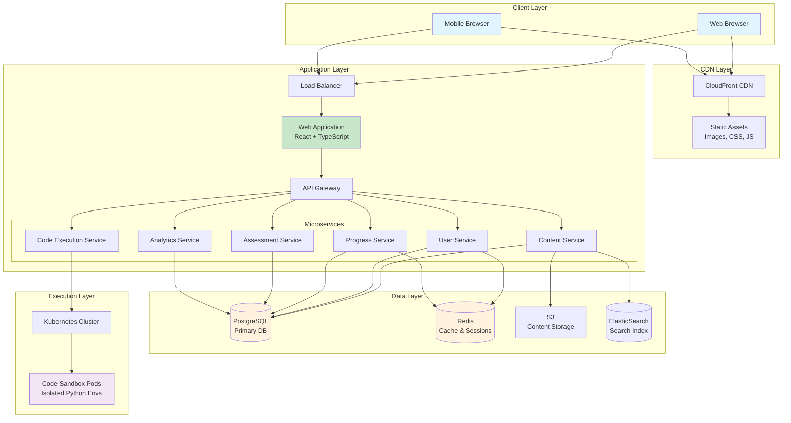
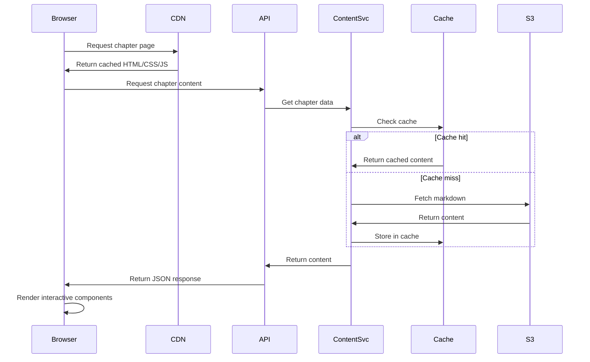
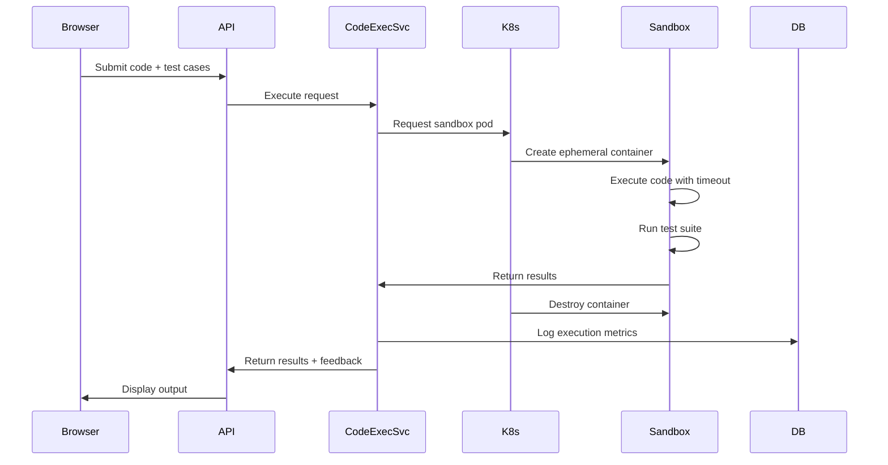
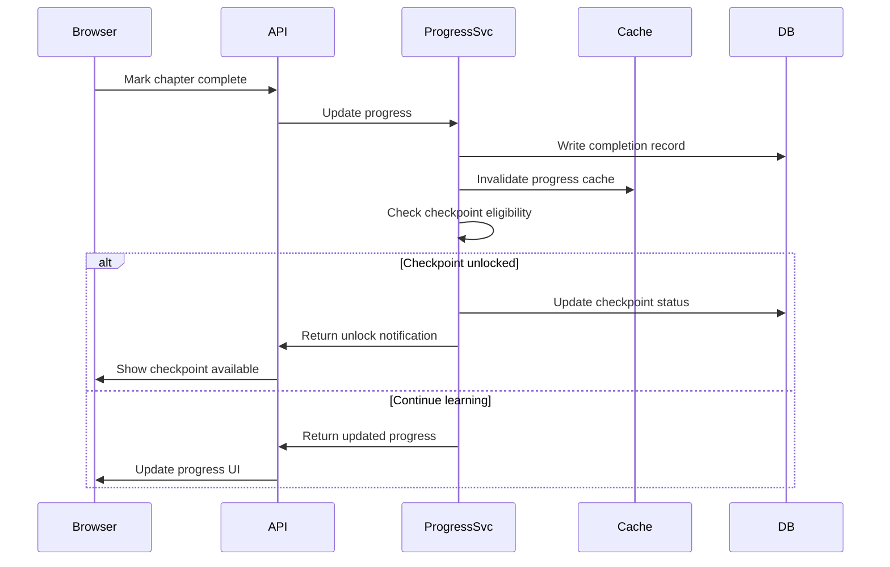
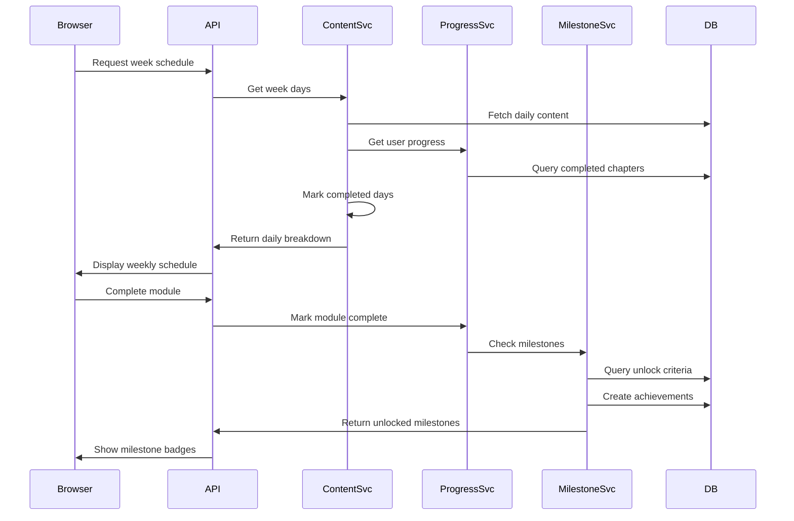
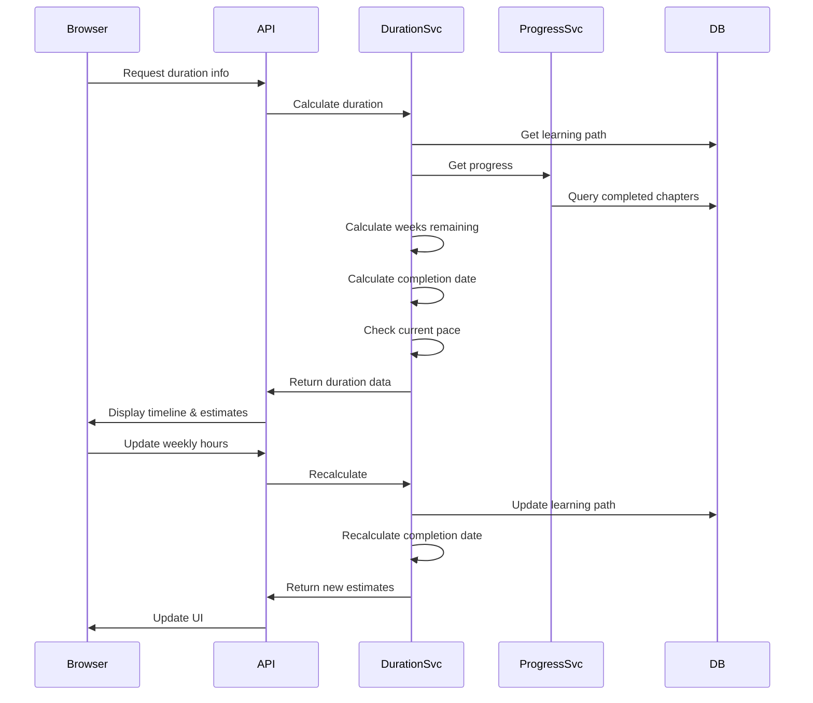
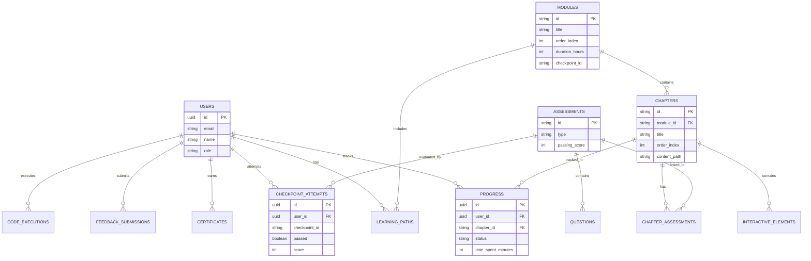
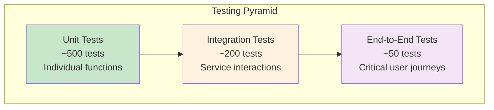

# Design Document: AI Engineering Curriculum Implementation

## Overview

The AI Engineering Curriculum Platform is a comprehensive, interactive web-based educational system that transforms learners from "vibe coders" into authoritative "Agentic Engineers." The platform implements a research-backed hybrid pedagogical approach combining top-down "Whole Game" learning with bottom-up "First Principles" mastery.

### System Purpose

The platform delivers a 28-30 week curriculum (600 hours at 20 hrs/week) covering 7 modules from Python foundations through production AI deployment. It provides:

- **Diagnostic-driven entry points** that personalize learning paths based on existing skills
- **Interactive learning elements** including explorable explanations, scrollytelling, and embedded code playgrounds
- **Checkpoint-based progression** ensuring mastery before advancement
- **Portfolio-ready capstone projects** demonstrating full-stack AI engineering competency

### Key Design Principles

1. **Pedagogy-First Architecture**: Every technical decision supports the 6-layer learning pattern (Action → Text → Video → See → Build → Interview)
2. **Progressive Disclosure**: Content complexity increases gradually with diagnostic-driven entry points
3. **Interactivity as Core**: Not a static content site - explorable explanations and live code execution are first-class features
4. **Verification Engineering Mindset**: Comprehensive assessment and checkpoint systems ensure learning outcomes
5. **Scalability and Performance**: Support 10,000+ concurrent learners with <2s page loads

### Technology Stack Overview

- **Frontend**: React with TypeScript for interactive UI components
- **Backend**: Node.js/Express for API services, Python for code execution sandboxes
- **Content Management**: Markdown-based with MDX for interactive components
- **Database**: PostgreSQL for structured data, Redis for caching and session management
- **Code Execution**: Containerized Python environments using Docker
- **Deployment**: Kubernetes for orchestration, CDN for static assets
- **Observability**: Application monitoring, user analytics, and performance tracking


## Architecture

### High-Level System Architecture



### Architecture Layers

#### 1. Client Layer
- **Web Browser**: Primary interface for desktop learners
- **Mobile Browser**: Responsive interface for mobile learners
- **Progressive Web App (PWA)**: Offline capability for downloaded content

#### 2. CDN Layer
- **CloudFront/CDN**: Global content delivery for static assets
- **Edge Caching**: Reduce latency for images, diagrams, CSS, JavaScript
- **Asset Optimization**: Automatic compression and format conversion (WebP, AVIF)

#### 3. Application Layer

**Web Application (React + TypeScript)**
- Single Page Application (SPA) architecture
- Component-based UI with reusable learning elements
- Client-side routing for seamless navigation
- State management using Redux Toolkit
- Real-time updates via WebSocket connections

**API Gateway**
- RESTful API endpoints for all services
- GraphQL endpoint for complex queries
- Authentication and authorization middleware
- Rate limiting and request throttling
- API versioning support

**Microservices Architecture**

1. **Content Service**
   - Serves curriculum content (chapters, modules, exercises)
   - Manages content versioning and updates
   - Handles MDX rendering and interactive component injection
   - Provides search functionality via ElasticSearch

2. **User Service**
   - User authentication (OAuth 2.0, JWT)
   - Profile management
   - Learning path customization
   - Certificate generation

3. **Progress Service**
   - Tracks completion status for chapters, modules, checkpoints
   - Manages learner state and session data
   - Calculates progress metrics and time estimates
   - Handles checkpoint gating logic

4. **Assessment Service**
   - Delivers diagnostic assessments
   - Manages checkpoint evaluations
   - Scores assessments and provides feedback
   - Generates personalized entry point recommendations

5. **Code Execution Service**
   - Manages code playground submissions
   - Orchestrates Docker container lifecycle
   - Executes Python code in isolated sandboxes
   - Returns execution results and test outcomes
   - Implements security controls and resource limits

6. **Analytics Service**
   - Collects user interaction events
   - Aggregates completion rates and time metrics
   - Identifies content improvement opportunities
   - Generates maintainer dashboards
   - Ensures GDPR compliance and data anonymization

#### 4. Data Layer

**PostgreSQL (Primary Database)**
- User profiles and authentication data
- Content metadata and versioning
- Progress tracking and checkpoint records
- Assessment results and scores
- Analytics aggregations

**Redis (Cache & Sessions)**
- Session management
- API response caching
- Real-time progress updates
- Rate limiting counters
- Pub/sub for real-time notifications

**S3 (Content Storage)**
- Markdown content files
- Diagrams and images
- Video content
- Downloadable resources
- Backup and archival

**ElasticSearch (Search Index)**
- Full-text search across all content
- Code example search
- Glossary term search
- Faceted search with filters

#### 5. Execution Layer

**Kubernetes Cluster**
- Container orchestration for code execution
- Auto-scaling based on demand
- Resource isolation and limits
- Health monitoring and auto-recovery

**Code Sandbox Pods**
- Ephemeral Docker containers for Python execution
- Pre-configured with curriculum dependencies
- Network isolation for security
- 30-second execution timeout
- Resource limits: 512MB RAM, 1 CPU core

### Data Flow Patterns

#### Content Delivery Flow


#### Code Execution Flow


#### Progress Tracking Flow


#### Daily Content and Milestone Flow (NEW)


#### Duration Calculation Flow (NEW)


### Security Architecture

#### Authentication & Authorization
- **OAuth 2.0** for third-party authentication (Google, GitHub)
- **JWT tokens** for session management
- **Role-Based Access Control (RBAC)**: Learner, Instructor, Admin, Maintainer
- **API key authentication** for programmatic access

#### Code Execution Security
- **Container isolation**: Each execution in ephemeral Docker container
- **Network restrictions**: No outbound internet access from sandboxes
- **Resource limits**: CPU, memory, disk, execution time
- **Input sanitization**: Validate and escape all user-provided code
- **Allowlist approach**: Only approved Python libraries available
- **Audit logging**: All code executions logged for security review

#### Data Security
- **Encryption at rest**: Database encryption, S3 server-side encryption
- **Encryption in transit**: TLS 1.3 for all connections
- **PII protection**: Minimal collection, anonymization for analytics
- **GDPR compliance**: Data export, deletion, consent management
- **Regular security audits**: Penetration testing, vulnerability scanning

### Scalability Considerations

#### Horizontal Scaling
- **Stateless services**: All microservices designed for horizontal scaling
- **Load balancing**: Distribute traffic across multiple instances
- **Database read replicas**: Scale read operations independently
- **CDN edge caching**: Reduce origin server load

#### Performance Optimization
- **Lazy loading**: Load content and assets on-demand
- **Code splitting**: Bundle JavaScript by route
- **Image optimization**: Responsive images, modern formats (WebP, AVIF)
- **Database indexing**: Optimize query performance
- **Query caching**: Redis cache for frequent queries
- **Connection pooling**: Reuse database connections

#### Capacity Planning
- **Target**: 10,000 concurrent learners
- **Peak load**: 50,000 page views/hour
- **Code executions**: 5,000 executions/hour
- **Storage**: 100GB content, 1TB user data
- **Bandwidth**: 10TB/month


## Components and Interfaces

### Frontend Components

#### Core UI Components

**1. Navigation Components**
```typescript
// GlobalNavigation.tsx
interface GlobalNavigationProps {
  currentModule: string;
  currentChapter: string;
  progressPercentage: number;
  onNavigate: (path: string) => void;
}

// Breadcrumb.tsx
interface BreadcrumbProps {
  path: Array<{label: string; href: string}>;
}

// TableOfContents.tsx
interface TableOfContentsProps {
  sections: Array<{id: string; title: string; level: number}>;
  activeSection: string;
}
```

**2. Content Display Components**
```typescript
// ChapterViewer.tsx
interface ChapterViewerProps {
  content: MDXContent;
  metadata: ChapterMetadata;
  onComplete: () => void;
}

// DiagramRenderer.tsx
interface DiagramRendererProps {
  type: 'mermaid' | 'architecture' | 'sequence';
  definition: string;
  interactive?: boolean;
}

// CodeBlock.tsx
interface CodeBlockProps {
  code: string;
  language: string;
  highlightLines?: number[];
  showLineNumbers?: boolean;
}
```

**3. Interactive Learning Components**
```typescript
// ExplorableExplanation.tsx
interface ExplorableExplanationProps {
  parameters: Array<{
    name: string;
    min: number;
    max: number;
    default: number;
    step: number;
  }>;
  visualization: (params: Record<string, number>) => React.ReactNode;
  explanation: string;
}

// ScrollytellingSection.tsx
interface ScrollytellingSectionProps {
  steps: Array<{
    narrative: string;
    visualization: React.ReactNode;
    triggerPoint: number; // 0-1, percentage of scroll
  }>;
}

// CodePlayground.tsx
interface CodePlaygroundProps {
  initialCode: string;
  testCases: Array<TestCase>;
  allowedLibraries: string[];
  onSubmit: (code: string) => Promise<ExecutionResult>;
}
```

**4. Assessment Components**
```typescript
// DiagnosticAssessment.tsx
interface DiagnosticAssessmentProps {
  assessmentType: 'python' | 'ai-engineering';
  onComplete: (score: number) => void;
}

// CheckpointGate.tsx
interface CheckpointGateProps {
  moduleId: string;
  requirements: string[];
  onPass: () => void;
  onFail: (gaps: string[]) => void;
}

// QuestionSet.tsx
interface QuestionSetProps {
  questions: Array<Question>;
  onSubmit: (answers: Record<string, any>) => void;
}
```

**5. Progress Tracking Components**
```typescript
// ProgressDashboard.tsx
interface ProgressDashboardProps {
  userId: string;
  completedModules: string[];
  currentModule: string;
  totalHours: number;
  checkpointsPassed: string[];
  milestones: MilestoneAchievement[]; // NEW
  durationInfo: LearningDurationInfo; // NEW
}

// ProgressIndicator.tsx
interface ProgressIndicatorProps {
  current: number;
  total: number;
  label: string;
}

// CheckpointBadge.tsx
interface CheckpointBadgeProps {
  checkpointId: string;
  status: 'locked' | 'available' | 'passed' | 'failed';
  attempts: number;
}

// NEW: DailyContentCard.tsx
interface DailyContentCardProps {
  dayNumber: number;
  topic: string;
  hours: number;
  type: 'content' | 'mini-project' | 'flagship-project';
  chapters: Array<{
    id: string;
    title: string;
    duration: number;
    completed: boolean;
  }>;
  description: string;
  onStartDay: () => void;
}

// NEW: WeeklySchedule.tsx
interface WeeklyScheduleProps {
  weekNumber: number;
  days: DailyContent[];
  currentDay: number;
  onSelectDay: (dayNumber: number) => void;
}

// NEW: MilestoneDisplay.tsx
interface MilestoneDisplayProps {
  milestones: Array<{
    id: string;
    milestoneText: string;
    badgeIcon: string;
    unlocked: boolean;
    achievedAt?: Date;
  }>;
  onShareMilestone: (milestoneId: string, platform: string) => void;
}

// NEW: MilestoneBadge.tsx
interface MilestoneBadgeProps {
  milestoneText: string;
  badgeIcon: string;
  achievedAt: Date;
  shared: boolean;
  onShare: (platform: string) => void;
}

// NEW: DurationCalculator.tsx
interface DurationCalculatorProps {
  totalWeeks: number;
  weeksCompleted: number;
  weeksRemaining: number;
  weeklyHours: number;
  estimatedCompletionDate: Date;
  currentPace: {
    hoursThisWeek: number;
    onTrack: boolean;
    adjustment: string;
  };
  onUpdateWeeklyHours: (newHours: number) => void;
}

// NEW: LearningPathTimeline.tsx
interface LearningPathTimelineProps {
  modules: Array<{
    id: string;
    title: string;
    weeks: number;
    status: 'completed' | 'current' | 'locked';
  }>;
  currentModule: string;
  progressPercentage: number;
}

// NEW: CompletionEstimate.tsx
interface CompletionEstimateProps {
  estimatedDate: Date;
  remainingWeeks: number;
  weeklyHours: number;
  onTrack: boolean;
}
```

### Backend Service Interfaces

#### Content Service API

```typescript
// GET /api/v1/content/modules
interface GetModulesResponse {
  modules: Array<{
    id: string;
    title: string;
    description: string;
    duration: number; // hours
    weeks: number;
    order: number;
    prerequisites: string[];
  }>;
}

// GET /api/v1/content/chapters/:chapterId
interface GetChapterResponse {
  id: string;
  moduleId: string;
  title: string;
  content: string; // MDX content
  metadata: {
    duration: number; // minutes
    difficulty: 'beginner' | 'intermediate' | 'advanced';
    tags: string[];
    version: string;
  };
  interactiveElements: Array<InteractiveElement>;
  assessments: Array<Assessment>;
}

// GET /api/v1/content/search
interface SearchRequest {
  query: string;
  filters?: {
    moduleIds?: string[];
    contentTypes?: ('chapter' | 'code' | 'glossary')[];
  };
  page: number;
  pageSize: number;
}

interface SearchResponse {
  results: Array<{
    id: string;
    type: 'chapter' | 'code' | 'glossary';
    title: string;
    excerpt: string;
    highlights: string[];
    url: string;
  }>;
  total: number;
  page: number;
}

// NEW: GET /api/v1/content/modules/:moduleId/weeks
interface GetModuleWeeksResponse {
  moduleId: string;
  weeks: Array<{
    id: string;
    weekNumber: number;
    title: string;
    totalHours: number;
    days: DailyContent[];
  }>;
}

// NEW: GET /api/v1/content/modules/:moduleId/weeks/:weekId/days
interface GetWeekDaysResponse {
  weekId: string;
  weekNumber: number;
  days: Array<{
    dayNumber: number;
    topic: string;
    hours: number;
    type: 'content' | 'mini-project' | 'flagship-project';
    chapters: Array<{
      id: string;
      title: string;
      duration: number;
      completed: boolean; // Based on user progress
    }>;
    description: string;
    learningObjectives: string[];
  }>;
}

// NEW: GET /api/v1/content/modules/:moduleId/milestones
interface GetModuleMilestonesResponse {
  moduleId: string;
  milestones: Array<{
    id: string;
    milestoneText: string;
    badgeIcon: string;
    unlocked: boolean; // Based on user progress
    achievedAt?: Date;
    order: number;
  }>;
}
```

#### User Service API

```typescript
// POST /api/v1/auth/login
interface LoginRequest {
  provider: 'google' | 'github' | 'email';
  credentials: {
    email?: string;
    password?: string;
    token?: string;
  };
}

interface LoginResponse {
  accessToken: string;
  refreshToken: string;
  user: UserProfile;
}

// GET /api/v1/users/:userId/profile
interface UserProfile {
  id: string;
  email: string;
  name: string;
  role: 'learner' | 'instructor' | 'admin';
  entryModule: string;
  learningPath: string[];
  createdAt: string;
  lastActive: string;
}

// PUT /api/v1/users/:userId/preferences
interface UserPreferences {
  theme: 'light' | 'dark' | 'auto';
  fontSize: 'small' | 'medium' | 'large';
  codeTheme: string;
  emailNotifications: boolean;
  dailyReminders: boolean;
}
```

#### Progress Service API

```typescript
// POST /api/v1/progress/chapters/:chapterId/complete
interface CompleteChapterRequest {
  userId: string;
  timeSpent: number; // minutes
  assessmentScore?: number;
}

interface CompleteChapterResponse {
  success: boolean;
  newProgress: ProgressSnapshot;
  checkpointUnlocked?: string;
}

// GET /api/v1/progress/users/:userId
interface ProgressSnapshot {
  userId: string;
  currentModule: string;
  currentChapter: string;
  currentWeek?: number; // NEW: Current week number
  currentDay?: number; // NEW: Current day number
  completedChapters: string[];
  completedModules: string[];
  checkpointsPassed: string[];
  totalHoursSpent: number;
  progressPercentage: number;
  estimatedCompletion: string; // ISO date
  remainingWeeks: number; // NEW: Weeks remaining in learning path
  totalWeeks: number; // NEW: Total weeks in learning path
  weeklyHours: number; // NEW: Current weekly hour commitment
}

// POST /api/v1/progress/checkpoints/:checkpointId/attempt
interface CheckpointAttemptRequest {
  userId: string;
  responses: Record<string, any>;
}

interface CheckpointAttemptResponse {
  passed: boolean;
  score: number;
  feedback: string;
  gaps?: string[]; // Areas to review if failed
  nextModule?: string; // If passed
  unlockedMilestones?: string[]; // NEW: Milestones unlocked by passing
}

// NEW: GET /api/v1/progress/users/:userId/milestones
interface GetUserMilestonesResponse {
  userId: string;
  achievements: Array<{
    milestoneId: string;
    moduleId: string;
    milestoneText: string;
    badgeIcon: string;
    achievedAt: Date;
    shared: boolean;
    sharedPlatforms: string[];
  }>;
  totalAchieved: number;
  totalAvailable: number;
}

// NEW: POST /api/v1/progress/users/:userId/milestones/:milestoneId/share
interface ShareMilestoneRequest {
  platform: 'linkedin' | 'twitter' | 'facebook';
  message?: string;
}

interface ShareMilestoneResponse {
  success: boolean;
  shareUrl: string;
  platform: string;
}

// NEW: GET /api/v1/progress/users/:userId/duration
interface GetLearningDurationResponse {
  userId: string;
  entryModule: string;
  totalWeeks: number;
  weeksCompleted: number;
  weeksRemaining: number;
  weeklyHours: number;
  estimatedCompletionDate: Date;
  progressPercentage: number;
  currentPace: {
    hoursThisWeek: number;
    onTrack: boolean;
    adjustment: string; // e.g., "2 hours behind schedule"
  };
}

// NEW: PUT /api/v1/progress/users/:userId/weekly-hours
interface UpdateWeeklyHoursRequest {
  weeklyHours: number; // New weekly hour commitment
}

interface UpdateWeeklyHoursResponse {
  success: boolean;
  newEstimatedCompletionDate: Date;
  weeksRemaining: number;
}
```

#### Assessment Service API

```typescript
// POST /api/v1/assessments/diagnostic/start
interface StartDiagnosticRequest {
  userId: string;
  assessmentType: 'python' | 'ai-engineering';
}

interface StartDiagnosticResponse {
  assessmentId: string;
  questions: Array<Question>;
  timeLimit: number; // minutes
}

// POST /api/v1/assessments/diagnostic/:assessmentId/submit
interface SubmitDiagnosticRequest {
  userId: string;
  answers: Record<string, any>;
}

interface SubmitDiagnosticResponse {
  score: number;
  maxScore: number;
  percentage: number;
  recommendedModule: string;
  recommendedPath: string;
  breakdown: Record<string, number>; // Topic scores
}

// GET /api/v1/assessments/questions/:questionId/feedback
interface QuestionFeedback {
  correct: boolean;
  explanation: string;
  referenceSection: string; // Chapter section to review
  relatedConcepts: string[];
}
```

#### Code Execution Service API

```typescript
// POST /api/v1/code/execute
interface ExecuteCodeRequest {
  userId: string;
  code: string;
  language: 'python';
  testCases?: Array<TestCase>;
  timeout?: number; // seconds, max 30
}

interface TestCase {
  input: any;
  expectedOutput: any;
  description: string;
}

interface ExecutionResult {
  success: boolean;
  output: string;
  errors?: string;
  executionTime: number; // milliseconds
  testResults?: Array<{
    testCase: TestCase;
    passed: boolean;
    actualOutput: any;
    message: string;
  }>;
}

// GET /api/v1/code/templates/:templateId
interface CodeTemplate {
  id: string;
  name: string;
  description: string;
  code: string;
  language: string;
  todos: Array<{line: number; description: string}>;
}
```

#### Analytics Service API

```typescript
// POST /api/v1/analytics/events
interface AnalyticsEvent {
  userId: string;
  eventType: string;
  eventData: Record<string, any>;
  timestamp: string;
  sessionId: string;
}

// GET /api/v1/analytics/chapters/:chapterId/metrics
interface ChapterMetrics {
  chapterId: string;
  completionRate: number;
  averageTimeSpent: number;
  averageAssessmentScore: number;
  dropoffRate: number;
  helpfulnessScore: number;
  commonIssues: Array<{
    issue: string;
    frequency: number;
  }>;
}

// GET /api/v1/analytics/dashboard
interface AnalyticsDashboard {
  totalLearners: number;
  activeLearners: number;
  completionRates: Record<string, number>; // By module
  averageProgressTime: number;
  checkpointPassRates: Record<string, number>;
  topPerformingContent: string[];
  contentNeedingImprovement: string[];
}
```

### Data Models

#### Content Models

```typescript
interface Module {
  id: string;
  title: string;
  description: string;
  order: number;
  duration: number; // hours
  weeks: number;
  prerequisites: string[];
  learningObjectives: string[];
  checkpointId: string;
  milestones: Milestone[]; // NEW: Success milestones for this module
  createdAt: Date;
  updatedAt: Date;
  version: string;
}

interface Week {
  id: string;
  moduleId: string;
  weekNumber: number;
  title: string;
  days: DailyContent[];
  createdAt: Date;
  updatedAt: Date;
}

interface DailyContent {
  id: string;
  weekId: string;
  dayNumber: number; // 1-7
  topic: string;
  hours: number;
  type: 'content' | 'mini-project' | 'flagship-project';
  chapterIds: string[]; // Chapters to complete on this day
  description: string;
  learningObjectives: string[];
}

interface Milestone {
  id: string;
  moduleId: string;
  milestoneText: string;
  badgeIcon: string; // Icon identifier or URL
  unlockCriteria: {
    type: 'module-completion' | 'checkpoint-pass' | 'custom';
    requiredCheckpoints?: string[];
    requiredChapters?: string[];
  };
  order: number;
}

interface Chapter {
  id: string;
  moduleId: string;
  weekId: string; // NEW: Link to week
  dayNumber: number; // NEW: Which day this chapter belongs to
  title: string;
  slug: string;
  order: number;
  contentPath: string; // S3 path to MDX file
  duration: number; // minutes
  difficulty: 'beginner' | 'intermediate' | 'advanced';
  tags: string[];
  interactiveElements: InteractiveElement[];
  assessmentIds: string[];
  createdAt: Date;
  updatedAt: Date;
  version: string;
}

interface InteractiveElement {
  id: string;
  type: 'explorable' | 'scrollytelling' | 'playground' | 'diagram';
  config: Record<string, any>;
  position: number; // Position in chapter content
}

interface Assessment {
  id: string;
  type: 'diagnostic' | 'checkpoint' | 'chapter' | 'quiz';
  questions: Question[];
  passingScore: number;
  timeLimit?: number; // minutes
  retakeable: boolean;
}

interface Question {
  id: string;
  type: 'multiple-choice' | 'coding' | 'short-answer' | 'design';
  prompt: string;
  options?: string[]; // For multiple-choice
  correctAnswer: any;
  explanation: string;
  referenceSection: string;
  difficulty: number; // 1-5
}
```

#### User Models

```typescript
interface User {
  id: string;
  email: string;
  name: string;
  role: 'learner' | 'instructor' | 'admin' | 'maintainer';
  authProvider: 'google' | 'github' | 'email';
  profilePicture?: string;
  createdAt: Date;
  lastActive: Date;
  preferences: UserPreferences;
}

interface LearningPath {
  userId: string;
  entryModule: string;
  recommendedPath: string[]; // Module IDs in order
  customizations: string[]; // User-modified path
  diagnosticScores: {
    python: number;
    aiEngineering: number;
  };
  totalWeeks: number; // NEW: Total duration based on entry point
  weeklyHours: number; // NEW: Learner's weekly hour commitment (default 20)
  estimatedCompletionDate: Date; // NEW: Calculated completion date
  createdAt: Date;
  updatedAt: Date;
}

interface Progress {
  id: string;
  userId: string;
  moduleId: string;
  chapterId: string;
  weekId?: string; // NEW: Track week progress
  dayNumber?: number; // NEW: Track daily progress
  status: 'not-started' | 'in-progress' | 'completed';
  startedAt?: Date;
  completedAt?: Date;
  timeSpent: number; // minutes
  assessmentScore?: number;
  lastPosition?: number; // Scroll position for resume
}

interface MilestoneAchievement {
  id: string;
  userId: string;
  milestoneId: string;
  achievedAt: Date;
  shared: boolean; // Whether learner shared on social media
  sharedPlatforms: string[]; // ['linkedin', 'twitter', etc.]
}

interface CheckpointAttempt {
  id: string;
  userId: string;
  checkpointId: string;
  attemptNumber: number;
  responses: Record<string, any>;
  score: number;
  passed: boolean;
  feedback: string;
  gaps?: string[];
  attemptedAt: Date;
}

interface Certificate {
  id: string;
  userId: string;
  type: 'module' | 'full-curriculum';
  moduleId?: string;
  issuedAt: Date;
  verificationCode: string;
  totalHours: number;
  pdfUrl: string;
}
```

#### Analytics Models

```typescript
interface UserSession {
  id: string;
  userId: string;
  startedAt: Date;
  endedAt?: Date;
  duration: number; // minutes
  chaptersViewed: string[];
  codeExecutions: number;
  assessmentsTaken: number;
}

interface ContentMetrics {
  contentId: string;
  contentType: 'module' | 'chapter';
  views: number;
  uniqueViewers: number;
  completions: number;
  averageTimeSpent: number;
  averageAssessmentScore: number;
  helpfulnessScore: number;
  lastCalculated: Date;
}

interface FeedbackSubmission {
  id: string;
  userId: string;
  contentId: string;
  contentType: 'chapter' | 'module';
  feedbackType: 'helpful' | 'not-helpful' | 'error-report' | 'suggestion';
  message?: string;
  upvotes: number;
  status: 'open' | 'in-progress' | 'resolved';
  createdAt: Date;
  resolvedAt?: Date;
}
```

### Integration Interfaces

#### External Service Integrations

**Authentication Providers**
```typescript
interface OAuthProvider {
  name: 'google' | 'github';
  clientId: string;
  clientSecret: string;
  redirectUri: string;
  scopes: string[];
}

interface OAuthCallback {
  code: string;
  state: string;
}

interface OAuthTokenResponse {
  accessToken: string;
  refreshToken: string;
  expiresIn: number;
  userInfo: {
    id: string;
    email: string;
    name: string;
    picture?: string;
  };
}
```

**Email Service**
```typescript
interface EmailService {
  sendWelcomeEmail(user: User): Promise<void>;
  sendProgressReminder(user: User, progress: Progress): Promise<void>;
  sendCheckpointUnlocked(user: User, checkpoint: string): Promise<void>;
  sendCertificate(user: User, certificate: Certificate): Promise<void>;
}
```

**CDN Service**
```typescript
interface CDNService {
  uploadAsset(file: Buffer, path: string): Promise<string>; // Returns CDN URL
  invalidateCache(paths: string[]): Promise<void>;
  getSignedUrl(path: string, expiresIn: number): Promise<string>;
}
```

**Search Service (ElasticSearch)**
```typescript
interface SearchService {
  indexContent(content: Chapter): Promise<void>;
  search(query: SearchRequest): Promise<SearchResponse>;
  updateIndex(contentId: string, updates: Partial<Chapter>): Promise<void>;
  deleteFromIndex(contentId: string): Promise<void>;
}
```

### Business Logic for New Features

#### Daily Content Scheduling Logic

```typescript
class DailyContentService {
  /**
   * Retrieves the daily content breakdown for a specific week
   * Marks Day 5 as mini-project and final week as flagship project
   */
  async getWeekDays(weekId: string, userId: string): Promise<DayContent[]> {
    const week = await db.weeks.findById(weekId);
    const dailyContent = await db.dailyContent.findByWeek(weekId);
    const userProgress = await db.progress.findByUser(userId);
    
    return dailyContent.map(day => ({
      ...day,
      chapters: day.chapters.map(chapter => ({
        ...chapter,
        completed: userProgress.some(p => 
          p.chapterId === chapter.id && p.status === 'completed'
        )
      })),
      // Mark special day types
      type: day.dayNumber === 5 ? 'mini-project' : 
            (week.weekNumber === week.module.weeks ? 'flagship-project' : 'content')
    }));
  }
  
  /**
   * Calculates current day based on learner's progress
   */
  async getCurrentDay(userId: string, moduleId: string): Promise<{weekId: string, dayNumber: number}> {
    const progress = await db.progress.findByUserAndModule(userId, moduleId);
    const completedChapters = progress.filter(p => p.status === 'completed');
    
    // Find the first incomplete day
    const weeks = await db.weeks.findByModule(moduleId);
    for (const week of weeks) {
      const days = await db.dailyContent.findByWeek(week.id);
      for (const day of days) {
        const dayChapters = await db.chapters.findByDailyContent(day.id);
        const allComplete = dayChapters.every(ch => 
          completedChapters.some(p => p.chapterId === ch.id)
        );
        if (!allComplete) {
          return { weekId: week.id, dayNumber: day.dayNumber };
        }
      }
    }
    
    // All days complete
    return null;
  }
}
```

#### Milestone Unlocking Logic

```typescript
class MilestoneService {
  /**
   * Checks and unlocks milestones when learner completes a module or checkpoint
   */
  async checkAndUnlockMilestones(userId: string, moduleId: string): Promise<string[]> {
    const milestones = await db.milestones.findByModule(moduleId);
    const unlockedMilestones: string[] = [];
    
    for (const milestone of milestones) {
      const alreadyAchieved = await db.milestoneAchievements.exists(userId, milestone.id);
      if (alreadyAchieved) continue;
      
      const unlocked = await this.checkUnlockCriteria(userId, milestone.unlockCriteria);
      if (unlocked) {
        await db.milestoneAchievements.create({
          userId,
          milestoneId: milestone.id,
          achievedAt: new Date()
        });
        unlockedMilestones.push(milestone.id);
      }
    }
    
    return unlockedMilestones;
  }
  
  /**
   * Evaluates unlock criteria for a milestone
   */
  private async checkUnlockCriteria(userId: string, criteria: UnlockCriteria): Promise<boolean> {
    switch (criteria.type) {
      case 'module-completion':
        const moduleProgress = await db.progress.findByUserAndModule(userId, criteria.moduleId);
        const allChapters = await db.chapters.findByModule(criteria.moduleId);
        return moduleProgress.filter(p => p.status === 'completed').length === allChapters.length;
        
      case 'checkpoint-pass':
        const checkpointAttempts = await db.checkpointAttempts.findByUser(userId);
        return criteria.requiredCheckpoints.every(cpId =>
          checkpointAttempts.some(a => a.checkpointId === cpId && a.passed)
        );
        
      case 'custom':
        // Custom criteria evaluation
        return await this.evaluateCustomCriteria(userId, criteria);
        
      default:
        return false;
    }
  }
  
  /**
   * Shares milestone achievement on social media
   */
  async shareMilestone(
    userId: string, 
    milestoneId: string, 
    platform: string
  ): Promise<{shareUrl: string}> {
    const achievement = await db.milestoneAchievements.findOne(userId, milestoneId);
    if (!achievement) throw new Error('Milestone not achieved');
    
    const milestone = await db.milestones.findById(milestoneId);
    const user = await db.users.findById(userId);
    
    // Generate share content
    const shareText = `I just achieved: ${milestone.milestoneText} in the AI Engineering Curriculum! 🎉`;
    const shareUrl = await this.generateShareUrl(platform, shareText, user);
    
    // Update achievement record
    await db.milestoneAchievements.update(achievement.id, {
      shared: true,
      sharedPlatforms: [...(achievement.sharedPlatforms || []), platform]
    });
    
    return { shareUrl };
  }
}
```

#### Learning Path Duration Calculation Logic

```typescript
class DurationCalculationService {
  /**
   * Calculates total weeks based on entry point
   */
  calculateTotalWeeks(entryModule: string): number {
    const pathDurations = {
      'module-0-week-1': 30,  // Path A
      'module-0-week-2': 29,  // Path B
      'module-1': 28,         // Path C
      'module-2': 25,         // Path D
      'module-3': 19          // Path E
    };
    
    return pathDurations[entryModule] || 28;
  }
  
  /**
   * Calculates estimated completion date based on weekly hours and progress
   */
  async calculateCompletionDate(userId: string): Promise<Date> {
    const learningPath = await db.learningPaths.findByUser(userId);
    const progress = await db.progress.findByUser(userId);
    
    const totalWeeks = learningPath.totalWeeks;
    const weeklyHours = learningPath.weeklyHours || 20;
    
    // Calculate weeks completed
    const completedChapters = progress.filter(p => p.status === 'completed');
    const totalChapters = await this.getTotalChaptersInPath(learningPath.recommendedPath);
    const weeksCompleted = (completedChapters.length / totalChapters) * totalWeeks;
    
    const weeksRemaining = totalWeeks - weeksCompleted;
    
    // Calculate completion date
    const today = new Date();
    const completionDate = new Date(today);
    completionDate.setDate(today.getDate() + (weeksRemaining * 7));
    
    return completionDate;
  }
  
  /**
   * Recalculates completion date when weekly hours change
   */
  async updateWeeklyHours(userId: string, newWeeklyHours: number): Promise<{
    estimatedCompletionDate: Date;
    weeksRemaining: number;
  }> {
    const learningPath = await db.learningPaths.findByUser(userId);
    const progress = await db.progress.findByUser(userId);
    
    // Update weekly hours
    await db.learningPaths.update(userId, { weeklyHours: newWeeklyHours });
    
    // Recalculate based on new pace
    const totalHoursRemaining = await this.calculateRemainingHours(userId);
    const weeksRemaining = Math.ceil(totalHoursRemaining / newWeeklyHours);
    
    const today = new Date();
    const estimatedCompletionDate = new Date(today);
    estimatedCompletionDate.setDate(today.getDate() + (weeksRemaining * 7));
    
    await db.learningPaths.update(userId, { estimatedCompletionDate });
    
    return { estimatedCompletionDate, weeksRemaining };
  }
  
  /**
   * Tracks current pace and provides adjustment recommendations
   */
  async getCurrentPace(userId: string): Promise<{
    hoursThisWeek: number;
    onTrack: boolean;
    adjustment: string;
  }> {
    const learningPath = await db.learningPaths.findByUser(userId);
    const weeklyHours = learningPath.weeklyHours || 20;
    
    // Get progress from last 7 days
    const sevenDaysAgo = new Date();
    sevenDaysAgo.setDate(sevenDaysAgo.getDate() - 7);
    
    const recentProgress = await db.progress.findByUserSince(userId, sevenDaysAgo);
    const hoursThisWeek = recentProgress.reduce((sum, p) => sum + (p.timeSpent / 60), 0);
    
    const onTrack = hoursThisWeek >= weeklyHours * 0.9; // Within 10% of target
    const difference = weeklyHours - hoursThisWeek;
    
    let adjustment = '';
    if (difference > 0) {
      adjustment = `${Math.round(difference)} hours behind schedule`;
    } else if (difference < -2) {
      adjustment = `${Math.round(Math.abs(difference))} hours ahead of schedule`;
    } else {
      adjustment = 'On track';
    }
    
    return { hoursThisWeek, onTrack, adjustment };
  }
  
  /**
   * Generates visual timeline data for learning path
   */
  async getTimelineData(userId: string): Promise<TimelineModule[]> {
    const learningPath = await db.learningPaths.findByUser(userId);
    const progress = await db.progress.findByUser(userId);
    const modules = await db.modules.findByIds(learningPath.recommendedPath);
    
    return modules.map(module => {
      const moduleProgress = progress.filter(p => p.moduleId === module.id);
      const moduleChapters = await db.chapters.findByModule(module.id);
      const completedCount = moduleProgress.filter(p => p.status === 'completed').length;
      
      let status: 'completed' | 'current' | 'locked';
      if (completedCount === moduleChapters.length) {
        status = 'completed';
      } else if (completedCount > 0) {
        status = 'current';
      } else {
        status = 'locked';
      }
      
      return {
        id: module.id,
        title: module.title,
        weeks: module.weeks,
        status
      };
    });
  }
}
```


## Data Models

### Database Schema

#### PostgreSQL Schema

```sql
-- Users and Authentication
CREATE TABLE users (
    id UUID PRIMARY KEY DEFAULT gen_random_uuid(),
    email VARCHAR(255) UNIQUE NOT NULL,
    name VARCHAR(255) NOT NULL,
    role VARCHAR(50) NOT NULL CHECK (role IN ('learner', 'instructor', 'admin', 'maintainer')),
    auth_provider VARCHAR(50) NOT NULL,
    auth_provider_id VARCHAR(255),
    profile_picture TEXT,
    created_at TIMESTAMP DEFAULT CURRENT_TIMESTAMP,
    last_active TIMESTAMP DEFAULT CURRENT_TIMESTAMP,
    UNIQUE(auth_provider, auth_provider_id)
);

CREATE TABLE user_preferences (
    user_id UUID PRIMARY KEY REFERENCES users(id) ON DELETE CASCADE,
    theme VARCHAR(20) DEFAULT 'auto',
    font_size VARCHAR(20) DEFAULT 'medium',
    code_theme VARCHAR(50) DEFAULT 'vs-dark',
    email_notifications BOOLEAN DEFAULT true,
    daily_reminders BOOLEAN DEFAULT false,
    updated_at TIMESTAMP DEFAULT CURRENT_TIMESTAMP
);

-- Content Structure
CREATE TABLE modules (
    id VARCHAR(100) PRIMARY KEY,
    title VARCHAR(255) NOT NULL,
    description TEXT NOT NULL,
    order_index INTEGER NOT NULL,
    duration_hours INTEGER NOT NULL,
    weeks INTEGER NOT NULL,
    prerequisites TEXT[], -- Array of module IDs
    learning_objectives TEXT[],
    checkpoint_id VARCHAR(100),
    version VARCHAR(20) NOT NULL,
    created_at TIMESTAMP DEFAULT CURRENT_TIMESTAMP,
    updated_at TIMESTAMP DEFAULT CURRENT_TIMESTAMP,
    UNIQUE(order_index)
);

-- NEW: Weeks table for organizing daily content
CREATE TABLE weeks (
    id VARCHAR(100) PRIMARY KEY,
    module_id VARCHAR(100) NOT NULL REFERENCES modules(id) ON DELETE CASCADE,
    week_number INTEGER NOT NULL,
    title VARCHAR(255) NOT NULL,
    created_at TIMESTAMP DEFAULT CURRENT_TIMESTAMP,
    updated_at TIMESTAMP DEFAULT CURRENT_TIMESTAMP,
    UNIQUE(module_id, week_number)
);

-- NEW: Daily content table
CREATE TABLE daily_content (
    id UUID PRIMARY KEY DEFAULT gen_random_uuid(),
    week_id VARCHAR(100) NOT NULL REFERENCES weeks(id) ON DELETE CASCADE,
    day_number INTEGER NOT NULL CHECK (day_number BETWEEN 1 AND 7),
    topic VARCHAR(255) NOT NULL,
    hours DECIMAL(3,1) NOT NULL,
    type VARCHAR(20) NOT NULL CHECK (type IN ('content', 'mini-project', 'flagship-project')),
    description TEXT,
    learning_objectives TEXT[],
    created_at TIMESTAMP DEFAULT CURRENT_TIMESTAMP,
    updated_at TIMESTAMP DEFAULT CURRENT_TIMESTAMP,
    UNIQUE(week_id, day_number)
);

-- NEW: Milestones table
CREATE TABLE milestones (
    id VARCHAR(100) PRIMARY KEY,
    module_id VARCHAR(100) NOT NULL REFERENCES modules(id) ON DELETE CASCADE,
    milestone_text TEXT NOT NULL,
    badge_icon VARCHAR(255) NOT NULL,
    unlock_criteria JSONB NOT NULL,
    order_index INTEGER NOT NULL,
    created_at TIMESTAMP DEFAULT CURRENT_TIMESTAMP,
    UNIQUE(module_id, order_index)
);

CREATE TABLE chapters (
    id VARCHAR(100) PRIMARY KEY,
    module_id VARCHAR(100) NOT NULL REFERENCES modules(id),
    week_id VARCHAR(100) REFERENCES weeks(id), -- NEW: Link to week
    day_number INTEGER CHECK (day_number BETWEEN 1 AND 7), -- NEW: Which day
    title VARCHAR(255) NOT NULL,
    slug VARCHAR(255) NOT NULL,
    order_index INTEGER NOT NULL,
    content_path TEXT NOT NULL, -- S3 path
    duration_minutes INTEGER NOT NULL,
    difficulty VARCHAR(20) CHECK (difficulty IN ('beginner', 'intermediate', 'advanced')),
    tags TEXT[],
    version VARCHAR(20) NOT NULL,
    created_at TIMESTAMP DEFAULT CURRENT_TIMESTAMP,
    updated_at TIMESTAMP DEFAULT CURRENT_TIMESTAMP,
    UNIQUE(module_id, order_index),
    UNIQUE(module_id, slug)
);

-- NEW: Link table for daily content to chapters
CREATE TABLE daily_content_chapters (
    daily_content_id UUID NOT NULL REFERENCES daily_content(id) ON DELETE CASCADE,
    chapter_id VARCHAR(100) NOT NULL REFERENCES chapters(id) ON DELETE CASCADE,
    order_index INTEGER NOT NULL,
    PRIMARY KEY (daily_content_id, chapter_id)
);

CREATE TABLE interactive_elements (
    id UUID PRIMARY KEY DEFAULT gen_random_uuid(),
    chapter_id VARCHAR(100) NOT NULL REFERENCES chapters(id) ON DELETE CASCADE,
    type VARCHAR(50) NOT NULL CHECK (type IN ('explorable', 'scrollytelling', 'playground', 'diagram')),
    config JSONB NOT NULL,
    position INTEGER NOT NULL,
    created_at TIMESTAMP DEFAULT CURRENT_TIMESTAMP
);

-- Assessments
CREATE TABLE assessments (
    id VARCHAR(100) PRIMARY KEY,
    type VARCHAR(50) NOT NULL CHECK (type IN ('diagnostic', 'checkpoint', 'chapter', 'quiz')),
    title VARCHAR(255) NOT NULL,
    passing_score INTEGER NOT NULL,
    time_limit_minutes INTEGER,
    retakeable BOOLEAN DEFAULT true,
    created_at TIMESTAMP DEFAULT CURRENT_TIMESTAMP,
    updated_at TIMESTAMP DEFAULT CURRENT_TIMESTAMP
);

CREATE TABLE questions (
    id UUID PRIMARY KEY DEFAULT gen_random_uuid(),
    assessment_id VARCHAR(100) NOT NULL REFERENCES assessments(id) ON DELETE CASCADE,
    type VARCHAR(50) NOT NULL CHECK (type IN ('multiple-choice', 'coding', 'short-answer', 'design')),
    prompt TEXT NOT NULL,
    options TEXT[], -- For multiple-choice
    correct_answer JSONB NOT NULL,
    explanation TEXT NOT NULL,
    reference_section VARCHAR(255),
    difficulty INTEGER CHECK (difficulty BETWEEN 1 AND 5),
    order_index INTEGER NOT NULL,
    created_at TIMESTAMP DEFAULT CURRENT_TIMESTAMP
);

CREATE TABLE chapter_assessments (
    chapter_id VARCHAR(100) NOT NULL REFERENCES chapters(id) ON DELETE CASCADE,
    assessment_id VARCHAR(100) NOT NULL REFERENCES assessments(id) ON DELETE CASCADE,
    PRIMARY KEY (chapter_id, assessment_id)
);

-- Learning Paths
CREATE TABLE learning_paths (
    user_id UUID PRIMARY KEY REFERENCES users(id) ON DELETE CASCADE,
    entry_module VARCHAR(100) NOT NULL REFERENCES modules(id),
    recommended_path TEXT[] NOT NULL, -- Array of module IDs
    customizations TEXT[],
    python_score INTEGER,
    ai_engineering_score INTEGER,
    total_weeks INTEGER NOT NULL, -- NEW: Total duration based on entry point
    weekly_hours INTEGER DEFAULT 20, -- NEW: Learner's weekly hour commitment
    estimated_completion_date DATE, -- NEW: Calculated completion date
    created_at TIMESTAMP DEFAULT CURRENT_TIMESTAMP,
    updated_at TIMESTAMP DEFAULT CURRENT_TIMESTAMP
);

-- Progress Tracking
CREATE TABLE progress (
    id UUID PRIMARY KEY DEFAULT gen_random_uuid(),
    user_id UUID NOT NULL REFERENCES users(id) ON DELETE CASCADE,
    module_id VARCHAR(100) NOT NULL REFERENCES modules(id),
    chapter_id VARCHAR(100) NOT NULL REFERENCES chapters(id),
    week_id VARCHAR(100) REFERENCES weeks(id), -- NEW: Track week progress
    day_number INTEGER CHECK (day_number BETWEEN 1 AND 7), -- NEW: Track daily progress
    status VARCHAR(20) NOT NULL CHECK (status IN ('not-started', 'in-progress', 'completed')),
    started_at TIMESTAMP,
    completed_at TIMESTAMP,
    time_spent_minutes INTEGER DEFAULT 0,
    assessment_score INTEGER,
    last_position INTEGER, -- Scroll position
    created_at TIMESTAMP DEFAULT CURRENT_TIMESTAMP,
    updated_at TIMESTAMP DEFAULT CURRENT_TIMESTAMP,
    UNIQUE(user_id, chapter_id)
);

CREATE INDEX idx_progress_user_status ON progress(user_id, status);
CREATE INDEX idx_progress_module ON progress(module_id);
CREATE INDEX idx_progress_week ON progress(week_id); -- NEW

-- NEW: Milestone achievements table
CREATE TABLE milestone_achievements (
    id UUID PRIMARY KEY DEFAULT gen_random_uuid(),
    user_id UUID NOT NULL REFERENCES users(id) ON DELETE CASCADE,
    milestone_id VARCHAR(100) NOT NULL REFERENCES milestones(id) ON DELETE CASCADE,
    achieved_at TIMESTAMP DEFAULT CURRENT_TIMESTAMP,
    shared BOOLEAN DEFAULT false,
    shared_platforms TEXT[],
    UNIQUE(user_id, milestone_id)
);

CREATE INDEX idx_milestone_achievements_user ON milestone_achievements(user_id);

CREATE TABLE checkpoint_attempts (
    id UUID PRIMARY KEY DEFAULT gen_random_uuid(),
    user_id UUID NOT NULL REFERENCES users(id) ON DELETE CASCADE,
    checkpoint_id VARCHAR(100) NOT NULL,
    attempt_number INTEGER NOT NULL,
    responses JSONB NOT NULL,
    score INTEGER NOT NULL,
    passed BOOLEAN NOT NULL,
    feedback TEXT NOT NULL,
    gaps TEXT[],
    attempted_at TIMESTAMP DEFAULT CURRENT_TIMESTAMP,
    UNIQUE(user_id, checkpoint_id, attempt_number)
);

CREATE INDEX idx_checkpoint_attempts_user ON checkpoint_attempts(user_id, checkpoint_id);

-- Certificates
CREATE TABLE certificates (
    id UUID PRIMARY KEY DEFAULT gen_random_uuid(),
    user_id UUID NOT NULL REFERENCES users(id) ON DELETE CASCADE,
    type VARCHAR(20) NOT NULL CHECK (type IN ('module', 'full-curriculum')),
    module_id VARCHAR(100) REFERENCES modules(id),
    issued_at TIMESTAMP DEFAULT CURRENT_TIMESTAMP,
    verification_code VARCHAR(50) UNIQUE NOT NULL,
    total_hours INTEGER NOT NULL,
    pdf_url TEXT NOT NULL
);

CREATE INDEX idx_certificates_verification ON certificates(verification_code);

-- Analytics
CREATE TABLE user_sessions (
    id UUID PRIMARY KEY DEFAULT gen_random_uuid(),
    user_id UUID NOT NULL REFERENCES users(id) ON DELETE CASCADE,
    started_at TIMESTAMP DEFAULT CURRENT_TIMESTAMP,
    ended_at TIMESTAMP,
    duration_minutes INTEGER,
    chapters_viewed TEXT[],
    code_executions INTEGER DEFAULT 0,
    assessments_taken INTEGER DEFAULT 0
);

CREATE INDEX idx_sessions_user_date ON user_sessions(user_id, started_at);

CREATE TABLE content_metrics (
    content_id VARCHAR(100) PRIMARY KEY,
    content_type VARCHAR(20) NOT NULL CHECK (content_type IN ('module', 'chapter')),
    views INTEGER DEFAULT 0,
    unique_viewers INTEGER DEFAULT 0,
    completions INTEGER DEFAULT 0,
    average_time_spent_minutes DECIMAL(10,2),
    average_assessment_score DECIMAL(5,2),
    helpfulness_score DECIMAL(3,2),
    last_calculated TIMESTAMP DEFAULT CURRENT_TIMESTAMP
);

CREATE TABLE feedback_submissions (
    id UUID PRIMARY KEY DEFAULT gen_random_uuid(),
    user_id UUID NOT NULL REFERENCES users(id) ON DELETE CASCADE,
    content_id VARCHAR(100) NOT NULL,
    content_type VARCHAR(20) NOT NULL CHECK (content_type IN ('chapter', 'module')),
    feedback_type VARCHAR(50) NOT NULL CHECK (feedback_type IN ('helpful', 'not-helpful', 'error-report', 'suggestion')),
    message TEXT,
    upvotes INTEGER DEFAULT 0,
    status VARCHAR(20) DEFAULT 'open' CHECK (status IN ('open', 'in-progress', 'resolved')),
    created_at TIMESTAMP DEFAULT CURRENT_TIMESTAMP,
    resolved_at TIMESTAMP
);

CREATE INDEX idx_feedback_content ON feedback_submissions(content_id, content_type);
CREATE INDEX idx_feedback_status ON feedback_submissions(status);

-- Code Execution Logs
CREATE TABLE code_executions (
    id UUID PRIMARY KEY DEFAULT gen_random_uuid(),
    user_id UUID NOT NULL REFERENCES users(id) ON DELETE CASCADE,
    chapter_id VARCHAR(100) REFERENCES chapters(id),
    code_hash VARCHAR(64) NOT NULL, -- SHA-256 of code
    language VARCHAR(20) NOT NULL,
    success BOOLEAN NOT NULL,
    execution_time_ms INTEGER NOT NULL,
    output_length INTEGER,
    error_type VARCHAR(100),
    executed_at TIMESTAMP DEFAULT CURRENT_TIMESTAMP
);

CREATE INDEX idx_code_executions_user ON code_executions(user_id, executed_at);

-- Content Versioning
CREATE TABLE content_versions (
    id UUID PRIMARY KEY DEFAULT gen_random_uuid(),
    content_id VARCHAR(100) NOT NULL,
    content_type VARCHAR(20) NOT NULL CHECK (content_type IN ('module', 'chapter')),
    version VARCHAR(20) NOT NULL,
    changes TEXT NOT NULL,
    published_at TIMESTAMP DEFAULT CURRENT_TIMESTAMP,
    published_by UUID REFERENCES users(id),
    UNIQUE(content_id, version)
);
```

### Redis Data Structures

```typescript
// Session Management
// Key: session:{sessionId}
// Type: Hash
// TTL: 24 hours
interface SessionData {
  userId: string;
  createdAt: string;
  lastActive: string;
  ipAddress: string;
}

// Progress Cache
// Key: progress:{userId}
// Type: Hash
// TTL: 1 hour
interface CachedProgress {
  currentModule: string;
  currentChapter: string;
  completedChapters: string; // JSON array
  progressPercentage: number;
  lastUpdated: string;
}

// Content Cache
// Key: content:chapter:{chapterId}
// Type: String (JSON)
// TTL: 6 hours
interface CachedChapter {
  id: string;
  content: string;
  metadata: object;
  cachedAt: string;
}

// Rate Limiting
// Key: ratelimit:{userId}:{endpoint}
// Type: String (counter)
// TTL: 1 minute
// Value: Request count

// Real-time Notifications
// Key: notifications:{userId}
// Type: List
// TTL: 7 days
interface Notification {
  type: string;
  message: string;
  timestamp: string;
  read: boolean;
}

// Code Execution Queue
// Key: code:queue
// Type: List
interface CodeExecutionJob {
  jobId: string;
  userId: string;
  code: string;
  priority: number;
  submittedAt: string;
}
```

### ElasticSearch Index Schema

```json
{
  "mappings": {
    "properties": {
      "id": {"type": "keyword"},
      "type": {"type": "keyword"},
      "moduleId": {"type": "keyword"},
      "title": {
        "type": "text",
        "analyzer": "standard",
        "fields": {
          "keyword": {"type": "keyword"}
        }
      },
      "content": {
        "type": "text",
        "analyzer": "standard"
      },
      "codeExamples": {
        "type": "text",
        "analyzer": "code_analyzer"
      },
      "tags": {"type": "keyword"},
      "difficulty": {"type": "keyword"},
      "createdAt": {"type": "date"},
      "updatedAt": {"type": "date"}
    }
  },
  "settings": {
    "analysis": {
      "analyzer": {
        "code_analyzer": {
          "type": "custom",
          "tokenizer": "standard",
          "filter": ["lowercase", "code_stop"]
        }
      },
      "filter": {
        "code_stop": {
          "type": "stop",
          "stopwords": ["def", "class", "import", "from"]
        }
      }
    }
  }
}
```

### S3 Storage Structure

```
curriculum-content/
├── modules/
│   ├── module-0/
│   │   ├── metadata.json
│   │   └── chapters/
│   │       ├── chapter-01.mdx
│   │       ├── chapter-02.mdx
│   │       └── ...
│   ├── module-1/
│   └── ...
├── assets/
│   ├── images/
│   │   ├── diagrams/
│   │   ├── screenshots/
│   │   └── icons/
│   ├── videos/
│   └── downloads/
├── certificates/
│   ├── templates/
│   │   ├── module-certificate.pdf
│   │   └── full-curriculum-certificate.pdf
│   └── issued/
│       ├── {userId}/
│       │   ├── {certificateId}.pdf
│       │   └── ...
└── exports/
    ├── offline-chapters/
    └── analytics-reports/
```

### Data Relationships Diagram




## Error Handling

### Error Classification

#### Client Errors (4xx)

**400 Bad Request**
- Invalid request payload
- Missing required fields
- Invalid data types or formats
- Failed validation rules

**401 Unauthorized**
- Missing authentication token
- Expired token
- Invalid credentials

**403 Forbidden**
- Insufficient permissions
- Checkpoint not unlocked
- Module prerequisites not met

**404 Not Found**
- Resource does not exist
- Invalid content ID
- User not found

**409 Conflict**
- Duplicate submission
- Concurrent modification conflict
- Version mismatch

**429 Too Many Requests**
- Rate limit exceeded
- Too many code executions
- Too many assessment attempts

#### Server Errors (5xx)

**500 Internal Server Error**
- Unhandled exceptions
- Database connection failures
- External service failures

**503 Service Unavailable**
- Maintenance mode
- Service overload
- Dependency unavailable

**504 Gateway Timeout**
- Code execution timeout
- External API timeout
- Database query timeout

### Error Response Format

```typescript
interface ErrorResponse {
  error: {
    code: string; // Machine-readable error code
    message: string; // Human-readable message
    details?: Record<string, any>; // Additional context
    timestamp: string;
    requestId: string; // For support tracking
    retryable: boolean; // Can client retry?
  };
}

// Example error responses
const examples = {
  validationError: {
    error: {
      code: 'VALIDATION_ERROR',
      message: 'Invalid request data',
      details: {
        fields: {
          email: 'Invalid email format',
          password: 'Password must be at least 8 characters'
        }
      },
      timestamp: '2026-05-04T10:30:00Z',
      requestId: 'req_abc123',
      retryable: false
    }
  },
  
  checkpointLocked: {
    error: {
      code: 'CHECKPOINT_LOCKED',
      message: 'Checkpoint not yet unlocked',
      details: {
        requiredChapters: ['chapter-01', 'chapter-02', 'chapter-03'],
        completedChapters: ['chapter-01', 'chapter-02'],
        missingChapters: ['chapter-03']
      },
      timestamp: '2026-05-04T10:30:00Z',
      requestId: 'req_abc124',
      retryable: false
    }
  },
  
  codeExecutionTimeout: {
    error: {
      code: 'EXECUTION_TIMEOUT',
      message: 'Code execution exceeded 30 second limit',
      details: {
        timeoutSeconds: 30,
        suggestion: 'Optimize your code or reduce input size'
      },
      timestamp: '2026-05-04T10:30:00Z',
      requestId: 'req_abc125',
      retryable: true
    }
  }
};
```

### Error Handling Strategies

#### Frontend Error Handling

```typescript
// Global error boundary for React
class ErrorBoundary extends React.Component {
  componentDidCatch(error: Error, errorInfo: React.ErrorInfo) {
    // Log to analytics service
    logError({
      error: error.message,
      stack: error.stack,
      componentStack: errorInfo.componentStack,
      userId: getCurrentUserId(),
      url: window.location.href
    });
    
    // Show user-friendly error UI
    this.setState({ hasError: true });
  }
}

// API error handling
async function apiCall<T>(endpoint: string, options: RequestInit): Promise<T> {
  try {
    const response = await fetch(endpoint, options);
    
    if (!response.ok) {
      const errorData: ErrorResponse = await response.json();
      throw new APIError(errorData);
    }
    
    return await response.json();
  } catch (error) {
    if (error instanceof APIError) {
      // Handle known API errors
      handleAPIError(error);
    } else if (error instanceof TypeError) {
      // Network error
      showNetworkError();
    } else {
      // Unknown error
      logUnknownError(error);
      showGenericError();
    }
    throw error;
  }
}

// Retry logic for transient failures
async function withRetry<T>(
  fn: () => Promise<T>,
  maxRetries: number = 3,
  backoff: number = 1000
): Promise<T> {
  for (let attempt = 1; attempt <= maxRetries; attempt++) {
    try {
      return await fn();
    } catch (error) {
      if (attempt === maxRetries || !isRetryable(error)) {
        throw error;
      }
      await sleep(backoff * attempt);
    }
  }
  throw new Error('Max retries exceeded');
}
```

#### Backend Error Handling

```typescript
// Express error handling middleware
app.use((err: Error, req: Request, res: Response, next: NextFunction) => {
  const requestId = req.id || generateRequestId();
  
  // Log error with context
  logger.error({
    error: err.message,
    stack: err.stack,
    requestId,
    userId: req.user?.id,
    endpoint: req.path,
    method: req.method
  });
  
  // Determine error type and response
  if (err instanceof ValidationError) {
    return res.status(400).json({
      error: {
        code: 'VALIDATION_ERROR',
        message: err.message,
        details: err.details,
        timestamp: new Date().toISOString(),
        requestId,
        retryable: false
      }
    });
  }
  
  if (err instanceof AuthenticationError) {
    return res.status(401).json({
      error: {
        code: 'AUTHENTICATION_ERROR',
        message: 'Authentication required',
        timestamp: new Date().toISOString(),
        requestId,
        retryable: false
      }
    });
  }
  
  // Default to 500 for unknown errors
  res.status(500).json({
    error: {
      code: 'INTERNAL_ERROR',
      message: 'An unexpected error occurred',
      timestamp: new Date().toISOString(),
      requestId,
      retryable: true
    }
  });
});

// Database error handling
async function withTransaction<T>(
  fn: (client: PoolClient) => Promise<T>
): Promise<T> {
  const client = await pool.connect();
  try {
    await client.query('BEGIN');
    const result = await fn(client);
    await client.query('COMMIT');
    return result;
  } catch (error) {
    await client.query('ROLLBACK');
    
    if (error.code === '23505') {
      // Unique constraint violation
      throw new ConflictError('Resource already exists');
    }
    
    if (error.code === '23503') {
      // Foreign key violation
      throw new ValidationError('Referenced resource does not exist');
    }
    
    throw error;
  } finally {
    client.release();
  }
}
```

#### Code Execution Error Handling

```typescript
// Sandbox execution with comprehensive error handling
async function executeCode(request: ExecuteCodeRequest): Promise<ExecutionResult> {
  const sandboxId = generateSandboxId();
  
  try {
    // Create isolated container
    const container = await createSandbox(sandboxId, {
      image: 'python:3.11-slim',
      memory: '512m',
      cpus: '1',
      timeout: request.timeout || 30,
      networkMode: 'none' // No internet access
    });
    
    // Write code to container
    await container.writeFile('/app/main.py', request.code);
    
    // Execute with timeout
    const result = await Promise.race([
      container.exec('python /app/main.py'),
      timeout(request.timeout * 1000)
    ]);
    
    return {
      success: true,
      output: result.stdout,
      errors: result.stderr,
      executionTime: result.duration
    };
    
  } catch (error) {
    if (error instanceof TimeoutError) {
      return {
        success: false,
        output: '',
        errors: `Execution exceeded ${request.timeout} second limit`,
        executionTime: request.timeout * 1000
      };
    }
    
    if (error instanceof MemoryError) {
      return {
        success: false,
        output: '',
        errors: 'Memory limit exceeded (512MB)',
        executionTime: 0
      };
    }
    
    // Syntax or runtime error
    return {
      success: false,
      output: '',
      errors: error.message,
      executionTime: 0
    };
    
  } finally {
    // Always cleanup sandbox
    await destroySandbox(sandboxId);
  }
}
```

### Circuit Breaker Pattern

```typescript
// Prevent cascading failures for external services
class CircuitBreaker {
  private failures: number = 0;
  private lastFailureTime: number = 0;
  private state: 'closed' | 'open' | 'half-open' = 'closed';
  
  constructor(
    private threshold: number = 5,
    private timeout: number = 60000, // 1 minute
    private resetTimeout: number = 30000 // 30 seconds
  ) {}
  
  async execute<T>(fn: () => Promise<T>): Promise<T> {
    if (this.state === 'open') {
      if (Date.now() - this.lastFailureTime > this.resetTimeout) {
        this.state = 'half-open';
      } else {
        throw new Error('Circuit breaker is open');
      }
    }
    
    try {
      const result = await fn();
      this.onSuccess();
      return result;
    } catch (error) {
      this.onFailure();
      throw error;
    }
  }
  
  private onSuccess() {
    this.failures = 0;
    this.state = 'closed';
  }
  
  private onFailure() {
    this.failures++;
    this.lastFailureTime = Date.now();
    
    if (this.failures >= this.threshold) {
      this.state = 'open';
    }
  }
}

// Usage for external services
const emailCircuitBreaker = new CircuitBreaker();

async function sendEmail(email: Email): Promise<void> {
  return emailCircuitBreaker.execute(async () => {
    return await emailService.send(email);
  });
}
```

### Graceful Degradation

```typescript
// Fallback strategies when services are unavailable
class ContentService {
  async getChapter(chapterId: string): Promise<Chapter> {
    try {
      // Try cache first
      const cached = await redis.get(`chapter:${chapterId}`);
      if (cached) return JSON.parse(cached);
      
      // Try database
      const chapter = await db.chapters.findById(chapterId);
      await redis.setex(`chapter:${chapterId}`, 3600, JSON.stringify(chapter));
      return chapter;
      
    } catch (error) {
      // Fallback to S3 direct read
      logger.warn('Database unavailable, falling back to S3', { chapterId });
      return await s3.getObject(`chapters/${chapterId}.json`);
    }
  }
}

// Feature flags for graceful degradation
const features = {
  codePlaygrounds: true,
  interactiveElements: true,
  realTimeProgress: true,
  analytics: true
};

function withFeatureFlag<T>(
  feature: keyof typeof features,
  fn: () => T,
  fallback: T
): T {
  if (features[feature]) {
    try {
      return fn();
    } catch (error) {
      logger.warn(`Feature ${feature} failed, using fallback`, { error });
      return fallback;
    }
  }
  return fallback;
}
```


## Testing Strategy

### Overview

The AI Engineering Curriculum Platform requires comprehensive testing across multiple layers to ensure reliability, correctness, and excellent user experience. Given the nature of this system (web application, content management, database operations, external integrations), **property-based testing is not applicable**. Instead, we employ a multi-layered testing strategy combining unit tests, integration tests, end-to-end tests, and specialized testing for interactive elements.

### Why Property-Based Testing Does Not Apply

This platform falls into categories where PBT is inappropriate:

1. **Web Application UI/UX**: React components, responsive layouts, user interactions
2. **Content Management System**: CRUD operations, content versioning, file storage
3. **Database Operations**: Simple queries, transactions, data persistence
4. **Infrastructure as Code**: Deployment configurations, container orchestration
5. **External Service Integrations**: OAuth providers, email services, CDN

**Alternative Testing Approaches**:
- **Snapshot tests** for UI components and content rendering
- **Integration tests** for database operations and external services
- **End-to-end tests** for complete user workflows
- **Mock-based tests** for external service interactions
- **Schema validation** for API contracts and data models

### Testing Pyramid



### Unit Testing

#### Frontend Unit Tests (Jest + React Testing Library)

**Component Tests**
```typescript
// ChapterViewer.test.tsx
describe('ChapterViewer', () => {
  it('renders chapter content correctly', () => {
    const chapter = createMockChapter();
    render(<ChapterViewer content={chapter.content} metadata={chapter.metadata} />);
    
    expect(screen.getByRole('heading', { name: chapter.metadata.title })).toBeInTheDocument();
    expect(screen.getByText(/Duration:/)).toHaveTextContent(`${chapter.metadata.duration} minutes`);
  });
  
  it('calls onComplete when user clicks complete button', async () => {
    const onComplete = jest.fn();
    render(<ChapterViewer {...mockProps} onComplete={onComplete} />);
    
    await userEvent.click(screen.getByRole('button', { name: /Mark Complete/i }));
    
    expect(onComplete).toHaveBeenCalledTimes(1);
  });
  
  it('displays progress indicator based on scroll position', () => {
    render(<ChapterViewer {...mockProps} />);
    
    fireEvent.scroll(window, { target: { scrollY: 500 } });
    
    expect(screen.getByRole('progressbar')).toHaveAttribute('aria-valuenow', '25');
  });
});

// CodePlayground.test.tsx
describe('CodePlayground', () => {
  it('executes code and displays output', async () => {
    const mockExecute = jest.fn().mockResolvedValue({
      success: true,
      output: 'Hello, World!'
    });
    
    render(<CodePlayground onSubmit={mockExecute} initialCode="print('Hello, World!')" />);
    
    await userEvent.click(screen.getByRole('button', { name: /Run Code/i }));
    
    await waitFor(() => {
      expect(screen.getByText('Hello, World!')).toBeInTheDocument();
    });
  });
  
  it('displays error message when code execution fails', async () => {
    const mockExecute = jest.fn().mockResolvedValue({
      success: false,
      errors: 'SyntaxError: invalid syntax'
    });
    
    render(<CodePlayground onSubmit={mockExecute} initialCode="print('test'" />);
    
    await userEvent.click(screen.getByRole('button', { name: /Run Code/i }));
    
    await waitFor(() => {
      expect(screen.getByText(/SyntaxError/)).toBeInTheDocument();
    });
  });
});
```

**Snapshot Tests for UI Components**
```typescript
// ExplorableExplanation.test.tsx
describe('ExplorableExplanation', () => {
  it('matches snapshot with default parameters', () => {
    const { container } = render(
      <ExplorableExplanation
        parameters={mockParameters}
        visualization={mockVisualization}
        explanation="Test explanation"
      />
    );
    
    expect(container).toMatchSnapshot();
  });
  
  it('updates visualization when parameter changes', () => {
    const { container } = render(<ExplorableExplanation {...mockProps} />);
    
    const slider = screen.getByRole('slider', { name: /Temperature/i });
    fireEvent.change(slider, { target: { value: '0.8' } });
    
    expect(container).toMatchSnapshot();
  });
});
```

#### Backend Unit Tests (Jest + Supertest)

**Service Layer Tests**
```typescript
// ContentService.test.ts
describe('ContentService', () => {
  let contentService: ContentService;
  let mockDb: jest.Mocked<Database>;
  let mockS3: jest.Mocked<S3Client>;
  
  beforeEach(() => {
    mockDb = createMockDatabase();
    mockS3 = createMockS3Client();
    contentService = new ContentService(mockDb, mockS3);
  });
  
  describe('getChapter', () => {
    it('returns chapter from cache if available', async () => {
      const cachedChapter = createMockChapter();
      mockDb.cache.get.mockResolvedValue(JSON.stringify(cachedChapter));
      
      const result = await contentService.getChapter('chapter-01');
      
      expect(result).toEqual(cachedChapter);
      expect(mockDb.chapters.findById).not.toHaveBeenCalled();
    });
    
    it('fetches from database and caches if not in cache', async () => {
      const chapter = createMockChapter();
      mockDb.cache.get.mockResolvedValue(null);
      mockDb.chapters.findById.mockResolvedValue(chapter);
      
      const result = await contentService.getChapter('chapter-01');
      
      expect(result).toEqual(chapter);
      expect(mockDb.cache.setex).toHaveBeenCalledWith(
        'chapter:chapter-01',
        3600,
        JSON.stringify(chapter)
      );
    });
    
    it('throws NotFoundError if chapter does not exist', async () => {
      mockDb.cache.get.mockResolvedValue(null);
      mockDb.chapters.findById.mockResolvedValue(null);
      
      await expect(contentService.getChapter('invalid-id')).rejects.toThrow(NotFoundError);
    });
  });
});

// ProgressService.test.ts
describe('ProgressService', () => {
  describe('completeChapter', () => {
    it('marks chapter as complete and updates progress', async () => {
      const userId = 'user-123';
      const chapterId = 'chapter-01';
      
      await progressService.completeChapter(userId, chapterId, 45);
      
      expect(mockDb.progress.update).toHaveBeenCalledWith({
        userId,
        chapterId,
        status: 'completed',
        completedAt: expect.any(Date),
        timeSpent: 45
      });
    });
    
    it('unlocks checkpoint when all required chapters are complete', async () => {
      mockDb.progress.findByUser.mockResolvedValue([
        { chapterId: 'chapter-01', status: 'completed' },
        { chapterId: 'chapter-02', status: 'completed' },
        { chapterId: 'chapter-03', status: 'in-progress' }
      ]);
      
      const result = await progressService.completeChapter('user-123', 'chapter-03', 30);
      
      expect(result.checkpointUnlocked).toBe('checkpoint-module-1');
    });
  });
});
```

**API Endpoint Tests**
```typescript
// content.routes.test.ts
describe('Content API', () => {
  describe('GET /api/v1/content/chapters/:chapterId', () => {
    it('returns chapter data for valid ID', async () => {
      const chapter = createMockChapter();
      mockContentService.getChapter.mockResolvedValue(chapter);
      
      const response = await request(app)
        .get('/api/v1/content/chapters/chapter-01')
        .set('Authorization', `Bearer ${validToken}`)
        .expect(200);
      
      expect(response.body).toMatchObject({
        id: chapter.id,
        title: chapter.title,
        content: chapter.content
      });
    });
    
    it('returns 404 for non-existent chapter', async () => {
      mockContentService.getChapter.mockRejectedValue(new NotFoundError());
      
      await request(app)
        .get('/api/v1/content/chapters/invalid-id')
        .set('Authorization', `Bearer ${validToken}`)
        .expect(404);
    });
    
    it('returns 401 without authentication', async () => {
      await request(app)
        .get('/api/v1/content/chapters/chapter-01')
        .expect(401);
    });
  });
});
```

### Integration Testing

#### Database Integration Tests

```typescript
// progress.integration.test.ts
describe('Progress Integration', () => {
  let db: Database;
  
  beforeAll(async () => {
    db = await createTestDatabase();
    await db.migrate.latest();
  });
  
  afterAll(async () => {
    await db.destroy();
  });
  
  beforeEach(async () => {
    await db.seed.run();
  });
  
  it('tracks progress across multiple chapters', async () => {
    const userId = 'test-user-1';
    const progressService = new ProgressService(db);
    
    // Complete first chapter
    await progressService.completeChapter(userId, 'chapter-01', 30);
    
    // Complete second chapter
    await progressService.completeChapter(userId, 'chapter-02', 45);
    
    // Verify progress
    const progress = await progressService.getUserProgress(userId);
    
    expect(progress.completedChapters).toHaveLength(2);
    expect(progress.totalHoursSpent).toBe(1.25);
    expect(progress.progressPercentage).toBeCloseTo(6.67, 1); // 2/30 chapters
  });
  
  it('enforces checkpoint gating', async () => {
    const userId = 'test-user-2';
    const assessmentService = new AssessmentService(db);
    
    // Try to access checkpoint without completing required chapters
    await expect(
      assessmentService.startCheckpoint(userId, 'checkpoint-module-1')
    ).rejects.toThrow('Checkpoint not unlocked');
    
    // Complete required chapters
    await completeChapters(userId, ['chapter-01', 'chapter-02', 'chapter-03']);
    
    // Now checkpoint should be accessible
    const checkpoint = await assessmentService.startCheckpoint(userId, 'checkpoint-module-1');
    expect(checkpoint).toBeDefined();
  });
});
```

#### External Service Integration Tests

```typescript
// email.integration.test.ts
describe('Email Service Integration', () => {
  it('sends welcome email via SendGrid', async () => {
    const emailService = new EmailService(sendGridClient);
    const user = createTestUser();
    
    await emailService.sendWelcomeEmail(user);
    
    // Verify email was sent (using SendGrid test mode)
    const sentEmails = await sendGridClient.getTestEmails();
    expect(sentEmails).toHaveLength(1);
    expect(sentEmails[0].to).toBe(user.email);
    expect(sentEmails[0].subject).toContain('Welcome');
  });
});

// s3.integration.test.ts
describe('S3 Integration', () => {
  it('uploads and retrieves content from S3', async () => {
    const s3Service = new S3Service(s3Client);
    const content = 'Test chapter content';
    
    const url = await s3Service.uploadContent('chapters/test.mdx', content);
    
    expect(url).toMatch(/^https:\/\/.+\.s3\.amazonaws\.com/);
    
    const retrieved = await s3Service.getContent('chapters/test.mdx');
    expect(retrieved).toBe(content);
  });
});
```

#### Code Execution Integration Tests

```typescript
// codeExecution.integration.test.ts
describe('Code Execution Integration', () => {
  let codeExecService: CodeExecutionService;
  
  beforeAll(() => {
    codeExecService = new CodeExecutionService(kubernetesClient);
  });
  
  it('executes valid Python code and returns output', async () => {
    const result = await codeExecService.execute({
      userId: 'test-user',
      code: 'print("Hello, World!")',
      language: 'python',
      timeout: 5
    });
    
    expect(result.success).toBe(true);
    expect(result.output).toContain('Hello, World!');
    expect(result.executionTime).toBeLessThan(5000);
  });
  
  it('handles syntax errors gracefully', async () => {
    const result = await codeExecService.execute({
      userId: 'test-user',
      code: 'print("unclosed string',
      language: 'python',
      timeout: 5
    });
    
    expect(result.success).toBe(false);
    expect(result.errors).toContain('SyntaxError');
  });
  
  it('enforces execution timeout', async () => {
    const result = await codeExecService.execute({
      userId: 'test-user',
      code: 'import time\nwhile True:\n    time.sleep(1)',
      language: 'python',
      timeout: 2
    });
    
    expect(result.success).toBe(false);
    expect(result.errors).toContain('timeout');
  });
  
  it('enforces memory limits', async () => {
    const result = await codeExecService.execute({
      userId: 'test-user',
      code: 'data = [0] * (1024 * 1024 * 1024)',  // Try to allocate 1GB
      language: 'python',
      timeout: 5
    });
    
    expect(result.success).toBe(false);
    expect(result.errors).toContain('memory');
  });
});
```

### End-to-End Testing

#### Critical User Journeys (Playwright)

```typescript
// e2e/learner-journey.spec.ts
test.describe('Complete Learner Journey', () => {
  test('new learner completes diagnostic and starts learning', async ({ page }) => {
    // 1. Visit homepage
    await page.goto('/');
    await expect(page.locator('h1')).toContainText('AI Engineering Curriculum');
    
    // 2. Sign up
    await page.click('text=Get Started');
    await page.fill('input[name="email"]', 'test@example.com');
    await page.fill('input[name="password"]', 'SecurePass123!');
    await page.click('button[type="submit"]');
    
    // 3. Take diagnostic assessment
    await expect(page.locator('h2')).toContainText('Diagnostic Assessment');
    await page.click('text=Start Python Assessment');
    
    // Answer questions
    for (let i = 0; i < 10; i++) {
      await page.click(`input[name="question-${i}"]`);
      await page.click('text=Next');
    }
    
    await page.click('text=Submit Assessment');
    
    // 4. View recommended path
    await expect(page.locator('.recommendation')).toContainText('Module 1');
    await page.click('text=Start Learning');
    
    // 5. View first chapter
    await expect(page.locator('h1')).toContainText('Chapter 1');
    await page.evaluate(() => window.scrollTo(0, document.body.scrollHeight));
    
    // 6. Mark chapter complete
    await page.click('text=Mark Complete');
    await expect(page.locator('.progress-indicator')).toContainText('1/30 chapters');
  });
  
  test('learner executes code in playground', async ({ page }) => {
    await loginAsTestUser(page);
    await page.goto('/modules/module-1/chapters/chapter-02');
    
    // Find code playground
    const playground = page.locator('.code-playground').first();
    await playground.locator('textarea').fill('print("Hello from test!")');
    
    // Execute code
    await playground.locator('button:has-text("Run Code")').click();
    
    // Verify output
    await expect(playground.locator('.output')).toContainText('Hello from test!');
  });
  
  test('learner completes checkpoint and unlocks next module', async ({ page }) => {
    await loginAsTestUser(page);
    
    // Complete all required chapters
    const requiredChapters = ['chapter-01', 'chapter-02', 'chapter-03'];
    for (const chapterId of requiredChapters) {
      await completeChapter(page, chapterId);
    }
    
    // Navigate to checkpoint
    await page.goto('/checkpoints/checkpoint-module-1');
    await expect(page.locator('.checkpoint-status')).toContainText('Available');
    
    // Take checkpoint
    await page.click('text=Start Checkpoint');
    await answerCheckpointQuestions(page);
    await page.click('text=Submit');
    
    // Verify pass
    await expect(page.locator('.result')).toContainText('Passed');
    await expect(page.locator('.next-module')).toContainText('Module 2');
  });
});

// e2e/interactive-elements.spec.ts
test.describe('Interactive Learning Elements', () => {
  test('explorable explanation updates visualization', async ({ page }) => {
    await page.goto('/modules/module-2/chapters/chapter-05');
    
    const explorable = page.locator('.explorable-explanation').first();
    
    // Adjust temperature slider
    const slider = explorable.locator('input[type="range"][name="temperature"]');
    await slider.fill('0.8');
    
    // Verify visualization updated
    await expect(explorable.locator('.visualization')).toHaveAttribute(
      'data-temperature',
      '0.8'
    );
  });
  
  test('scrollytelling triggers animations', async ({ page }) => {
    await page.goto('/modules/module-2/chapters/chapter-03');
    
    const scrollytelling = page.locator('.scrollytelling-section');
    
    // Scroll through section
    await scrollytelling.scrollIntoViewIfNeeded();
    await page.evaluate(() => window.scrollBy(0, 500));
    
    // Verify animation triggered
    await expect(scrollytelling.locator('.step-1')).toHaveClass(/active/);
    
    await page.evaluate(() => window.scrollBy(0, 500));
    await expect(scrollytelling.locator('.step-2')).toHaveClass(/active/);
  });
});
```

### Performance Testing

```typescript
// performance/load-test.ts
import { check } from 'k6';
import http from 'k6/http';

export const options = {
  stages: [
    { duration: '2m', target: 100 },   // Ramp up to 100 users
    { duration: '5m', target: 100 },   // Stay at 100 users
    { duration: '2m', target: 1000 },  // Ramp up to 1000 users
    { duration: '5m', target: 1000 },  // Stay at 1000 users
    { duration: '2m', target: 0 },     // Ramp down
  ],
  thresholds: {
    http_req_duration: ['p(95)<2000'], // 95% of requests under 2s
    http_req_failed: ['rate<0.01'],    // Less than 1% failure rate
  },
};

export default function () {
  // Test chapter loading
  const chapterResponse = http.get('https://api.example.com/api/v1/content/chapters/chapter-01', {
    headers: { Authorization: `Bearer ${__ENV.TEST_TOKEN}` },
  });
  
  check(chapterResponse, {
    'chapter loaded': (r) => r.status === 200,
    'response time OK': (r) => r.timings.duration < 2000,
  });
  
  // Test code execution
  const codeResponse = http.post('https://api.example.com/api/v1/code/execute', JSON.stringify({
    code: 'print("test")',
    language: 'python',
  }), {
    headers: {
      'Content-Type': 'application/json',
      Authorization: `Bearer ${__ENV.TEST_TOKEN}`,
    },
  });
  
  check(codeResponse, {
    'code executed': (r) => r.status === 200,
    'execution time OK': (r) => r.timings.duration < 5000,
  });
}
```

### Accessibility Testing

```typescript
// a11y/accessibility.test.ts
import { injectAxe, checkA11y } from 'axe-playwright';

test.describe('Accessibility', () => {
  test('chapter page meets WCAG 2.1 Level AA', async ({ page }) => {
    await page.goto('/modules/module-1/chapters/chapter-01');
    await injectAxe(page);
    
    await checkA11y(page, null, {
      detailedReport: true,
      detailedReportOptions: {
        html: true,
      },
    });
  });
  
  test('keyboard navigation works for all interactive elements', async ({ page }) => {
    await page.goto('/modules/module-1/chapters/chapter-01');
    
    // Tab through all interactive elements
    await page.keyboard.press('Tab');
    await expect(page.locator(':focus')).toHaveAttribute('role', 'button');
    
    await page.keyboard.press('Tab');
    await expect(page.locator(':focus')).toHaveAttribute('role', 'link');
    
    // Verify code playground is keyboard accessible
    await page.keyboard.press('Tab');
    await expect(page.locator(':focus')).toHaveClass(/code-editor/);
  });
});
```

### Test Coverage Goals

| Layer | Target Coverage | Rationale |
|-------|----------------|-----------|
| Unit Tests | 80%+ | Core business logic and utilities |
| Integration Tests | 70%+ | Service interactions and data flows |
| E2E Tests | Critical paths | Key user journeys and workflows |
| API Tests | 90%+ | All public API endpoints |

### Continuous Integration

```yaml
# .github/workflows/test.yml
name: Test Suite

on: [push, pull_request]

jobs:
  unit-tests:
    runs-on: ubuntu-latest
    steps:
      - uses: actions/checkout@v3
      - uses: actions/setup-node@v3
        with:
          node-version: '18'
      - run: npm ci
      - run: npm run test:unit
      - run: npm run test:coverage
      - uses: codecov/codecov-action@v3
  
  integration-tests:
    runs-on: ubuntu-latest
    services:
      postgres:
        image: postgres:15
        env:
          POSTGRES_PASSWORD: test
        options: >-
          --health-cmd pg_isready
          --health-interval 10s
          --health-timeout 5s
          --health-retries 5
      redis:
        image: redis:7
        options: >-
          --health-cmd "redis-cli ping"
          --health-interval 10s
          --health-timeout 5s
          --health-retries 5
    steps:
      - uses: actions/checkout@v3
      - uses: actions/setup-node@v3
      - run: npm ci
      - run: npm run test:integration
  
  e2e-tests:
    runs-on: ubuntu-latest
    steps:
      - uses: actions/checkout@v3
      - uses: actions/setup-node@v3
      - run: npm ci
      - run: npx playwright install
      - run: npm run test:e2e
      - uses: actions/upload-artifact@v3
        if: failure()
        with:
          name: playwright-report
          path: playwright-report/
```


#### Project Portfolio and Submission Logic (NEW - Requirements 41 & 48)

```typescript
class ProjectPortfolioService {
  /**
   * Retrieves learner's project portfolio with all completed projects
   */
  async getPortfolio(userId: string): Promise<PortfolioProject[]> {
    const progress = await db.progress.findByUser(userId);
    const completedChapters = progress.filter(p => p.status === 'completed');
    
    // Find all project chapters (mini-projects, flagship projects, capstone)
    const projectChapters = await db.chapters.findByIds(
      completedChapters.map(p => p.chapterId)
    ).filter(ch => 
      ch.tags.includes('mini-project') || 
      ch.tags.includes('flagship-project') ||
      ch.tags.includes('capstone-project')
    );
    
    // Get project submissions and metadata
    const projects = await Promise.all(
      projectChapters.map(async (chapter) => {
        const submission = await db.projectSubmissions.findByChapter(userId, chapter.id);
        const reviews = await db.projectReviews.findBySubmission(submission?.id);
        
        return {
          id: submission?.id || chapter.id,
          chapterId: chapter.id,
          title: chapter.title,
          moduleId: chapter.moduleId,
          type: this.getProjectType(chapter.tags),
          completedAt: progress.find(p => p.chapterId === chapter.id)?.completedAt,
          status: submission?.status || 'not-submitted',
          portfolioReady: submission?.portfolioReady || false,
          githubUrl: submission?.githubUrl,
          demoUrl: submission?.demoUrl,
          screenshots: submission?.screenshots || [],
          reviewScore: reviews.length > 0 ? this.calculateAverageScore(reviews) : null,
          technologies: submission?.technologies || []
        };
      })
    );
    
    return projects.sort((a, b) => 
      new Date(b.completedAt).getTime() - new Date(a.completedAt).getTime()
    );
  }
  
  /**
   * Submits a project for review
   */
  async submitProject(
    userId: string,
    chapterId: string,
    submission: ProjectSubmissionData
  ): Promise<ProjectSubmission> {
    // Verify chapter is completed
    const progress = await db.progress.findOne(userId, chapterId);
    if (progress?.status !== 'completed') {
      throw new Error('Chapter must be completed before submitting project');
    }
    
    // Create or update submission
    const existingSubmission = await db.projectSubmissions.findByChapter(userId, chapterId);
    
    if (existingSubmission) {
      // Resubmission after feedback
      return await db.projectSubmissions.update(existingSubmission.id, {
        ...submission,
        status: 'pending-review',
        submittedAt: new Date(),
        revisionNumber: existingSubmission.revisionNumber + 1
      });
    } else {
      // First submission
      return await db.projectSubmissions.create({
        userId,
        chapterId,
        ...submission,
        status: 'pending-review',
        submittedAt: new Date(),
        revisionNumber: 1
      });
    }
  }
  
  /**
   * Marks a project as portfolio-ready
   */
  async markPortfolioReady(userId: string, submissionId: string): Promise<void> {
    const submission = await db.projectSubmissions.findById(submissionId);
    
    if (submission.userId !== userId) {
      throw new Error('Unauthorized');
    }
    
    if (submission.status !== 'approved') {
      throw new Error('Project must be approved before marking as portfolio-ready');
    }
    
    await db.projectSubmissions.update(submissionId, {
      portfolioReady: true
    });
  }
  
  /**
   * Generates public portfolio URL for sharing
   */
  async generatePublicPortfolio(userId: string, visibility: 'public' | 'unlisted'): Promise<string> {
    const user = await db.users.findById(userId);
    const portfolio = await this.getPortfolio(userId);
    const portfolioReadyProjects = portfolio.filter(p => p.portfolioReady);
    
    // Generate unique portfolio slug
    const slug = `${user.name.toLowerCase().replace(/\s+/g, '-')}-${generateShortId()}`;
    
    // Store portfolio configuration
    await db.portfolioConfigs.upsert({
      userId,
      slug,
      visibility,
      projectIds: portfolioReadyProjects.map(p => p.id),
      updatedAt: new Date()
    });
    
    return `${process.env.PUBLIC_URL}/portfolio/${slug}`;
  }
  
  /**
   * Exports portfolio in specified format
   */
  async exportPortfolio(
    userId: string,
    format: 'pdf' | 'html' | 'json'
  ): Promise<{url: string; expiresAt: Date}> {
    const portfolio = await this.getPortfolio(userId);
    const user = await db.users.findById(userId);
    
    let exportUrl: string;
    
    switch (format) {
      case 'pdf':
        exportUrl = await this.generatePDFPortfolio(user, portfolio);
        break;
      case 'html':
        exportUrl = await this.generateHTMLPortfolio(user, portfolio);
        break;
      case 'json':
        exportUrl = await this.generateJSONPortfolio(user, portfolio);
        break;
    }
    
    // Generate signed URL with 7-day expiration
    const signedUrl = await s3.getSignedUrl(exportUrl, 7 * 24 * 60 * 60);
    const expiresAt = new Date();
    expiresAt.setDate(expiresAt.getDate() + 7);
    
    return { url: signedUrl, expiresAt };
  }
  
  private getProjectType(tags: string[]): 'mini-project' | 'flagship-project' | 'capstone' | 'custom' {
    if (tags.includes('capstone-project')) return 'capstone';
    if (tags.includes('flagship-project')) return 'flagship-project';
    if (tags.includes('mini-project')) return 'mini-project';
    return 'custom';
  }
  
  private calculateAverageScore(reviews: ProjectReview[]): number {
    const scores = reviews.map(r => r.overallScore);
    return scores.reduce((sum, score) => sum + score, 0) / scores.length;
  }
}

class ProjectReviewService {
  /**
   * Submits a review for a project
   */
  async submitReview(
    reviewerId: string,
    submissionId: string,
    review: ProjectReviewData
  ): Promise<ProjectReview> {
    const submission = await db.projectSubmissions.findById(submissionId);
    
    if (!submission) {
      throw new Error('Submission not found');
    }
    
    // Create review
    const createdReview = await db.projectReviews.create({
      submissionId,
      reviewerId,
      ...review,
      reviewedAt: new Date()
    });
    
    // Update submission status based on review
    const newStatus = this.determineSubmissionStatus(review);
    await db.projectSubmissions.update(submissionId, {
      status: newStatus
    });
    
    // Notify learner
    await this.notifyLearner(submission.userId, submissionId, newStatus);
    
    return createdReview;
  }
  
  /**
   * Adds a line-by-line code comment
   */
  async addCodeComment(
    reviewerId: string,
    submissionId: string,
    comment: CodeCommentData
  ): Promise<CodeComment> {
    return await db.codeComments.create({
      submissionId,
      reviewerId,
      filePath: comment.filePath,
      lineNumber: comment.lineNumber,
      lineEnd: comment.lineEnd,
      comment: comment.comment,
      severity: comment.severity || 'info',
      createdAt: new Date()
    });
  }
  
  /**
   * Retrieves all reviews for a submission
   */
  async getReviews(submissionId: string): Promise<ProjectReviewWithComments[]> {
    const reviews = await db.projectReviews.findBySubmission(submissionId);
    const codeComments = await db.codeComments.findBySubmission(submissionId);
    
    return reviews.map(review => ({
      ...review,
      codeComments: codeComments.filter(c => c.reviewerId === review.reviewerId)
    }));
  }
  
  /**
   * Allows learner to respond to feedback
   */
  async respondToReview(
    userId: string,
    reviewId: string,
    response: string
  ): Promise<ReviewResponse> {
    const review = await db.projectReviews.findById(reviewId);
    const submission = await db.projectSubmissions.findById(review.submissionId);
    
    if (submission.userId !== userId) {
      throw new Error('Unauthorized');
    }
    
    return await db.reviewResponses.create({
      reviewId,
      userId,
      response,
      createdAt: new Date()
    });
  }
  
  private determineSubmissionStatus(review: ProjectReviewData): ProjectSubmissionStatus {
    if (review.overallScore >= 80 && review.recommendation === 'approve') {
      return 'approved';
    } else if (review.recommendation === 'revision-required') {
      return 'revision-requested';
    } else {
      return 'reviewed';
    }
  }
  
  private async notifyLearner(
    userId: string,
    submissionId: string,
    status: ProjectSubmissionStatus
  ): Promise<void> {
    const notification = {
      userId,
      type: 'project-review',
      title: 'Project Review Received',
      message: `Your project submission has been ${status}`,
      link: `/projects/submissions/${submissionId}`,
      createdAt: new Date()
    };
    
    await db.notifications.create(notification);
    await redis.publish(`notifications:${userId}`, JSON.stringify(notification));
  }
}
```

### Additional Data Models for Portfolio and Reviews

```typescript
interface ProjectSubmission {
  id: string;
  userId: string;
  chapterId: string;
  status: 'not-submitted' | 'pending-review' | 'reviewed' | 'revision-requested' | 'approved';
  portfolioReady: boolean;
  githubUrl?: string;
  demoUrl?: string;
  screenshots: string[]; // S3 URLs
  description: string;
  technologies: string[];
  submittedAt: Date;
  revisionNumber: number;
}

interface ProjectReview {
  id: string;
  submissionId: string;
  reviewerId: string;
  codeQualityScore: number; // 0-100
  documentationScore: number; // 0-100
  testingScore: number; // 0-100
  deploymentScore: number; // 0-100
  overallScore: number; // 0-100
  strengths: string[];
  improvements: string[];
  recommendation: 'approve' | 'revision-required' | 'needs-work';
  generalFeedback: string;
  reviewedAt: Date;
}

interface CodeComment {
  id: string;
  submissionId: string;
  reviewerId: string;
  filePath: string;
  lineNumber: number;
  lineEnd?: number; // For multi-line comments
  comment: string;
  severity: 'info' | 'suggestion' | 'issue' | 'critical';
  createdAt: Date;
}

interface ReviewResponse {
  id: string;
  reviewId: string;
  userId: string;
  response: string;
  createdAt: Date;
}

interface PortfolioConfig {
  userId: string;
  slug: string;
  visibility: 'public' | 'private' | 'unlisted';
  projectIds: string[];
  customization: {
    theme: string;
    layout: string;
    sections: string[];
  };
  updatedAt: Date;
}

interface PortfolioProject {
  id: string;
  chapterId: string;
  title: string;
  moduleId: string;
  type: 'mini-project' | 'flagship-project' | 'capstone' | 'custom';
  completedAt: Date;
  status: ProjectSubmissionStatus;
  portfolioReady: boolean;
  githubUrl?: string;
  demoUrl?: string;
  screenshots: string[];
  reviewScore?: number;
  technologies: string[];
}
```

### Additional Database Schema for Portfolio and Reviews

```sql
-- Project Submissions
CREATE TABLE project_submissions (
    id UUID PRIMARY KEY DEFAULT gen_random_uuid(),
    user_id UUID NOT NULL REFERENCES users(id) ON DELETE CASCADE,
    chapter_id VARCHAR(100) NOT NULL REFERENCES chapters(id),
    status VARCHAR(30) NOT NULL CHECK (status IN ('not-submitted', 'pending-review', 'reviewed', 'revision-requested', 'approved')),
    portfolio_ready BOOLEAN DEFAULT false,
    github_url TEXT,
    demo_url TEXT,
    screenshots TEXT[], -- Array of S3 URLs
    description TEXT,
    technologies TEXT[],
    submitted_at TIMESTAMP DEFAULT CURRENT_TIMESTAMP,
    revision_number INTEGER DEFAULT 1,
    UNIQUE(user_id, chapter_id, revision_number)
);

CREATE INDEX idx_project_submissions_user ON project_submissions(user_id);
CREATE INDEX idx_project_submissions_status ON project_submissions(status);

-- Project Reviews
CREATE TABLE project_reviews (
    id UUID PRIMARY KEY DEFAULT gen_random_uuid(),
    submission_id UUID NOT NULL REFERENCES project_submissions(id) ON DELETE CASCADE,
    reviewer_id UUID NOT NULL REFERENCES users(id),
    code_quality_score INTEGER CHECK (code_quality_score BETWEEN 0 AND 100),
    documentation_score INTEGER CHECK (documentation_score BETWEEN 0 AND 100),
    testing_score INTEGER CHECK (testing_score BETWEEN 0 AND 100),
    deployment_score INTEGER CHECK (deployment_score BETWEEN 0 AND 100),
    overall_score INTEGER CHECK (overall_score BETWEEN 0 AND 100),
    strengths TEXT[],
    improvements TEXT[],
    recommendation VARCHAR(30) CHECK (recommendation IN ('approve', 'revision-required', 'needs-work')),
    general_feedback TEXT,
    reviewed_at TIMESTAMP DEFAULT CURRENT_TIMESTAMP
);

CREATE INDEX idx_project_reviews_submission ON project_reviews(submission_id);

-- Code Comments (line-by-line feedback)
CREATE TABLE code_comments (
    id UUID PRIMARY KEY DEFAULT gen_random_uuid(),
    submission_id UUID NOT NULL REFERENCES project_submissions(id) ON DELETE CASCADE,
    reviewer_id UUID NOT NULL REFERENCES users(id),
    file_path VARCHAR(500) NOT NULL,
    line_number INTEGER NOT NULL,
    line_end INTEGER, -- For multi-line comments
    comment TEXT NOT NULL,
    severity VARCHAR(20) CHECK (severity IN ('info', 'suggestion', 'issue', 'critical')),
    created_at TIMESTAMP DEFAULT CURRENT_TIMESTAMP
);

CREATE INDEX idx_code_comments_submission ON code_comments(submission_id);

-- Review Responses (learner responses to feedback)
CREATE TABLE review_responses (
    id UUID PRIMARY KEY DEFAULT gen_random_uuid(),
    review_id UUID NOT NULL REFERENCES project_reviews(id) ON DELETE CASCADE,
    user_id UUID NOT NULL REFERENCES users(id),
    response TEXT NOT NULL,
    created_at TIMESTAMP DEFAULT CURRENT_TIMESTAMP
);

CREATE INDEX idx_review_responses_review ON review_responses(review_id);

-- Portfolio Configurations
CREATE TABLE portfolio_configs (
    user_id UUID PRIMARY KEY REFERENCES users(id) ON DELETE CASCADE,
    slug VARCHAR(100) UNIQUE NOT NULL,
    visibility VARCHAR(20) NOT NULL CHECK (visibility IN ('public', 'private', 'unlisted')),
    project_ids TEXT[], -- Array of project submission IDs
    customization JSONB,
    updated_at TIMESTAMP DEFAULT CURRENT_TIMESTAMP
);

CREATE INDEX idx_portfolio_configs_slug ON portfolio_configs(slug);
```

### Additional API Endpoints for Portfolio and Reviews

```typescript
// Portfolio Management
// GET /api/v1/portfolio/users/:userId
interface GetPortfolioResponse {
  userId: string;
  projects: PortfolioProject[];
  totalProjects: number;
  portfolioReadyCount: number;
  publicUrl?: string;
}

// POST /api/v1/portfolio/users/:userId/projects/:submissionId/mark-ready
interface MarkPortfolioReadyRequest {
  portfolioReady: boolean;
}

// POST /api/v1/portfolio/users/:userId/generate-public
interface GeneratePublicPortfolioRequest {
  visibility: 'public' | 'unlisted';
  projectIds: string[];
}

interface GeneratePublicPortfolioResponse {
  publicUrl: string;
  slug: string;
}

// GET /api/v1/portfolio/public/:slug
interface PublicPortfolioResponse {
  userName: string;
  profilePicture?: string;
  projects: Array<{
    title: string;
    description: string;
    technologies: string[];
    githubUrl?: string;
    demoUrl?: string;
    screenshots: string[];
    completedAt: Date;
  }>;
}

// POST /api/v1/portfolio/users/:userId/export
interface ExportPortfolioRequest {
  format: 'pdf' | 'html' | 'json';
}

interface ExportPortfolioResponse {
  url: string;
  expiresAt: Date;
}

// Project Submission
// POST /api/v1/projects/submit
interface SubmitProjectRequest {
  chapterId: string;
  githubUrl?: string;
  demoUrl?: string;
  screenshots: string[]; // S3 URLs
  description: string;
  technologies: string[];
}

interface SubmitProjectResponse {
  submissionId: string;
  status: 'pending-review';
  submittedAt: Date;
}

// GET /api/v1/projects/submissions/:submissionId
interface GetSubmissionResponse {
  submission: ProjectSubmission;
  reviews: ProjectReviewWithComments[];
  revisionHistory: ProjectSubmission[];
}

// Project Review
// POST /api/v1/projects/submissions/:submissionId/reviews
interface SubmitReviewRequest {
  codeQualityScore: number;
  documentationScore: number;
  testingScore: number;
  deploymentScore: number;
  overallScore: number;
  strengths: string[];
  improvements: string[];
  recommendation: 'approve' | 'revision-required' | 'needs-work';
  generalFeedback: string;
}

// POST /api/v1/projects/submissions/:submissionId/comments
interface AddCodeCommentRequest {
  filePath: string;
  lineNumber: number;
  lineEnd?: number;
  comment: string;
  severity: 'info' | 'suggestion' | 'issue' | 'critical';
}

// POST /api/v1/projects/reviews/:reviewId/respond
interface RespondToReviewRequest {
  response: string;
}

// GET /api/v1/projects/submissions/pending
interface GetPendingSubmissionsResponse {
  submissions: Array<{
    id: string;
    userId: string;
    userName: string;
    chapterId: string;
    chapterTitle: string;
    submittedAt: Date;
    revisionNumber: number;
  }>;
  total: number;
}
```

### Additional Frontend Components for Portfolio and Reviews

```typescript
// Portfolio Components
// PortfolioDashboard.tsx
interface PortfolioDashboardProps {
  userId: string;
  projects: PortfolioProject[];
  publicUrl?: string;
  onGeneratePublic: () => void;
  onExport: (format: 'pdf' | 'html' | 'json') => void;
}

// ProjectCard.tsx
interface ProjectCardProps {
  project: PortfolioProject;
  onMarkReady: (ready: boolean) => void;
  onViewDetails: () => void;
}

// PublicPortfolio.tsx
interface PublicPortfolioProps {
  slug: string;
  userName: string;
  projects: PortfolioProject[];
}

// PortfolioExportModal.tsx
interface PortfolioExportModalProps {
  onExport: (format: 'pdf' | 'html' | 'json') => void;
  onClose: () => void;
}

// Project Submission Components
// ProjectSubmissionForm.tsx
interface ProjectSubmissionFormProps {
  chapterId: string;
  onSubmit: (data: SubmitProjectRequest) => Promise<void>;
}

// SubmissionStatusBadge.tsx
interface SubmissionStatusBadgeProps {
  status: ProjectSubmissionStatus;
}

// RevisionHistory.tsx
interface RevisionHistoryProps {
  submissions: ProjectSubmission[];
  currentRevision: number;
}

// Project Review Components
// ReviewInterface.tsx
interface ReviewInterfaceProps {
  submission: ProjectSubmission;
  onSubmitReview: (review: SubmitReviewRequest) => Promise<void>;
  onAddComment: (comment: AddCodeCommentRequest) => Promise<void>;
}

// CodeReviewPanel.tsx
interface CodeReviewPanelProps {
  submissionId: string;
  files: Array<{path: string; content: string}>;
  comments: CodeComment[];
  onAddComment: (comment: AddCodeCommentRequest) => void;
}

// ReviewFeedbackDisplay.tsx
interface ReviewFeedbackDisplayProps {
  reviews: ProjectReviewWithComments[];
  onRespond: (reviewId: string, response: string) => Promise<void>;
}

// ReviewRubric.tsx
interface ReviewRubricProps {
  scores: {
    codeQuality: number;
    documentation: number;
    testing: number;
    deployment: number;
  };
  onChange: (scores: any) => void;
}

// FeedbackThread.tsx
interface FeedbackThreadProps {
  review: ProjectReview;
  responses: ReviewResponse[];
  onAddResponse: (response: string) => void;
}
```


## Design Updates Summary

### Overview of Changes

This design document has been comprehensively updated to incorporate five new requirements (34-36, 41 extension, 48) that enhance the curriculum platform with detailed daily structure, success milestones, learning path duration tracking, project portfolio management, and project submission/feedback workflows. These additions transform the platform from a module-based system into a granular, day-by-day learning experience with clear achievement markers, personalized timeline tracking, and comprehensive project showcase capabilities.

### Key Additions

#### 1. Daily Content Structure (Requirement 34)

**Data Models:**
- Added `Week` model to organize content by week
- Added `DailyContent` model with day number, topic, hours, and type (content/mini-project/flagship-project)
- Added `daily_content_chapters` link table to associate chapters with specific days
- Enhanced `Chapter` model with `weekId` and `dayNumber` fields

**API Endpoints:**
- `GET /api/v1/content/modules/:moduleId/weeks` - Retrieve all weeks in a module
- `GET /api/v1/content/modules/:moduleId/weeks/:weekId/days` - Retrieve daily breakdown for a week

**Frontend Components:**
- `DailyContentCard` - Displays individual day with topic, hours, and type indicator
- `WeeklySchedule` - Shows Mon-Thu content, Fri mini-projects, Sat-Sun optional days

**Business Logic:**
- `DailyContentService.getWeekDays()` - Retrieves daily content with completion status
- `DailyContentService.getCurrentDay()` - Calculates learner's current day based on progress
- Automatic marking of Day 5 as mini-project and final week as flagship project

**Daily Content Organization Examples (per Requirement 34):**

*Module 0 Week 1:*
- Day 1: Variables & Types (3h)
- Day 2: Strings & F-strings (3h)
- Day 3: Lists & Tuples (3h)
- Day 4: Dictionaries & Sets (3h)
- Day 5: Control Flow (3h) - Mini-project
- Day 6: Functions & Closures (3h)
- Day 7: Weekly Project (2h)

*Module 0 Week 2:*
- Day 8: Error Handling (3h)
- Day 9: Context Managers (3h)
- Day 10: OOP & Inheritance (3h)
- Day 11: Magic Methods (3h)
- Day 12: Comprehensions & Generators (3h) - Mini-project
- Day 13: Unpacking & Patterns (3h)
- Day 14: Weekly Project (2h)

*Module 1 (3 weeks):*
- Week 1: Execute complete LangGraph system (7 days × 4h)
- Week 2: Modify prompts, tools, routing (7 days × 4h)
- Week 3: Deploy locally, add observability (7 days × 4h, final week = flagship project)

*Module 2 (6 weeks):*
- Weeks 1-2: BPE tokenization implementation
- Weeks 3-4: Vector embeddings and attention mechanisms
- Weeks 5-6: Mini transformer and backpropagation (final week = flagship project)

*Module 3 (4 weeks):*
- Week 1: MCP fundamentals (Resources, Tools, Prompts)
- Week 2: Build MCP server with FastMCP
- Week 3: Context engineering and schema validation
- Week 4: Security patterns (RBAC, OAuth 2.1) - Flagship project

*Module 4 (8 weeks):*
- Weeks 1-2: RAG systems (chunking, retrieval, evaluation)
- Week 3: Advanced RAG (Self-RAG, CRAG, RAPTOR)
- Weeks 4-5: Agent patterns (ReAct, Reflection, Planning, HITL)
- Weeks 6-7: LangGraph orchestration
- Week 8: Multi-agent collaboration - Flagship project

*Module 5 (7 weeks):*
- Week 1: Golden datasets and evaluation
- Week 2: Regression testing and CI/CD
- Week 3: FastAPI for AI services
- Week 4: Docker containerization
- Week 5: Observability (LangSmith, Arize Phoenix)
- Week 6: Production guardrails
- Week 7: Fine-tuning essentials - Flagship project

*Module 6 (2 weeks):*
- Week 1: Capstone project architecture and implementation
- Week 2: Testing, deployment, documentation - Flagship project

#### 2. Success Milestones and Achievement Tracking (Requirement 35)

**Data Models:**
- Added `Milestone` model with milestone text, badge icon, and unlock criteria
- Added `MilestoneAchievement` model to track user achievements
- Added `milestone_achievements` table with social sharing tracking

**API Endpoints:**
- `GET /api/v1/content/modules/:moduleId/milestones` - Retrieve module milestones
- `GET /api/v1/progress/users/:userId/milestones` - Retrieve user's achieved milestones
- `POST /api/v1/progress/users/:userId/milestones/:milestoneId/share` - Share milestone on social media

**Frontend Components:**
- `MilestoneDisplay` - Shows all milestones with unlock status
- `MilestoneBadge` - Individual milestone badge with share functionality

**Business Logic:**
- `MilestoneService.checkAndUnlockMilestones()` - Evaluates unlock criteria and creates achievements
- `MilestoneService.checkUnlockCriteria()` - Validates module completion, checkpoint pass, or custom criteria
- `MilestoneService.shareMilestone()` - Generates social media share URLs

**Milestone Examples (per Requirement 35):**
- **Module 0**: "You can build CLI tools with OOP and error handling"
- **Module 1**: 
  - "You can run and modify production-grade agentic systems"
  - "You understand the role of LLMs, vector stores, tools, state"
  - "You're confident that complex AI systems are accessible"
- **Module 2**: 
  - "You can explain LLM tokenization from raw bytes to tokens"
  - "You can manually code attention mechanisms"
  - "You understand why LLMs behave strangely with certain inputs"
  - "You're no longer a vibe coder"
- **Module 3**: 
  - "You can build secure MCP servers with OAuth 2.1"
  - "You understand the 'USB-C for AI' protocol"
  - "You can connect any LLM to any enterprise system"
- **Module 4**: 
  - "You can implement Self-RAG, CRAG, RAPTOR"
  - "You can orchestrate multi-agent systems with LangGraph"
  - "You master 7 core agentic design patterns"
- **Module 5**: 
  - "You can deploy containerized AI systems"
  - "You can monitor production systems with distributed tracing"
  - "You can build golden datasets and regression tests"
  - "You're a Verification Engineer, not a vibe coder"
- **Module 6**: 
  - "You have 3 portfolio-ready projects"
  - "You can pass AI engineering interviews"
  - "You're an authoritative architect of autonomous systems"

#### 3. Learning Path Duration Calculation (Requirement 36)

**Data Models:**
- Enhanced `LearningPath` model with `totalWeeks`, `weeklyHours`, and `estimatedCompletionDate`
- Enhanced `Progress` model with `weekId` and `dayNumber` for granular tracking

**API Endpoints:**
- `GET /api/v1/progress/users/:userId/duration` - Calculate total duration and remaining weeks
- `PUT /api/v1/progress/users/:userId/weekly-hours` - Update weekly hour commitment and recalculate

**Frontend Components:**
- `DurationCalculator` - Shows progress bars, timelines, and completion estimates
- `LearningPathTimeline` - Visual timeline of all modules with current position
- `CompletionEstimate` - Displays estimated completion date and pace tracking

**Business Logic:**
- `DurationCalculationService.calculateTotalWeeks()` - Maps entry point to total weeks (30, 29, 28, 25, or 19)
- `DurationCalculationService.calculateCompletionDate()` - Estimates completion based on progress and pace
- `DurationCalculationService.updateWeeklyHours()` - Recalculates estimates when commitment changes
- `DurationCalculationService.getCurrentPace()` - Tracks hours this week and provides adjustment recommendations
- `DurationCalculationService.getTimelineData()` - Generates visual timeline data

**Learning Path Durations (per Requirement 36):**
- **Path A** (Module 0 Week 1 entry): 30 weeks total
  - Module 0: 2 weeks (Week 1 + Week 2)
  - Modules 1-6: 28 weeks
- **Path B** (Module 0 Week 2 entry): 29 weeks total
  - Module 0: 1 week (Week 2 only)
  - Modules 1-6: 28 weeks
- **Path C** (Module 1 entry): 28 weeks total
  - Modules 1-6: 28 weeks
- **Path D** (Module 2 entry): 25 weeks total
  - Modules 2-6: 25 weeks (skips Module 1's 3 weeks)
- **Path E** (Module 3 entry): 19 weeks total
  - Modules 3-6: 19 weeks (skips Modules 1-2's 9 weeks)

#### 4. Project Portfolio System (Requirement 48)

**Data Models:**
- Added `ProjectSubmission` model with status tracking, GitHub/demo URLs, and portfolio-ready flag
- Added `PortfolioConfig` model for public portfolio configuration
- Added `project_submissions` and `portfolio_configs` tables

**API Endpoints:**
- `GET /api/v1/portfolio/users/:userId` - Retrieve learner's complete portfolio
- `POST /api/v1/portfolio/users/:userId/projects/:submissionId/mark-ready` - Mark project as portfolio-ready
- `POST /api/v1/portfolio/users/:userId/generate-public` - Generate public portfolio URL
- `GET /api/v1/portfolio/public/:slug` - View public portfolio
- `POST /api/v1/portfolio/users/:userId/export` - Export portfolio (PDF, HTML, JSON)

**Frontend Components:**
- `PortfolioDashboard` - Main portfolio management interface
- `ProjectCard` - Individual project display with status and actions
- `PublicPortfolio` - Public-facing portfolio view
- `PortfolioExportModal` - Export options dialog

**Business Logic:**
- `ProjectPortfolioService.getPortfolio()` - Retrieves all completed projects with submission status
- `ProjectPortfolioService.submitProject()` - Creates or updates project submission
- `ProjectPortfolioService.markPortfolioReady()` - Marks approved projects as portfolio-ready
- `ProjectPortfolioService.generatePublicPortfolio()` - Creates shareable public URL
- `ProjectPortfolioService.exportPortfolio()` - Generates PDF, HTML, or JSON exports

**Portfolio Features:**
- Organizes projects by module and specialization track
- Displays project metadata (title, description, technologies, completion date)
- Supports GitHub integration for source code linking
- Provides public portfolio URLs for employer sharing
- Allows custom project additions outside curriculum
- Tracks portfolio completeness percentage
- Integrates with certificate generation

#### 5. Project Submission and Feedback (Requirement 41 Extension)

**Data Models:**
- Added `ProjectReview` model with rubric-based scoring (code quality, documentation, testing, deployment)
- Added `CodeComment` model for line-by-line code feedback
- Added `ReviewResponse` model for learner responses to feedback
- Added `project_reviews`, `code_comments`, and `review_responses` tables

**API Endpoints:**
- `POST /api/v1/projects/submit` - Submit project for review
- `GET /api/v1/projects/submissions/:submissionId` - Get submission with reviews
- `POST /api/v1/projects/submissions/:submissionId/reviews` - Submit review
- `POST /api/v1/projects/submissions/:submissionId/comments` - Add line-by-line code comment
- `POST /api/v1/projects/reviews/:reviewId/respond` - Respond to review feedback
- `GET /api/v1/projects/submissions/pending` - Get pending submissions for reviewers

**Frontend Components:**
- `ProjectSubmissionForm` - Form for submitting projects with GitHub URL, demo URL, screenshots
- `ReviewInterface` - Complete review interface with rubric and code commenting
- `CodeReviewPanel` - Side-by-side code view with inline comments
- `ReviewFeedbackDisplay` - Shows all reviews with scores and feedback
- `ReviewRubric` - Structured scoring interface (0-100 for each category)
- `FeedbackThread` - Conversation thread for review discussions

**Business Logic:**
- `ProjectReviewService.submitReview()` - Creates review and updates submission status
- `ProjectReviewService.addCodeComment()` - Adds line-by-line code feedback
- `ProjectReviewService.getReviews()` - Retrieves all reviews with comments
- `ProjectReviewService.respondToReview()` - Allows learner to respond to feedback
- Automatic status transitions: pending-review → reviewed → revision-requested → approved

**Review Features:**
- Rubric-based scoring: code quality, documentation, testing, deployment (0-100 each)
- Line-by-line code comments with severity levels (info, suggestion, issue, critical)
- Structured feedback: strengths, improvements, general feedback
- Revision tracking: submission → feedback → revision → resubmission cycle
- Notification system for feedback received
- Feedback templates for common issues
- Integration with portfolio system (approved projects can be marked portfolio-ready)

### Architecture Impact

**New Data Flows:**
- Daily Content and Milestone Flow - Handles weekly schedule retrieval and milestone unlocking
- Duration Calculation Flow - Manages duration calculations and weekly hour updates
- **Project Submission Flow** - Handles project submission, review, and revision cycles
- **Portfolio Generation Flow** - Creates public portfolios and exports

**Database Schema Changes:**
- 4 new tables: `weeks`, `daily_content`, `milestones`, `milestone_achievements`
- 1 new link table: `daily_content_chapters`
- **5 new tables**: `project_submissions`, `project_reviews`, `code_comments`, `review_responses`, `portfolio_configs`
- Enhanced existing tables: `learning_paths`, `progress`, `chapters`

**Service Layer Additions:**
- `DailyContentService` - Manages daily content scheduling and current day calculation
- `MilestoneService` - Handles milestone unlocking and social sharing
- `DurationCalculationService` - Calculates durations, completion dates, and pace tracking
- **`ProjectPortfolioService`** - Manages project portfolio, submissions, and public sharing
- **`ProjectReviewService`** - Handles project reviews, code comments, and feedback workflows

### Implementation Considerations

**Performance:**
- Daily content queries should be cached (Redis, 1 hour TTL)
- Milestone checks should be triggered only on module/checkpoint completion
- Duration calculations should be cached and recalculated only on progress updates
- **Portfolio queries should be cached with invalidation on submission updates**
- **Code comments should be paginated for large submissions**
- **Public portfolio pages should be CDN-cached with 1-hour TTL**

**User Experience:**
- Day 5 mini-projects should have distinct visual indicators (project icon, e.g., 🔨 or dedicated badge)
- Flagship projects (final week of each module) should have trophy icons (🏆) and special highlighting
- Milestone badges should be shareable with one-click social media integration (LinkedIn, Twitter, Facebook)
- Duration estimates should update in real-time as learners adjust weekly hours
- Current day should be prominently highlighted in weekly schedule view
- Completed days should show checkmarks and completion timestamps
- Locked days (future days) should be grayed out with lock icons
- **Project submission form should support drag-and-drop for screenshots**
- **Code review interface should support side-by-side diff view**
- **Review notifications should be real-time via WebSocket**
- **Portfolio-ready projects should have prominent "Featured" badges**
- **Public portfolio should be mobile-responsive and printer-friendly**

**Testing:**
- Unit tests for duration calculation algorithms
- Integration tests for milestone unlocking logic
- E2E tests for daily content navigation and milestone sharing
- Performance tests for timeline rendering with large datasets
- **Unit tests for review scoring and status transitions**
- **Integration tests for project submission and review workflows**
- **E2E tests for complete submission → review → revision → approval cycle**
- **Load tests for public portfolio page views**

### Migration Path

For existing deployments:
1. Run database migrations to add new tables (`weeks`, `daily_content`, `milestones`, `milestone_achievements`, `daily_content_chapters`, **`project_submissions`, `project_reviews`, `code_comments`, `review_responses`, `portfolio_configs`**)
2. Populate `weeks` and `daily_content` tables from existing module structure
3. Create milestone records for all modules with appropriate unlock criteria
4. Calculate and backfill `totalWeeks` and `estimatedCompletionDate` for existing users based on their entry points
5. **Identify completed project chapters and create initial `project_submissions` records with 'not-submitted' status**
6. Deploy new API endpoints and frontend components
7. Update existing progress tracking to include `weekId` and `dayNumber`
8. Notify existing learners of new features (daily schedules, milestones, timeline tracking, **project portfolio, submission system**)
9. **Provide migration guide for learners to submit existing projects for portfolio inclusion**

### Integration Between Features

**Daily Content → Progress Tracking:**
- When a learner completes all chapters for a day, mark that day as complete
- Update `weekId` and `dayNumber` in progress records
- Calculate current day position for "Continue Learning" functionality

**Progress Tracking → Milestones:**
- When a learner completes all chapters in a module, trigger milestone unlock check
- When a learner passes a checkpoint, trigger milestone unlock check
- Display newly unlocked milestones with celebration animation

**Progress Tracking → Duration Calculation:**
- Track actual hours spent per week
- Compare against committed weekly hours (default 20)
- Adjust completion date estimates based on actual pace
- Provide "on track" / "behind schedule" / "ahead of schedule" indicators

**Milestones → Social Sharing:**
- Generate shareable images with milestone text and badge
- Pre-populate social media posts with achievement text
- Track which platforms each milestone was shared to
- Display share count on learner profile

**Duration Calculation → Learning Path:**
- Entry point determines total weeks (30, 29, 28, 25, or 19)
- Weekly hours commitment affects completion date
- Progress percentage = completed chapters / total chapters in path
- Remaining weeks = (total chapters - completed chapters) × avg hours per chapter / weekly hours

**Project Completion → Portfolio:**
- When a learner completes a project chapter (mini-project, flagship, capstone), create portfolio entry
- Display project in portfolio dashboard with "not-submitted" status
- Allow learner to submit project for review or mark as custom project

**Project Submission → Review Workflow:**
- When a project is submitted, status changes to "pending-review"
- Notify assigned reviewers (instructors or peers)
- Reviewers provide rubric-based scores and line-by-line code comments
- System determines status based on review: "reviewed", "revision-requested", or "approved"
- Learner receives notification and can respond to feedback

**Review Approval → Portfolio Ready:**
- When a project receives "approved" status, learner can mark it as "portfolio-ready"
- Portfolio-ready projects appear in public portfolio
- Portfolio-ready count displayed on dashboard and progress tracker

**Portfolio → Certificates:**
- Portfolio-ready project count included in certificate metadata
- Certificate generation triggered when all required projects are portfolio-ready
- Public portfolio URL included in certificate for employer verification

**Portfolio → Social Sharing:**
- Learners can share public portfolio URL on LinkedIn, Twitter, etc.
- Individual projects can be shared with direct links
- Portfolio exports (PDF) can be attached to job applications

### Design Decisions and Rationale

**Why Daily Granularity?**
- Provides clear daily goals and prevents overwhelm
- Enables precise progress tracking and time management
- Supports "just 4 hours a day" commitment messaging
- Allows for flexible catch-up on weekends (Days 6-7)

**Why Day 5 Mini-Projects?**
- Reinforces weekly learning through practical application
- Provides natural checkpoint before weekend
- Builds portfolio of small projects alongside flagship projects
- Prevents "tutorial hell" by forcing hands-on synthesis

**Why Explicit Milestones?**
- Transforms abstract "module completion" into concrete skill statements
- Provides shareable achievements for professional networking
- Motivates learners with clear success markers
- Addresses "imposter syndrome" by explicitly stating competencies gained

**Why Duration Tracking?**
- Sets realistic expectations for time commitment
- Enables learners to plan around work/life schedules
- Provides accountability through pace tracking
- Reduces dropout by showing "light at the end of the tunnel"

**Why 20 Hours/Week Default?**
- Aligns with "4 hours/day × 5 days" commitment model
- Realistic for working professionals
- Allows completion in 6-7 months (28-30 weeks)
- Adjustable for learners with more/less time availability

### Example User Journey: Daily Content + Milestones + Duration

**Scenario:** Sarah, a Python developer, starts the curriculum

**Day 1 - Diagnostic Assessment:**
1. Sarah takes Python diagnostic → scores 85%
2. Takes AI Engineering diagnostic → scores 2/5
3. System recommends: **Path C (Module 1 entry) - 28 weeks total**
4. System calculates: At 20 hrs/week, completion date = **November 3, 2026**
5. Dashboard shows: "0 of 28 weeks complete, 28 weeks remaining"

**Week 1 - Module 1, Week 1:**
1. Sarah sees weekly schedule:
   - Day 1: Execute LangGraph System (4h) ✓ Completed
   - Day 2: Observe Agent Behavior (4h) ← Current
   - Day 3: Modify Prompts (4h) 🔒 Locked
   - Day 4: Add Custom Tools (4h) 🔒 Locked
   - Day 5: Mini-Project: Custom Agent (4h) 🔨 Mini-project
   - Day 6: Debug Agent Failures (4h) 🔒 Locked
   - Day 7: Weekly Review (2h) 🔒 Locked

2. Sarah completes Day 2, system updates:
   - Progress: 2/140 chapters (1.4%)
   - Hours this week: 8 hours
   - Status: "On track" (target: 20 hrs/week)
   - Estimated completion: Still November 3, 2026

**Week 3 - Module 1, Week 3 (Final Week):**
1. Sarah reaches final week of Module 1
2. Day 7 shows: "🏆 Flagship Project: Deploy Production Agent"
3. Sarah completes flagship project
4. System triggers milestone check:
   - ✅ Module 1 complete
   - 🎉 **Milestones Unlocked:**
     - "You can run and modify production-grade agentic systems"
     - "You understand the role of LLMs, vector stores, tools, state"
     - "You're confident that complex AI systems are accessible"

5. Celebration modal appears with share buttons:
   - Share on LinkedIn ✓
   - Share on Twitter
   - Share on Facebook

6. Sarah shares first milestone on LinkedIn
7. Dashboard updates:
   - Progress: 21/140 chapters (15%)
   - Weeks complete: 3/28
   - Milestones: 3 earned, 18 remaining
   - Estimated completion: November 3, 2026 (still on track)

**Week 10 - Pace Adjustment:**
1. Sarah's work gets busy, only completes 12 hours this week
2. System detects: "8 hours behind schedule"
3. Dashboard shows:
   - Current pace: 12 hrs/week (target: 20 hrs/week)
   - New estimated completion: **December 15, 2026** (+6 weeks)
   - Recommendation: "Increase to 22 hrs/week to stay on track"

4. Sarah adjusts commitment to 15 hrs/week
5. System recalculates:
   - New estimated completion: **January 5, 2027**
   - Weeks remaining: 22 weeks (at new pace)

**Week 28 - Final Module:**
1. Sarah completes Module 6 capstone project
2. System triggers final milestone check:
   - ✅ All modules complete
   - ✅ All checkpoints passed
   - 🎉 **Final Milestones Unlocked:**
     - "You have 3 portfolio-ready projects"
     - "You can pass AI engineering interviews"
     - "You're an authoritative architect of autonomous systems"

3. Certificate generation triggered:
   - Full Curriculum Certificate
   - Verification code: AEC-2026-SARAH-X7Y9Z
   - Total hours: 560 hours
   - Completion date: January 5, 2027

4. Dashboard shows:
   - Progress: 140/140 chapters (100%) ✓
   - Weeks complete: 28/28 ✓
   - Milestones: 21/21 earned ✓
   - Total time: 28 weeks (started May 4, 2026)

This example demonstrates how daily content structure, milestone tracking, and duration calculation work together to provide a comprehensive, motivating learning experience with clear progress indicators and realistic timeline management.

### Summary of Design Impact

The addition of daily content structure, success milestones, duration tracking, project portfolio management, and project submission/feedback workflows transforms the AI Engineering Curriculum Platform from a traditional course management system into a **personalized, goal-oriented learning journey platform with comprehensive project showcase and professional development capabilities**. 

**Key Improvements:**

1. **Granular Progress Tracking**: From module-level to day-level tracking, providing precise visibility into learning progress

2. **Motivation Through Milestones**: Explicit skill statements replace abstract "module completion," giving learners concrete achievements to celebrate and share

3. **Realistic Time Management**: Duration tracking with pace adjustment helps learners plan their journey and stay accountable

4. **Structured Daily Rhythm**: Clear daily topics with time estimates prevent overwhelm and enable effective session planning

5. **Portfolio Building**: Mini-projects (Day 5) and flagship projects (final week) create a portfolio of work alongside learning

6. **Social Proof**: Shareable milestones enable professional networking and public demonstration of skills

7. **Adaptive Learning**: System adjusts estimates based on actual pace, providing realistic completion dates

8. **Professional Project Showcase**: Comprehensive portfolio system with public URLs, GitHub integration, and multiple export formats for job applications

9. **Structured Feedback Workflow**: Rubric-based reviews with line-by-line code comments provide actionable feedback for improvement

10. **Career Readiness**: Portfolio-ready projects with professional presentation demonstrate skills to employers

**Technical Complexity Added:**
- **9 new database tables** with relationships (was 4)
- **5 new service classes** with business logic (was 3)
- **20+ new API endpoints** (was 8)
- **14+ new frontend components** (was 6)
- Enhanced data flow patterns with portfolio and review workflows

**User Experience Improvements:**
- Clear daily goals and time commitments
- Visual progress indicators at multiple levels (day, week, module, overall)
- Celebration moments for milestone achievements
- Realistic timeline expectations with adjustment capabilities
- Reduced cognitive load through structured daily planning
- **Professional project portfolio for employer showcase**
- **Structured feedback on project work**
- **Public portfolio URLs for LinkedIn and job applications**
- **Revision tracking and improvement cycles**
- **Portfolio export in multiple formats (PDF, HTML, JSON)**

**Alignment with Pedagogical Goals:**
- Supports "4 hours/day" commitment model
- Reinforces learning through weekly mini-projects
- Provides clear success markers to combat imposter syndrome
- Enables flexible pacing for working professionals
- Maintains motivation through visible progress and achievements
- **Integrates professional workflow practices (Git, testing, deployment, code review)**
- **Provides real-world project experience with feedback**
- **Builds portfolio of work for career advancement**
- **Develops professional communication skills through review responses**

**Career Impact:**
- **Portfolio-ready projects demonstrate practical skills**
- **Public portfolio URLs shareable on LinkedIn and resumes**
- **Structured feedback improves code quality and professional practices**
- **Revision cycles teach iterative improvement**
- **Professional presentation of work aligns with industry standards**

This design update ensures the platform delivers not just content, but a complete, motivating, and manageable learning journey from "vibe coder" to "Agentic Engineer" with a **professional portfolio of work ready for job applications and career advancement**.

