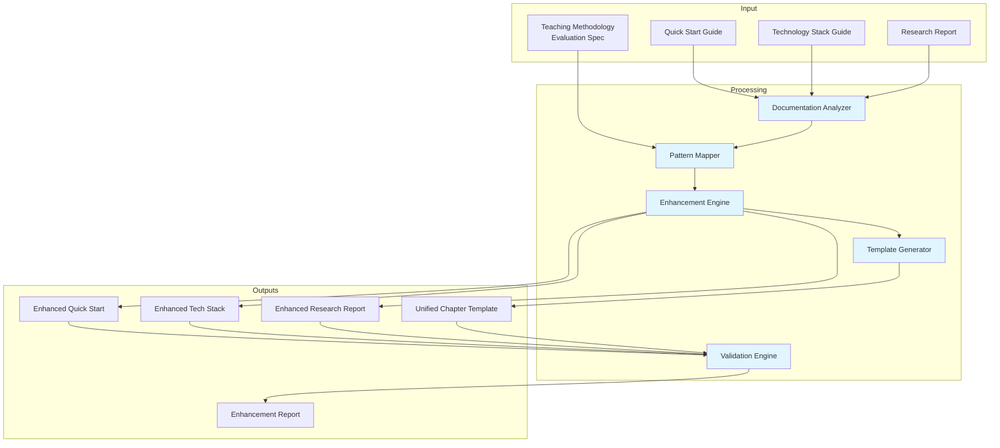
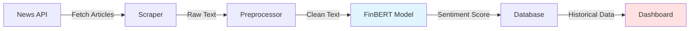

# Design Document: Capstone Pedagogical Enhancement

## Document Information

**Version**: 1.0  
**Last Updated**: 2026-05-03  
**Status**: Draft  
**Owner**: Curriculum Design Team  
**Related Documents**:
- Requirements: `requirements.md`
- Tasks: `tasks.md`

## Overview

This design document specifies the architecture and implementation approach for enhancing the capstone project documentation with evidence-based pedagogical patterns. The system will systematically integrate six key pedagogical improvements into three financial technology project guides while maintaining their practical, actionable nature.

### System Purpose

The Capstone Documentation Enhancer serves as a transformation tool to:
- Integrate evidence-based pedagogical patterns into existing project documentation
- Maintain technical accuracy while adding educational structure
- Create a unified chapter template for future project documentation
- Ensure projects prepare learners for technical interviews and professional work
- Support modern development practices (Git-native, AI-compatible, portfolio-ready)

### Enhancement Scope

The enhancement targets three capstone documentation files:
1. **Quick Start Guide** (`docs/quick-start-financial-projects.md`) - 6 project ideas with quick start guidance
2. **Technology Stack Guide** (`docs/technology-stack-comparison.md`) - Technology decision matrix and recommendations
3. **Research Report** (`docs/financial-market-projects-research-2026.md`) - Comprehensive market research and implementation roadmap

### Key Design Principles

1. **Preserve Technical Content**: All existing technical information must be retained
2. **Systematic Integration**: Apply pedagogical patterns consistently across all documents
3. **Practical Focus**: Maintain actionable, hands-on guidance
4. **Evidence-Based**: Ground all enhancements in teaching methodology evaluation research
5. **Template-Driven**: Create reusable patterns for future documentation
6. **Non-Disruptive**: Enhance rather than replace existing structure

## Architecture

### System Components



### Component Responsibilities

#### Documentation Analyzer
- Parses existing capstone documentation files
- Extracts structure (sections, subsections, code examples)
- Identifies code examples and technical content
- Identifies project descriptions and implementation guidance
- Creates structural map of each document
- Assesses current learning progression

#### Pattern Mapper
- Maps six pedagogical patterns to document sections
- Identifies integration points for each pattern
- Prioritizes integration points by learning impact
- Creates pattern integration plan
- Identifies opportunities for multiple pattern integration

#### Enhancement Engine
- Integrates code comprehension exercises
- Adds technical interview preparation elements
- Integrates professional workflow guidance
- Updates platform recommendations
- Adds scaffolding progression structure
- Adds multi-modal learning support
- Maintains existing technical content

#### Template Generator
- Creates unified chapter template
- Incorporates all six pedagogical patterns
- Provides implementation guidance
- Includes author checklist
- Provides examples and common mistakes
- Specifies platform requirements

#### Validation Engine
- Verifies pattern integration across all files
- Checks code comprehension precedes generation
- Verifies interview prep is distributed
- Validates professional workflow emphasis
- Checks platform recommendations
- Generates validation report

## Pedagogical Pattern Integration

### Pattern 1: Code Comprehension First

**Integration Approach:**
- Add "Explain in Plain English" (EiPE) exercises before all code examples
- Structure code learning as: read → explain → modify → create
- Add comprehension questions for complex code
- Include exercises on evaluating AI-generated code

**Example Integration:**
```markdown
### Before Enhancement:
```python
def get_stock_price(symbol):
    api_key = "YOUR_API_KEY"
    url = f"https://www.alphavantage.co/query?function=TIME_SERIES_DAILY&symbol={symbol}&apikey={api_key}"
    response = requests.get(url)
    data = response.json()
    return data
```

### After Enhancement:
**📖 Code Comprehension Exercise:**
Before writing any code, let's understand what this function does:

1. **Read the code above** and explain in plain English what it does
2. **Identify the inputs** - What does this function need to work?
3. **Trace the flow** - What happens step by step?
4. **Predict the output** - What does this function return?

<details>
<summary>✅ Sample Answer</summary>

This function fetches daily stock price data from Alpha Vantage API. It takes a stock symbol (like "AAPL"), constructs an API URL with the symbol and API key, makes an HTTP GET request, and returns the JSON response containing price data.

**Inputs:** Stock symbol string (e.g., "AAPL")  
**Flow:** Build URL → Make API request → Parse JSON → Return data  
**Output:** Dictionary containing time series price data
</details>

**🔧 Now Try It:**
```python
def get_stock_price(symbol):
    api_key = "YOUR_API_KEY"
    url = f"https://www.alphavantage.co/query?function=TIME_SERIES_DAILY&symbol={symbol}&apikey={api_key}"
    response = requests.get(url)
    data = response.json()
    return data
```

**🎯 Modification Exercise:**
Now that you understand the code, modify it to:
1. Add error handling for failed API requests
2. Extract just the closing price from the response
3. Add a parameter for the time interval (daily, weekly, monthly)
```

### Pattern 2: Technical Interview Preparation

**Integration Approach:**
- Add "explain your solution" exercises at project milestones
- Include think-aloud practice guidance
- Add mock interview scenarios
- Integrate peer code review mechanisms

**Example Integration:**
```markdown
### 🎤 Interview Practice: Explain Your Solution

**Scenario:** You're in a technical interview and need to explain your stock sentiment analyzer design.

**Practice Exercise:**
1. **Set a 5-minute timer**
2. **Explain out loud** (or to a peer) how your sentiment analyzer works
3. **Cover these points:**
   - What problem does it solve?
   - How does the architecture work?
   - What are the key technical decisions?
   - What trade-offs did you make?

**💡 Interview Tip:** Interviewers want to hear your thought process, not just the final answer. Practice explaining while you code!

**👥 Pair Programming Exercise:**
- **Driver:** Write code while explaining your reasoning out loud
- **Observer:** Ask clarifying questions, take notes on communication clarity
- **Switch roles** after 15 minutes
- **Debrief:** What communication patterns worked well?

**📝 Mock Interview Checkpoint:**
After completing this project milestone, schedule a 30-minute mock interview with a peer or mentor. Practice explaining your implementation decisions and handling technical questions.
```

### Pattern 3: Professional Workflow Integration

**Integration Approach:**
- Add Git workflow guidance to all projects
- Integrate testing practices
- Add deployment guidance
- Emphasize portfolio-building

**Example Integration:**
```markdown
### 🔧 Professional Workflow: Git + Testing + Deployment

**Git Workflow Practice:**
```bash
# 1. Create feature branch
git checkout -b feature/sentiment-analysis

# 2. Make incremental commits (not one giant commit!)
git add sentiment_analyzer.py
git commit -m "Add FinBERT sentiment scoring function"

git add tests/test_sentiment.py
git commit -m "Add unit tests for sentiment scoring"

# 3. Push and create pull request
git push -u origin feature/sentiment-analysis
```

**✅ Testing Practice:**
Write tests BEFORE implementing features (TDD approach):

```python
# tests/test_sentiment.py
def test_sentiment_analyzer_positive():
    """Test that positive news gets positive sentiment score."""
    text = "Company reports record profits and strong growth"
    score = analyze_sentiment(text)
    assert score > 0.5, "Positive news should have score > 0.5"

def test_sentiment_analyzer_negative():
    """Test that negative news gets negative sentiment score."""
    text = "Company faces bankruptcy and massive layoffs"
    score = analyze_sentiment(text)
    assert score < -0.5, "Negative news should have score < -0.5"
```

**Run tests:**
```bash
pytest tests/ -v
```

**🚀 Deployment as Portfolio Piece:**
Deploy your project so you can share it with employers:

1. **Deploy backend:** Railway, Heroku, or AWS
2. **Deploy frontend:** Vercel or Netlify
3. **Add to portfolio:** Include live demo link and GitHub repo
4. **Write README:** Explain what it does, tech stack, how to run it

**Portfolio README Template:**
```markdown
# Stock Sentiment Analyzer

Live Demo: https://your-project.vercel.app  
GitHub: https://github.com/yourusername/sentiment-analyzer

## What It Does
Analyzes financial news sentiment to predict stock movements using FinBERT NLP model.

## Tech Stack
- Python (FastAPI, pandas, transformers)
- React (frontend)
- PostgreSQL (database)
- Deployed on Railway + Vercel

## Key Features
- Real-time news scraping
- FinBERT sentiment analysis
- Historical accuracy tracking
- RESTful API

## How to Run Locally
[Installation instructions]
```
```

### Pattern 4: Platform and Tooling

**Integration Approach:**
- Update platform recommendations for Git-native design
- Add AI-compatibility considerations
- Emphasize reproducible execution
- Support deployment capabilities

**Example Integration:**
```markdown
### 🛠️ Platform Selection: Git-Native + AI-Compatible

**Recommended Platform: marimo (Python Reactive Notebooks)**

**Why marimo over Jupyter?**
- ✅ **Git-native:** Plain Python files (.py), not JSON
- ✅ **Clean diffs:** Easy to review changes in pull requests
- ✅ **AI-compatible:** Works seamlessly with Claude Code, GitHub Copilot
- ✅ **Reproducible:** Automatic dependency tracking, runs reliably when shared
- ✅ **Deployable:** Export as web app for portfolio
- ✅ **Reactive:** Cells auto-update when dependencies change

**Installation:**
```bash
pip install marimo
marimo tutorial intro
```

**Create your first notebook:**
```bash
marimo edit sentiment_analyzer.py
```

**Deploy as web app:**
```bash
marimo run sentiment_analyzer.py
# Now accessible at http://localhost:8080
```

**Alternative Platforms:**
| Platform | Git-Native | AI-Compatible | Deployable | Best For |
|----------|-----------|---------------|------------|----------|
| marimo | ✅ | ✅ | ✅ | Learning + Portfolio |
| Jupyter | ❌ | ⚠️ | ⚠️ | Quick prototyping |
| Quarto | ✅ | ✅ | ✅ | Documentation-heavy |
| VS Code + .py | ✅ | ✅ | ✅ | Production code |
```

### Pattern 5: Scaffolding Progression

**Integration Approach:**
- Structure learning as: worked example → partial example → independent problem
- Ensure code comprehension precedes generation
- Add progressive complexity layering

**Example Integration:**
```markdown
### 📚 Learning Progression: Worked → Partial → Independent

**Level 1: Worked Example (Read & Understand)**
Here's a complete sentiment analyzer. Study how it works:

```python
# Complete implementation with detailed comments
def analyze_sentiment(text):
    """Analyze sentiment of financial news text."""
    # Load pre-trained FinBERT model
    model = load_finbert_model()
    
    # Tokenize input text
    tokens = tokenize(text)
    
    # Get sentiment scores
    scores = model.predict(tokens)
    
    # Return sentiment label and confidence
    return {
        'label': scores.argmax(),
        'confidence': scores.max()
    }
```

**📖 Comprehension Check:**
- What does this function take as input?
- What model is being used?
- What does it return?

---

**Level 2: Partial Example (Fill in the Blanks)**
Now complete this partially-implemented version:

```python
def analyze_sentiment_batch(texts):
    """Analyze sentiment for multiple texts efficiently."""
    model = load_finbert_model()
    results = []
    
    # TODO: Implement batch processing
    # Hint: Process all texts at once instead of one by one
    # This is much faster for large datasets
    
    for text in texts:
        # YOUR CODE HERE
        pass
    
    return results
```

**💡 Hints:**
- Use `model.predict_batch()` instead of calling `predict()` in a loop
- Tokenize all texts together
- Return a list of sentiment dictionaries

---

**Level 3: Independent Problem (Build from Scratch)**
Now build your own feature without scaffolding:

**Challenge:** Implement a sentiment trend analyzer that:
1. Fetches news for a stock over the past 7 days
2. Analyzes sentiment for each day
3. Calculates the sentiment trend (improving/declining)
4. Returns a buy/sell/hold recommendation

**Requirements:**
- Use the `analyze_sentiment()` function you learned
- Handle API rate limits
- Include error handling
- Write unit tests

**No code provided - you've got this! 🚀**
```

### Pattern 6: Multi-Modal Learning

**Integration Approach:**
- Add visual explanations (diagrams, concept maps)
- Ensure hands-on exercises for all concepts
- Maintain conversational tone

**Example Integration:**
```markdown
### 📊 System Architecture (Visual)



**🎯 Hands-On Exercise:**
Let's build each component step by step:

**Step 1: News Scraper (15 minutes)**
```python
# You'll build this
```

**Step 2: Text Preprocessor (10 minutes)**
```python
# You'll build this
```

**💬 Conversational Explanation:**
Think of the sentiment analyzer like a restaurant review system. The News API is like Yelp (provides reviews), the Scraper is like a web crawler (collects reviews), the Preprocessor is like a spell-checker (cleans up text), and FinBERT is like a food critic (judges if reviews are positive or negative). Finally, the Dashboard is like the restaurant's rating page (shows the overall sentiment).

**🎨 Visual Progress Tracker:**
```
Project Completion: [████████░░] 80%

✅ News scraping
✅ Sentiment analysis  
✅ Database integration
⏳ Dashboard (in progress)
☐ Deployment
```
```

## Unified Chapter Template

### Template Structure

```markdown
# [Project Name]: [One-Line Description]

**Build Time:** [X weeks]  
**Difficulty:** ⭐⭐⭐☆☆  
**Portfolio-Ready:** ✅ Deployable as web app

## 📋 What You'll Learn

**Technical Skills:**
- [Skill 1]
- [Skill 2]
- [Skill 3]

**Professional Skills:**
- Git workflow and code review
- Testing and deployment
- Technical communication

**Interview Prep:**
- System design practice
- Code explanation exercises
- Think-aloud problem-solving

---

## 🎯 Project Overview

### What It Does
[Clear, concise description]

### Why Build This?
[Real-world relevance, career value]

### Architecture Overview
[Mermaid diagram showing system components]

---

## 📚 Prerequisites

**Before You Start:**
- [ ] Understand [prerequisite concept 1]
- [ ] Complete [prerequisite project/tutorial]
- [ ] Set up development environment

**📖 Comprehension Check:**
[Quick quiz to verify prerequisites]

---

## 🛠️ Tech Stack

### Recommended Stack
[Platform and technology recommendations with Git-native, AI-compatible emphasis]

### Alternative Options
[Comparison table with trade-offs]

---

## 🚀 Implementation Guide

### Phase 1: Foundation (Worked Example)
**Goal:** Understand the core concept

**📖 Code Comprehension:**
[Worked example with EiPE exercises]

**🎤 Explain It:**
[Think-aloud practice prompt]

---

### Phase 2: Core Features (Partial Example)
**Goal:** Build with scaffolding

**🔧 Implementation:**
[Partial code with TODOs]

**✅ Testing:**
[Test cases to write]

**🔄 Git Workflow:**
[Commit and branch guidance]

---

### Phase 3: Advanced Features (Independent)
**Goal:** Build without scaffolding

**💡 Challenge:**
[Feature requirements without code]

**🎤 Interview Practice:**
[Mock interview scenario]

**👥 Peer Review:**
[Code review checklist]

---

## 🚀 Deployment & Portfolio

### Deploy Your Project
[Step-by-step deployment guide]

### Portfolio Presentation
[README template, demo video guidance]

### Share Your Work
[GitHub, LinkedIn, portfolio site]

---

## ✅ Validation Checklist

**Technical Completion:**
- [ ] All features implemented
- [ ] Tests passing
- [ ] Deployed and accessible
- [ ] README complete

**Professional Skills:**
- [ ] Git history shows incremental commits
- [ ] Code reviewed by peer
- [ ] Deployed as portfolio piece

**Interview Readiness:**
- [ ] Can explain architecture in 5 minutes
- [ ] Practiced think-aloud coding
- [ ] Completed mock interview

---

## 📚 Next Steps

**Extend This Project:**
- [Enhancement idea 1]
- [Enhancement idea 2]

**Related Projects:**
- [Next project in learning path]

**Interview Prep:**
- [Related interview questions to practice]
```

### Template Usage Guidelines

**When to Use Each Section:**
1. **Project Overview** - Always required, sets context
2. **Prerequisites** - Required for intermediate/advanced projects
3. **Tech Stack** - Always required, emphasize Git-native and AI-compatible options
4. **Implementation Guide** - Always required, follow scaffolding progression
5. **Deployment & Portfolio** - Always required, emphasize career readiness
6. **Validation Checklist** - Always required, verify all patterns integrated

**Adaptation Points:**
- Adjust difficulty level based on target audience
- Scale scaffolding based on concept complexity
- Vary interview practice based on project type
- Customize deployment based on tech stack

## Implementation Workflow

### Phase 1: Analysis (Week 1)
1. Parse all three capstone documentation files
2. Extract structure and identify content types
3. Map pedagogical patterns to sections
4. Create enhancement plan with priorities

### Phase 2: Pattern Integration (Weeks 2-4)
1. Integrate Code Comprehension First pattern
2. Add Technical Interview Preparation elements
3. Integrate Professional Workflow guidance
4. Update Platform and Tooling recommendations
5. Add Scaffolding Progression structure
6. Add Multi-Modal Learning support

### Phase 3: Template Creation (Week 5)
1. Create unified chapter template
2. Apply template to one sample project
3. Document template usage guidelines
4. Create before/after comparison

### Phase 4: Validation (Week 6)
1. Verify all patterns integrated
2. Check distribution across documents
3. Validate code comprehension precedes generation
4. Verify interview prep is distributed
5. Generate validation report

## Validation Criteria

### Pattern Integration Checklist

**Code Comprehension First:**
- [ ] EiPE exercises before all code examples
- [ ] Read → explain → modify → create progression
- [ ] Comprehension questions for complex code
- [ ] AI-generated code evaluation exercises

**Technical Interview Preparation:**
- [ ] "Explain your solution" exercises at milestones
- [ ] Think-aloud practice guidance
- [ ] Mock interview scenarios
- [ ] Peer code review mechanisms
- [ ] Distributed throughout (not isolated)

**Professional Workflow:**
- [ ] Git workflow guidance in all projects
- [ ] Testing practices integrated
- [ ] Deployment guidance provided
- [ ] Portfolio-building emphasized
- [ ] Professional practices throughout

**Platform and Tooling:**
- [ ] Git-native platforms recommended
- [ ] AI-compatibility considered
- [ ] Reproducible execution supported
- [ ] Deployment capabilities emphasized

**Scaffolding Progression:**
- [ ] Worked → partial → independent structure
- [ ] Code comprehension before generation
- [ ] Progressive complexity layering

**Multi-Modal Learning:**
- [ ] Visual explanations (diagrams)
- [ ] Hands-on exercises for all concepts
- [ ] Conversational tone maintained

### Quality Metrics

**Coverage:**
- All three documentation files enhanced
- All six patterns integrated
- Patterns distributed throughout documents

**Consistency:**
- Same pattern implementation across files
- Consistent terminology and structure
- Unified template applied

**Preservation:**
- All original technical content retained
- Practical, actionable guidance maintained
- Document structure preserved where appropriate

## Error Handling

### Documentation Parsing Errors

**Error Type**: Malformed Markdown  
**Handling Strategy**:
- Validate Markdown syntax before processing
- Log specific line numbers and syntax errors
- Provide clear error messages with correction guidance
- Continue processing other documents if one fails

**Error Type**: Missing Required Sections  
**Handling Strategy**:
- Identify missing sections during analysis phase
- Generate warning report listing missing sections
- Provide template sections to add
- Allow partial processing with warnings

### Pattern Integration Errors

**Error Type**: Code Example Without Context  
**Handling Strategy**:
- Flag code blocks lacking surrounding explanation
- Suggest comprehension exercise placement
- Provide template EiPE questions
- Allow manual review before integration

**Error Type**: Conflicting Pattern Placement  
**Handling Strategy**:
- Detect overlapping pattern integration points
- Prioritize by pedagogical impact
- Merge compatible patterns
- Flag conflicts for manual resolution

### Template Application Errors

**Error Type**: Template Section Mismatch  
**Handling Strategy**:
- Identify sections that don't fit template structure
- Provide adaptation guidance
- Allow custom section mapping
- Document deviations from template

**Error Type**: Content Loss During Restructuring  
**Handling Strategy**:
- Create backup of original content
- Track all content movements
- Validate no content deleted
- Provide diff report showing all changes

### Validation Errors

**Error Type**: Pattern Integration Incomplete  
**Handling Strategy**:
- Generate detailed validation report
- List specific missing patterns by section
- Provide remediation checklist
- Allow iterative validation

**Error Type**: Code Comprehension Not Before Generation  
**Handling Strategy**:
- Identify all violations
- Suggest reordering
- Provide correct sequence examples
- Require manual approval for exceptions

## Testing Strategy

### Why Property-Based Testing Does NOT Apply

Property-based testing (PBT) is **not appropriate** for this feature because:

1. **Declarative Transformation**: This system performs document transformation based on pedagogical templates, similar to Infrastructure as Code. The output quality is subjective and context-dependent, not a universal property.

2. **No Pure Functions**: The core operations (pattern integration, template application) are complex text transformations with subjective quality criteria, not pure functions with clear input/output relationships.

3. **Subjective Quality**: "Good" pedagogical integration cannot be reduced to computable properties. Quality depends on context, audience, and pedagogical judgment.

4. **One-Shot Operations**: Each document is transformed once based on specific content, not repeatedly with varying inputs that would benefit from randomized testing.

5. **Human Judgment Required**: Validation requires human review of pedagogical effectiveness, not automated property verification.

### Testing Approach

Instead of property-based testing, this feature uses:

#### Unit Tests
Test individual components with specific examples:

**Documentation Analyzer Tests:**
```python
def test_parse_markdown_structure():
    """Test that Markdown structure is correctly extracted."""
    markdown = """
    # Section 1
    ## Subsection 1.1
    ```python
    code_example()
    ```
    """
    analyzer = DocumentationAnalyzer()
    structure = analyzer.parse(markdown)
    
    assert len(structure.sections) == 1
    assert structure.sections[0].title == "Section 1"
    assert len(structure.sections[0].subsections) == 1
    assert len(structure.sections[0].code_examples) == 1

def test_identify_code_examples():
    """Test that code examples are correctly identified."""
    markdown = "```python\nprint('hello')\n```"
    analyzer = DocumentationAnalyzer()
    examples = analyzer.extract_code_examples(markdown)
    
    assert len(examples) == 1
    assert examples[0].language == "python"
    assert "print('hello')" in examples[0].code
```

**Pattern Mapper Tests:**
```python
def test_map_code_comprehension_pattern():
    """Test that code comprehension pattern is mapped to code examples."""
    structure = DocumentStructure(
        sections=[Section(code_examples=[CodeExample(...)])]
    )
    mapper = PatternMapper()
    mapping = mapper.map_patterns(structure)
    
    assert "code_comprehension" in mapping
    assert len(mapping["code_comprehension"]) > 0

def test_prioritize_integration_points():
    """Test that integration points are prioritized by impact."""
    opportunities = [
        Opportunity(impact="high", effort="low"),
        Opportunity(impact="low", effort="high"),
        Opportunity(impact="high", effort="high"),
    ]
    mapper = PatternMapper()
    prioritized = mapper.prioritize(opportunities)
    
    assert prioritized[0].impact == "high"
    assert prioritized[0].effort == "low"
```

**Enhancement Engine Tests:**
```python
def test_add_eipe_exercise():
    """Test that EiPE exercise is correctly added before code."""
    code_example = CodeExample(
        language="python",
        code="def get_stock_price(symbol): ..."
    )
    engine = EnhancementEngine()
    enhanced = engine.add_eipe_exercise(code_example)
    
    assert "📖 Code Comprehension Exercise:" in enhanced
    assert "Read the code above" in enhanced
    assert code_example.code in enhanced

def test_add_interview_practice():
    """Test that interview practice is added to milestone."""
    milestone = ProjectMilestone(
        title="Complete Sentiment Analyzer",
        description="..."
    )
    engine = EnhancementEngine()
    enhanced = engine.add_interview_practice(milestone)
    
    assert "🎤 Interview Practice:" in enhanced
    assert "Explain Your Solution" in enhanced
```

**Template Generator Tests:**
```python
def test_generate_unified_template():
    """Test that unified template includes all six patterns."""
    generator = TemplateGenerator()
    template = generator.create_unified_template()
    
    assert "Code Comprehension Exercise" in template
    assert "Interview Practice" in template
    assert "Professional Workflow" in template
    assert "Platform Selection" in template
    assert "Learning Progression" in template
    assert "Multi-Modal" in template

def test_apply_template_to_project():
    """Test that template can be applied to existing project."""
    project = Project(title="Stock Sentiment Analyzer", ...)
    generator = TemplateGenerator()
    restructured = generator.apply_template(project)
    
    assert restructured.has_section("Code Comprehension")
    assert restructured.has_section("Interview Practice")
    assert len(restructured.sections) >= len(project.sections)
```

**Validation Engine Tests:**
```python
def test_validate_pattern_integration():
    """Test that validation detects missing patterns."""
    document = Document(sections=[...])
    validator = ValidationEngine()
    report = validator.validate(document)
    
    assert report.has_code_comprehension == True
    assert report.has_interview_prep == True
    assert report.has_professional_workflow == True

def test_validate_comprehension_before_generation():
    """Test that validation detects incorrect ordering."""
    document = Document(sections=[
        Section(type="code_generation"),
        Section(type="code_comprehension")  # Wrong order!
    ])
    validator = ValidationEngine()
    violations = validator.check_comprehension_order(document)
    
    assert len(violations) > 0
    assert "comprehension must precede generation" in violations[0]
```

#### Integration Tests
Test complete workflows with realistic data:

**End-to-End Enhancement Test:**
```python
def test_enhance_quick_start_guide():
    """Test complete enhancement of Quick Start Guide."""
    # Load actual Quick Start Guide
    with open("docs/quick-start-financial-projects.md") as f:
        original = f.read()
    
    # Run enhancement pipeline
    analyzer = DocumentationAnalyzer()
    mapper = PatternMapper()
    engine = EnhancementEngine()
    
    structure = analyzer.parse(original)
    mapping = mapper.map_patterns(structure)
    enhanced = engine.enhance(original, mapping)
    
    # Validate enhancements
    assert "📖 Code Comprehension Exercise:" in enhanced
    assert "🎤 Interview Practice:" in enhanced
    assert "🔧 Professional Workflow:" in enhanced
    assert len(enhanced) > len(original)  # Content added
    assert all(section in enhanced for section in structure.sections)  # No content lost

def test_template_application_workflow():
    """Test complete template application workflow."""
    # Load sample project
    project = load_project("docs/quick-start-financial-projects.md")
    
    # Generate and apply template
    generator = TemplateGenerator()
    template = generator.create_unified_template()
    restructured = generator.apply_template(project, template)
    
    # Validate result
    validator = ValidationEngine()
    report = validator.validate(restructured)
    
    assert report.all_patterns_present == True
    assert report.comprehension_before_generation == True
    assert report.interview_prep_distributed == True
```

#### Manual Validation Tests
Human review required for:

**Pedagogical Quality:**
- Are EiPE exercises appropriate for the code complexity?
- Do interview scenarios match project milestones?
- Is scaffolding progression smooth and logical?
- Are multi-modal elements helpful or distracting?

**Content Preservation:**
- Is all original technical content retained?
- Are code examples still accurate?
- Are project descriptions still clear?

**Usability:**
- Can learners follow the enhanced documentation?
- Is the structure intuitive?
- Are exercises at appropriate difficulty?

### Test Coverage Goals

- **Unit Tests**: 80% code coverage
- **Integration Tests**: All major workflows covered
- **Manual Validation**: 100% of enhanced documents reviewed by curriculum designer

### Testing Tools

- **Unit Testing**: pytest
- **Markdown Parsing**: python-markdown, mistune
- **Diff Generation**: difflib
- **Validation**: Custom validation engine
- **Manual Review**: GitHub pull request review process

## Change Log

| Version | Date | Changes | Author |
|---------|------|---------|--------|
| 1.0 | 2026-05-03 | Initial design document | Curriculum Design Team |
| 1.1 | 2026-05-03 | Added Error Handling and Testing Strategy sections; clarified PBT not applicable | Curriculum Design Team |
