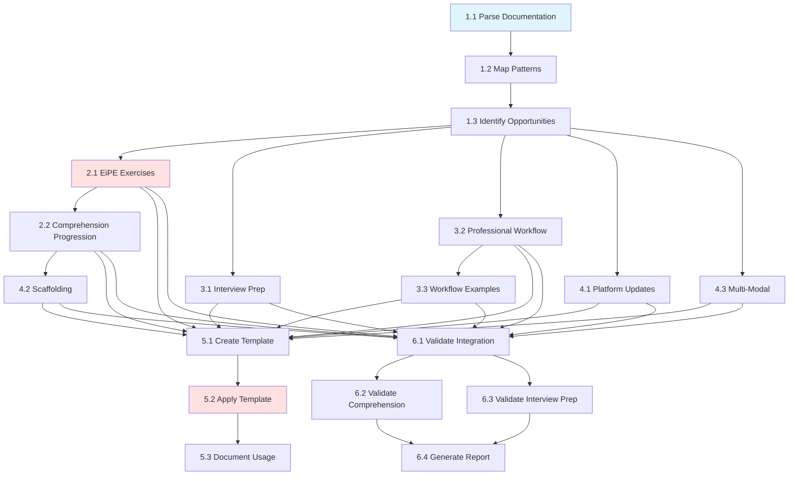

# Implementation Plan: Capstone Pedagogical Enhancement

## Overview

This implementation plan transforms three capstone documentation files by integrating six evidence-based pedagogical patterns. The approach follows a systematic workflow: analyze existing documentation, integrate pedagogical patterns, create a unified template, and validate the enhancements.

**Target Files:**
- `docs/quick-start-financial-projects.md`
- `docs/technology-stack-comparison.md`
- `docs/financial-market-projects-research-2026.md`

**Pedagogical Patterns to Integrate:**
1. Code Comprehension First (EiPE exercises, read → explain → modify → create)
2. Technical Interview Preparation (think-aloud, mock interviews)
3. Professional Workflow (Git, testing, deployment, portfolio)
4. Platform & Tooling (Git-native, AI-compatible)
5. Scaffolding Progression (worked → partial → independent)
6. Multi-Modal Learning (visual, hands-on, conversational)

## Tasks

### Phase 1: Analysis

#### 1.1 - Parse and Analyze Existing Documentation
**Status**: `[ ]`  
**Phase**: Analysis  
**Effort**: 2 days  
**Dependencies**: None  
**Requirements**: Req 1

Parse all three capstone documentation files and extract structure.

**Deliverables**:
- Structural map of Quick Start Guide
- Structural map of Technology Stack Guide
- Structural map of Research Report
- List of code examples in each document
- List of project descriptions
- Current learning progression assessment

**Acceptance Criteria**:
- [ ] All three files parsed successfully
- [ ] Structure extracted (sections, subsections, code examples)
- [ ] Code examples identified and cataloged
- [ ] Project descriptions identified
- [ ] Structural maps created for each document
- [ ] Current learning progression documented

---

#### 1.2 - Map Pedagogical Patterns to Document Sections
**Status**: `[ ]`  
**Phase**: Analysis  
**Effort**: 2 days  
**Dependencies**: 1.1  
**Requirements**: Req 2

Map the six pedagogical patterns to specific sections of each document.

**Deliverables**:
- Pattern mapping document
- Integration points for each pattern
- Priority ranking of integration points
- Multi-pattern integration opportunities

**Acceptance Criteria**:
- [ ] All six patterns mapped to document sections
- [ ] At least 3 integration points identified per pattern
- [ ] Integration points prioritized by learning impact
- [ ] Multi-pattern opportunities identified
- [ ] Patterns distributed throughout documents

---

#### 1.3 - Identify and Prioritize Enhancement Opportunities
**Status**: `[ ]`  
**Phase**: Analysis  
**Effort**: 2 days  
**Dependencies**: 1.2  
**Requirements**: Req 3

Identify specific enhancement opportunities and create prioritized roadmap.

**Deliverables**:
- List of enhancement opportunities
- Effort estimates (low, medium, high)
- Impact estimates (low, medium, high)
- Prioritized enhancement roadmap

**Acceptance Criteria**:
- [ ] Code examples lacking comprehension exercises identified
- [ ] Projects lacking interview prep identified
- [ ] Content lacking workflow context identified
- [ ] Platform recommendations needing updates identified
- [ ] Content lacking scaffolding identified
- [ ] Opportunities prioritized by impact-to-effort ratio
- [ ] Enhancement roadmap created

---

### Phase 2: Code Comprehension Pattern

#### 2.1 - Integrate EiPE Exercises for All Code Examples
**Status**: `[ ]`  
**Phase**: Code Comprehension Pattern  
**Effort**: 5 days  
**Dependencies**: 1.3  
**Requirements**: Req 4

Add "Explain in Plain English" exercises before all code examples.

**Deliverables**:
- EiPE exercises for all code examples in Quick Start Guide
- EiPE exercises for all code examples in Technology Stack Guide
- EiPE exercises for all code examples in Research Report
- Sample answers for comprehension exercises

**Acceptance Criteria**:
- [ ] EiPE exercises added before all code examples
- [ ] Exercises ask learners to explain what code does
- [ ] Comprehension questions added for complex code
- [ ] Sample answers provided in collapsible sections
- [ ] Exercises reference AI-era programming education research

---

#### 2.2 - Implement Comprehension-First Progression
**Status**: `[ ]`  
**Phase**: Code Comprehension Pattern  
**Effort**: 4 days  
**Dependencies**: 2.1  
**Requirements**: Req 4

Structure all code learning as: read → explain → modify → create.

**Deliverables**:
- Restructured code examples following progression
- Modification exercises for existing code
- AI-generated code evaluation exercises
- Guidance on reading codebases before modifying

**Acceptance Criteria**:
- [ ] All code examples follow read → explain → modify → create
- [ ] Comprehension exercises precede generation exercises
- [ ] Modification exercises added
- [ ] AI code evaluation exercises included
- [ ] Guidance on reading codebases added

---

### Phase 3: Interview & Workflow Patterns

#### 3.1 - Integrate Technical Interview Preparation
**Status**: `[ ]`  
**Phase**: Interview & Workflow Patterns  
**Effort**: 5 days  
**Dependencies**: 1.3  
**Requirements**: Req 5

Add interview preparation elements throughout all projects.

**Deliverables**:
- "Explain your solution" exercises at project milestones
- Think-aloud practice guidance
- Mock interview scenarios
- Peer code review mechanisms
- Communication skills practice

**Acceptance Criteria**:
- [ ] "Explain your solution" exercises added to all major milestones
- [ ] Think-aloud practice guidance added
- [ ] Mock interview scenarios added for key concepts
- [ ] Peer code review mechanisms integrated
- [ ] Interview prep distributed throughout (not isolated)
- [ ] References 54% pass rate problem
- [ ] Communication skills practice included

---

#### 3.2 - Integrate Professional Workflow Practices
**Status**: `[ ]`  
**Phase**: Interview & Workflow Patterns  
**Effort**: 5 days  
**Dependencies**: 1.3  
**Requirements**: Req 6

Add professional workflow guidance to all projects.

**Deliverables**:
- Git workflow guidance for all projects
- Testing practice guidance (unit tests, integration tests, TDD)
- Deployment guidance for all projects
- Code review practice
- Portfolio-building guidance

**Acceptance Criteria**:
- [ ] Git workflow guidance added to all projects
- [ ] Testing practices integrated (unit, integration, TDD)
- [ ] Deployment guidance added for all projects
- [ ] Code review practice added
- [ ] Portfolio-building emphasized
- [ ] Professional workflow integrated throughout
- [ ] CI/CD pipeline guidance added where appropriate
- [ ] Documentation best practices included

---

#### 3.3 - Add Professional Workflow Examples
**Status**: `[ ]`  
**Phase**: Interview & Workflow Patterns  
**Effort**: 3 days  
**Dependencies**: 3.2  
**Requirements**: Req 6

Add concrete examples of professional workflows.

**Deliverables**:
- Git workflow examples (commit, branch, PR)
- Test code examples
- Deployment scripts and guidance
- Portfolio README templates

**Acceptance Criteria**:
- [ ] Git workflow examples added
- [ ] Test code examples provided
- [ ] Deployment scripts included
- [ ] Portfolio README templates provided
- [ ] Examples reference 2024-2026 research

---

### Phase 4: Platform & Scaffolding Patterns

#### 4.1 - Update Platform and Tooling Recommendations
**Status**: `[ ]`  
**Phase**: Platform & Scaffolding Patterns  
**Effort**: 4 days  
**Dependencies**: 1.3  
**Requirements**: Req 7

Update platform recommendations for Git-native and AI-compatible tools.

**Deliverables**:
- Updated Technology Stack Guide with Git-native platforms
- AI-compatibility assessments
- Reproducible execution guidance
- Deployment capability assessments
- Platform comparison tables

**Acceptance Criteria**:
- [ ] Platform recommendations evaluated against Git-native criteria
- [ ] AI-compatibility criteria added
- [ ] Reproducible execution criteria added
- [ ] Deployment as portfolio pieces emphasized
- [ ] Reactive notebook recommendations added (e.g., marimo)
- [ ] Platform comparison tables updated
- [ ] References 2024-2026 research on reproducibility

---

#### 4.2 - Integrate Scaffolding Progression
**Status**: `[ ]`  
**Phase**: Platform & Scaffolding Patterns  
**Effort**: 5 days  
**Dependencies**: 2.2  
**Requirements**: Req 8

Structure project learning with scaffolding progression.

**Deliverables**:
- Worked examples for complex concepts
- Partial examples with TODOs
- Independent problems without scaffolding
- Progressive complexity layering
- Scaffolding transition guidance

**Acceptance Criteria**:
- [ ] Projects structured as: worked → partial → independent
- [ ] Code comprehension precedes generation
- [ ] Worked examples added for complex concepts
- [ ] Partial examples with TODOs added
- [ ] Independent problems added
- [ ] Progressive complexity layering implemented
- [ ] Scaffolding transitions clear

---

#### 4.3 - Integrate Multi-Modal Learning Support
**Status**: `[ ]`  
**Phase**: Platform & Scaffolding Patterns  
**Effort**: 4 days  
**Dependencies**: 1.3  
**Requirements**: Req 9

Add multi-modal learning elements to all documents.

**Deliverables**:
- Architecture diagrams (Mermaid)
- Concept maps for complex topics
- Hands-on exercises for all major concepts
- Conversational explanations
- Visual progress indicators

**Acceptance Criteria**:
- [ ] Visual explanations added (diagrams, concept maps)
- [ ] Hands-on exercises present for all major concepts
- [ ] Conversational tone maintained
- [ ] Architecture diagrams added
- [ ] Flowcharts added for processes
- [ ] Visual progress indicators added

---

### Phase 5: Template Creation

#### 5.1 - Create Unified Chapter Template
**Status**: `[ ]`  
**Phase**: Template Creation  
**Effort**: 4 days  
**Dependencies**: Phase 2, Phase 3, Phase 4  
**Requirements**: Req 10

Create unified chapter template incorporating all six patterns.

**Deliverables**:
- Unified chapter template in Markdown
- Template sections with pedagogical rationale
- Author checklist
- Common mistakes guide
- Platform requirements specification
- Adaptation guidance

**Acceptance Criteria**:
- [ ] Template incorporates all six pedagogical patterns
- [ ] Sections for code comprehension exercises included
- [ ] Sections for interview preparation included
- [ ] Sections for professional workflow included
- [ ] Platform recommendations section included
- [ ] Scaffolding progression structure included
- [ ] Multi-modal elements included
- [ ] Inline comments explain pedagogical rationale
- [ ] Author checklist provided
- [ ] Common mistakes documented
- [ ] Platform format requirements specified
- [ ] Adaptation guidance provided

---

#### 5.2 - Apply Template to Sample Project
**Status**: `[ ]`  
**Phase**: Template Creation  
**Effort**: 5 days  
**Dependencies**: 5.1  
**Requirements**: Req 11

Apply unified template to one sample project.

**Deliverables**:
- Restructured sample project using template
- Before/after comparison
- Template adjustment documentation
- Application guide

**Acceptance Criteria**:
- [ ] One project selected for template application
- [ ] Project restructured using unified template
- [ ] All six patterns present in restructured project
- [ ] Original technical content maintained
- [ ] Learning progression improved
- [ ] All template sections added
- [ ] Before/after comparison provided
- [ ] Template adjustments documented
- [ ] Application guide created

---

#### 5.3 - Document Template Usage Guidelines
**Status**: `[ ]`  
**Phase**: Template Creation  
**Effort**: 2 days  
**Dependencies**: 5.2  
**Requirements**: Req 10, Req 11

Create comprehensive template usage documentation.

**Deliverables**:
- Template usage guide
- Section-by-section guidance
- Adaptation examples
- Quality checklist

**Acceptance Criteria**:
- [ ] Usage guide created
- [ ] When to use each section documented
- [ ] Adaptation points explained
- [ ] Examples for different project types provided
- [ ] Quality checklist included

---

### Phase 6: Validation

#### 6.1 - Validate Pattern Integration Across All Files
**Status**: `[ ]`  
**Phase**: Validation  
**Effort**: 3 days  
**Dependencies**: Phase 2, Phase 3, Phase 4  
**Requirements**: Req 12

Verify all patterns correctly integrated across all three files.

**Deliverables**:
- Pattern integration checklist
- Coverage analysis
- Distribution analysis
- Gap identification

**Acceptance Criteria**:
- [ ] All three files include code comprehension exercises
- [ ] All three files include interview preparation
- [ ] All three files include professional workflow guidance
- [ ] Platform recommendations support Git-native and AI-compatible
- [ ] Scaffolding progression present in all projects
- [ ] Multi-modal support present in all files
- [ ] Patterns distributed throughout (not clustered)

---

#### 6.2 - Validate Code Comprehension Precedes Generation
**Status**: `[ ]`  
**Phase**: Validation  
**Effort**: 2 days  
**Dependencies**: 6.1  
**Requirements**: Req 12

Verify comprehension exercises come before generation exercises.

**Deliverables**:
- Code example sequence analysis
- Violations list
- Corrections

**Acceptance Criteria**:
- [ ] All code examples have comprehension before generation
- [ ] EiPE exercises precede code writing
- [ ] Read → explain → modify → create sequence verified
- [ ] Violations identified and corrected

---

#### 6.3 - Validate Interview Prep Distribution
**Status**: `[ ]`  
**Phase**: Validation  
**Effort**: 2 days  
**Dependencies**: 6.1  
**Requirements**: Req 12

Verify interview preparation is distributed throughout, not isolated.

**Deliverables**:
- Interview prep distribution map
- Integration analysis
- Recommendations for improvement

**Acceptance Criteria**:
- [ ] Interview prep present in all three files
- [ ] Interview prep distributed throughout documents
- [ ] Not isolated to single section
- [ ] Think-aloud practice integrated
- [ ] Mock interview scenarios distributed

---

#### 6.4 - Generate Validation Report
**Status**: `[ ]`  
**Phase**: Validation  
**Effort**: 2 days  
**Dependencies**: 6.1, 6.2, 6.3  
**Requirements**: Req 12

Generate comprehensive validation report.

**Deliverables**:
- Validation report with all checks
- Pass/fail status for each criterion
- Recommendations for corrections
- Quality metrics

**Acceptance Criteria**:
- [ ] Validation report generated
- [ ] All checks listed with pass/fail status
- [ ] Specific recommendations provided for failures
- [ ] Coverage metrics included
- [ ] Consistency metrics included
- [ ] Preservation metrics included

---

## Summary

**Total Tasks**: 18  
**Total Effort**: 61 person-days  
**Completed**: 0 (0%)  
**In Progress**: 0  
**Blocked**: 0  
**Pending**: 18

### Phase Breakdown

| Phase | Tasks | Effort (days) | Status | Completion % |
|-------|-------|---------------|--------|--------------|
| Phase 1: Analysis | 3 | 6 | Pending | 0% |
| Phase 2: Code Comprehension Pattern | 2 | 9 | Pending | 0% |
| Phase 3: Interview & Workflow Patterns | 3 | 13 | Pending | 0% |
| Phase 4: Platform & Scaffolding Patterns | 3 | 13 | Pending | 0% |
| Phase 5: Template Creation | 3 | 11 | Pending | 0% |
| Phase 6: Validation | 4 | 9 | Pending | 0% |
| **Total** | **18** | **61** | - | **0%** |

### Timeline Estimates

- **Sequential**: ~61 days (12 weeks / 3 months)
- **With Parallelization**: ~45 days (9 weeks / 2 months)
- **Optimistic** (with 2 developers): ~35 days (7 weeks)
- **Pessimistic** (with delays): ~75 days (15 weeks)

### Critical Path

```
1.1 → 1.2 → 1.3 → 2.1 → 2.2 → 5.1 → 5.2 → 5.3 → 6.1 → 6.2 → 6.3 → 6.4
```

**Critical Path Duration**: ~41 days

### Parallelization Opportunities

**Phase 3-4 (Pattern Integration)** can be parallelized:
- Team A: Tasks 3.1, 3.2, 3.3 (Interview & Workflow)
- Team B: Tasks 4.1, 4.2, 4.3 (Platform & Scaffolding)

**Estimated Parallel Duration**: 13 days (longest phase)

### Requirements Coverage

| Requirement | Tasks | Status |
|-------------|-------|--------|
| Req 1 | 1.1 | Pending |
| Req 2 | 1.2 | Pending |
| Req 3 | 1.3 | Pending |
| Req 4 | 2.1, 2.2 | Pending |
| Req 5 | 3.1 | Pending |
| Req 6 | 3.2, 3.3 | Pending |
| Req 7 | 4.1 | Pending |
| Req 8 | 4.2 | Pending |
| Req 9 | 4.3 | Pending |
| Req 10 | 5.1, 5.3 | Pending |
| Req 11 | 5.2 | Pending |
| Req 12 | 6.1, 6.2, 6.3, 6.4 | Pending |

### Risk Assessment

**High Risk Tasks**:
- **2.1** - Integrating EiPE exercises (requires careful placement)
- **3.1** - Interview preparation integration (must be distributed, not isolated)
- **5.2** - Template application (may reveal template issues)

**Medium Risk Tasks**:
- **4.2** - Scaffolding progression (complex restructuring)
- **6.1** - Pattern validation (comprehensive checking)

**Mitigation Strategies**:
- Start high-risk tasks early
- Review pattern integration incrementally
- Test template on small section before full application
- Get peer review on pattern placement

---

## Task Dependencies Graph



---

## Change Log

| Version | Date | Changes | Author |
|---------|------|---------|--------|
| 1.0 | 2026-05-03 | Initial tasks document with 18 tasks | Development Team |
