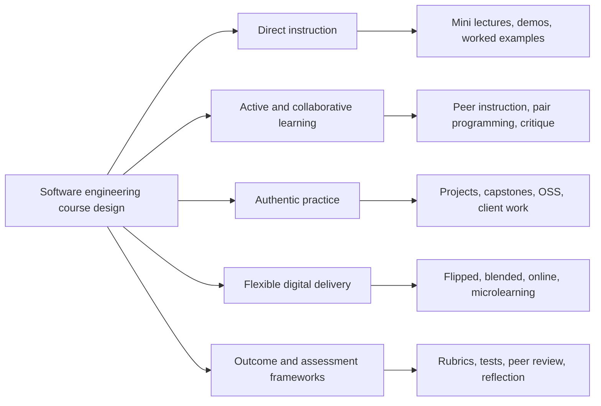

# Pedagogical Teaching Styles and Methodologies for Software Engineering Education

Research date: 2026-05-18

Purpose: consolidate evidence-backed teaching styles, instructional design methods, and open-source curriculum examples that can strengthen this repo's AI/software engineering curriculum without replacing its current learner-written, test-guided contract.

## Research Method

- Requested method: Tavily MCP deep research plus GitHub search.
- Tavily MCP status: attempted `tavily_research` and `tavily_search`, but the configured Tavily MCP key was rejected as invalid by the endpoint. The research below therefore uses current web search, source extraction snippets, and authenticated GitHub CLI/API searches as fallback evidence.
- GitHub search method: authenticated `gh.exe` repository search and `gh.exe repo view` for current repository metadata where useful.
- Scope: general pedagogy, computing education, software engineering education, programming education, project-based developer learning, automated feedback, and open-source curricula.

## Scope and Evidence Frame

This document uses "pedagogy" broadly, but the categories should not be blurred:

- **Teaching methods:** project-based learning, problem-based learning, peer instruction, case-based learning, cognitive apprenticeship, studio critique, pair programming.
- **Delivery modes:** lecture, flipped classroom, blended/hybrid, online asynchronous, MOOCs, microlearning.
- **Assessment and curriculum frameworks:** backward design, ABET-style outcomes, competency rubrics, mastery learning, peer assessment, micro-credentials, T-shaped skill development.
- **Learning infrastructure:** GitHub Classroom, CI checks, autograders, code review systems, issue trackers, project boards, deployment pipelines.

Evidence labels used below:

- **High:** supported by official curriculum guidance, accreditation logic, multiple primary studies, or broad adoption in mature learning ecosystems.
- **Moderate:** supported by case studies, mapping studies, computing-adjacent evidence, or repeated practice patterns.
- **Emerging:** promising but thin in software-engineering-specific comparative research.

The key design point is that software engineering courses usually combine several layers. A strong lesson or module might use concise direct instruction, worked examples, pair work, CI feedback, project artifacts, rubric review, and reflection in one sequence.

## Executive Synthesis

The strongest teaching model for software engineering is not one method. It is a layered design:

1. Use backward design to define what learners must be able to build, explain, test, and defend.
2. Use cognitive apprenticeship to make expert reasoning visible through modeling, coaching, scaffolding, and gradual release.
3. Use worked examples, worked traces, subgoal labels, and Parsons-style scaffolds before independent code writing.
4. Use project-based and problem-based learning for transfer, but protect novices from unguided project chaos with tight checkpoints.
5. Use test-guided development, immediate formative feedback, and CI-style verification as both professional practice and pedagogy.
6. Use peer instruction, pair programming, code review, and team rituals to teach communication and design judgment.
7. Use retrieval practice, spaced review, reflection, and explanation prompts so learners retain concepts rather than merely finish tasks.
8. Use Universal Design for Learning so learners can access material, practice skills, and demonstrate mastery in more than one way.

For this repo, the practical implication is: keep the existing "read -> trace -> explain -> modify -> create -> verify -> reflect" loop, but strengthen it with a named evidence map and explicit choices per lesson.

## Layered Software Engineering Pedagogy Model

Planning implication: do not ask a single methodology to do every job. Use direct instruction for framing, active methods for processing, authentic projects for transfer, and assessment infrastructure for feedback and accountability.

## Methodology Inventory

| Methodology | Core idea | Best use in software engineering education | Caution |
| --- | --- | --- | --- |
| Direct instruction / demonstration | Efficient instructor-led framing, live coding, or worked demonstration. | Introduce vocabulary, mental models, tool setup, and common failure modes before practice. | Weak alone for SE practice; pair it with active work. |
| Flipped classroom | Move basic content before class or lab so live time is used for application. | Use pre-reading or trace review before debugging, design critique, or implementation labs. | Depends on short accountable preparation; not a magic format by itself. |
| Blended / hybrid learning | Combine in-person or synchronous work with online repos, discussions, tests, and reviews. | Teach distributed teamwork, asynchronous review, CI feedback, and durable project artifacts. | Online work must be integrated into assessment and cadence. |
| Online asynchronous learning | Learners progress through readings, tasks, repos, and feedback on their own schedule. | Self-paced modules, professional learners, setup-heavy labs, portfolio building. | Needs discussion, review, or projects to teach tacit team skills. |
| MOOC-style learning | Massive open self-paced learning with reusable content and optional certificates. | Broad access, bridge programs, refresher units, standardized foundational content. | Does not replace mentorship-heavy capstones or studio critique. |
| Micro-credentials | Short recognitions of specific skill mastery. | Optional badges/checkpoints for CI, testing, Git, code review, prompt evals, or deployment. | Credentialing frame, not a teaching method; avoid fragmenting the curriculum. |
| Backward design / Understanding by Design | Start with desired outcomes, evidence, then activities. | Define module gates around observable artifacts: tests pass, code review response, design note, deployed demo, eval result. | Avoid outcome lists so broad they cannot be assessed. |
| Constructivism | Learners build understanding through active meaning-making. | Ask learners to predict, explain, compare alternatives, and construct small features. | Unguided discovery is risky for novices in high-complexity code. |
| Cognitive apprenticeship | Make expert thinking visible, then fade support. | Model debugging, test reading, code review, tradeoff analysis, and incident thinking. | Fading must be deliberate; permanent hand-holding blocks independence. |
| Scaffolding and gradual release | Provide temporary support, remove it over time. | TODOs, hints, failing tests, partial functions, fixture data, guided refactors. | Too much scaffolding can hide design decisions. |
| Worked examples | Learners study a complete or partial solution before solving. | Read a small working pipeline before editing a related one. | Must transition into active work; reading alone is not enough. |
| Worked-example fading | Remove steps progressively as competence grows. | Start with complete trace, then partial TODO, then blank function, then small feature. | Fading too fast creates frustration; too slow creates dependency. |
| Subgoal labeling | Label reusable chunks of a procedure. | Name recurring steps: validate input, normalize data, call model, parse output, evaluate response. | Labels should teach structure, not become decorative headings. |
| Parsons problems | Reorder mixed code blocks to reduce syntax load. | Help beginners learn control flow, APIs, or unfamiliar syntax before writing from scratch. | Less suitable once the goal is open-ended system design. |
| Whole-part-whole | Show full workflow, isolate a part, reconnect to full workflow. | Show full RAG/agent/data pipeline, practice chunking or tool schema, reconnect to system behavior. | The initial whole must be small enough to inspect. |
| Spiral curriculum | Revisit concepts with increasing complexity. | Revisit testing, evals, logging, safety, and source grounding across modules. | Spirals need explicit callbacks or learners see repetition as accidental. |
| Mastery learning | Learners progress after meeting clear criteria. | Gate lessons with import health, unit tests, explanation prompts, and rubric checks. | Avoid making mastery equal to only green tests. |
| Competency-based education | Focus on demonstrable capabilities. | Map modules to capabilities such as "writes a typed tool schema" or "builds a golden eval." | Competencies need authentic evidence, not checkbox phrasing. |
| Project-based learning | Learn by building meaningful artifacts. | Portfolio projects, capstones, realistic AI engineering workflows. | Projects need constraints, checkpoints, and feedback loops. |
| Problem-based learning | Start from a messy problem and learn what is needed. | Debugging labs, incident-style exercises, "why did retrieval fail?" investigations. | Use carefully for novices; provide a solvable path. |
| Inquiry-based learning | Learners ask and test questions. | Model comparison, prompt/eval experiments, performance debugging. | Must include guardrails for reliable measurement. |
| Experiential learning | Cycle through concrete experience, reflection, concepts, and experimentation. | Run code, observe failures, reflect, apply theory, retry. | Reflection must be prompted; otherwise experience can remain shallow. |
| Deliberate practice | Focused repetition with feedback on specific subskills. | Katas for parsing, tests, refactors, prompts, retrieval checks, schema validation. | Drill without context can feel arbitrary. |
| Retrieval practice | Recall strengthens learning more than rereading. | Low-stakes questions, "write from memory," explain a failing test, short reviews. | Use for concepts and procedures, not just vocabulary. |
| Spaced repetition | Revisit knowledge over increasing intervals. | Reintroduce prior tools and concepts in later modules and capstone callbacks. | Avoid isolated flashcards disconnected from code practice. |
| Peer instruction | Learners answer, discuss, then revise conceptual answers. | Concept checks on code behavior, complexity, security, testing, or architecture tradeoffs. | Needs good questions with plausible misconceptions. |
| Pair programming | Driver/navigator collaboration around one task. | Teach communication, review habits, debugging, and design reasoning. | Rotate roles and assess individual understanding. |
| Code review pedagogy | Review becomes a learning task, not just quality control. | Require learners to respond to review, justify changes, and revise code. | Review comments must be specific and psychologically safe. |
| Studio model / critique | Learners present work and receive structured critique. | Design reviews, architecture walkthroughs, UX/API critiques, capstone demos. | Needs rubrics to avoid vague taste-based feedback. |
| Test-driven learning / TDD | Tests become specification, feedback, and design pressure. | Current repo pattern: tests-first, TODO implementation, expected failures, CI gates. | TDD can slow novices unless tests are explained as learning feedback. |
| Automated formative feedback | Immediate machine feedback on submissions. | Pytest, linters, type checks, eval harnesses, GitHub Classroom, CI. | Automated checks cannot replace human review of design and explanation. |
| Computer-supported collaborative learning | Collaboration mediated by repositories, discussion tools, analytics, or issue trackers. | Distributed team projects, review traces, GitHub discussions, project boards, and PR workflows. | Tooling is not pedagogy unless roles, feedback, and accountability are designed. |
| Peer assessment | Learners evaluate peer work or contribution using clear criteria. | Team projects, PR reviews, design critiques, capstone checkpoints. | Needs calibration and rubrics to avoid popularity or effort-only grading. |
| Competency rubrics | Analytic descriptions of mastery across artifacts, process, teamwork, and professionalism. | Capstone gates, review checkpoints, portfolio evaluation, instructor calibration. | Rubrics take effort to maintain and can become bureaucratic if too broad. |
| Microlearning | Short focused learning units. | Small labs for one API, one prompt pattern, one eval metric, one refactor. | Needs integration into bigger projects to avoid fragmentation. |
| Gamification | Use game elements for motivation and progress. | Badges/checkpoints, progress meters, review leaderboards, streaks. | Systematic reviews warn about possible stress and shallow motivation. |
| Universal Design for Learning | Multiple means of engagement, representation, and action/expression. | Text, diagrams, traces, runnable code, optional videos, multiple ways to explain mastery. | UDL is design discipline, not extra decoration. |
| Metacognition and reflection | Learners monitor their own understanding. | "Explain like a teammate," post-test reflection, design tradeoff notes. | Reflection prompts should be short and concrete. |
| Open-source contribution learning | Learn through real issue/PR workflows. | Later-stage capstone extension: docs issue, bug fix, test PR, review response. | Needs carefully selected beginner-friendly projects and maintainer etiquette. |
| Industry-sponsored or real-client capstones | External stakeholders provide constraints, feedback, or accountability. | Advanced projects, portfolio capstones, stakeholder communication, release planning. | High authenticity but introduces coordination risk and uneven feedback. |
| T-shaped skill development | Deep skill in one area plus broad fluency across the lifecycle. | AI engineers need depth in LLM/RAG/evals plus breadth in data, testing, deployment, safety, and product tradeoffs. | Breadth can crowd out depth if project evidence is weak. |
| Agile / Scrum simulation | Practice planning, estimation, retrospectives, iteration. | Team modules, sprint boards, issue breakdown, retrospectives, release notes. | Avoid process theater; tie ceremonies to code and evidence. |

## Software Engineering Teaching Patterns

### 1. Tests as Teacher

Use tests to express expected behavior, provide feedback, and train professional habits. Research on TDD shows quality gains are plausible but context dependent; for teaching, its strongest value is immediate formative feedback and precision of expectation.

Repo fit:

- Keep intentional TODO failures as lesson state.
- Ask learners to read tests before editing.
- Add "expected failure interpretation" to each lesson.
- Use CI-style commands as routine proof, not a final afterthought.

### 2. Read and Trace Before Write

Programming education research repeatedly points to the gap between seeing code and generating code. Worked examples, subgoal-labeled examples, and Parsons problems help bridge that gap.

Repo fit:

- Before each TODO block, include a small trace or comparable example.
- Add subgoal labels to recurring AI engineering procedures.
- Use Parsons-style exercises sparingly for syntax-heavy or sequence-heavy beginner tasks.

### 3. Whole Workflow, Small Slice, Workflow Again

Software engineering is systems work. Learners need to see the full workflow, but practice must happen in small, assessable slices.

Repo fit:

- Introduce the full FinAgent workflow early.
- In each lesson, isolate one behavior such as parsing, retrieval, evaluation, logging, or tool schema design.
- End with a callback that explains how the slice affects the larger system.

### 4. Authentic Project-Based Progression

Project-based learning is central to SE education, but projects must be structured. SE2014 specifically emphasizes recurring themes, tool use, real projects, internships/co-op/open-source participation, and student projects as ways to develop an engineering mindset.

Repo fit:

- Keep FinAgent as the spine.
- Add smaller layer-proof projects before the final capstone.
- Make each project produce a portfolio artifact plus an explanation artifact.

### 5. Peer, Review, and Team Practice

Professional software work is collaborative. Pair programming, peer instruction, code review, issue discussions, and agile rituals teach skills individual kata cannot.

Repo fit:

- Add optional "solo or pair" prompts.
- Add code review checklists to capstone checkpoints.
- Ask learners to write short PR-style summaries even when working locally.

### 6. Feedback Loops at Multiple Speeds

Effective software engineering learning uses several feedback tempos:

- Seconds: test failure, lint output, type error.
- Minutes: debug lab, hint, focused explanation.
- Hours: code review, refactor, rubric.
- Days/weeks: spaced callback, capstone integration, portfolio review.

Repo fit:

- Preserve pytest feedback.
- Add spaced revisit prompts in later modules.
- Track "concept returns" in ROADMAP updates when new lessons are added.

## Mapping Methods to Software Engineering Topics

No single method fits every software engineering topic equally well. Use this mapping when choosing lesson shapes:

| Topic | Best-fit pedagogies | Why it fits | Good evidence artifacts |
| --- | --- | --- | --- |
| Requirements engineering | Case-based learning, problem-based learning, peer instruction, real-client projects | Requirements are ambiguous, stakeholder-heavy, and tradeoff-heavy. | User stories, acceptance criteria, stakeholder memos, requirements critique. |
| Software design | Studio critique, example-based learning, pair design, project-based learning | Design improves through examples, comparison, critique, and iteration. | Design reviews, diagrams, ADRs, interface contracts, refactoring rationale. |
| Software architecture | Case-based learning, studio critique, inquiry-based exploration | Architecture is about constraints, quality attributes, risk, and rationale. | ADRs, scenario evaluation, risk register, architecture review notes. |
| Testing and QA | Test-driven learning, pair programming, automated feedback, example-based labs | Testing benefits from fast feedback, failure analysis, and regression thinking. | Unit/integration/e2e tests, CI logs, coverage notes, failed-build diagnosis. |
| Maintenance and refactoring | OSS participation, apprenticeship, code review, case-based debugging | Maintenance means reading unfamiliar code and changing it responsibly. | Bug-fix PRs, refactoring plans, review responses, regression tests. |
| DevOps and operations | CI/CD labs, project-based learning, experiential incident labs | Operations is tool-mediated and evidence-heavy. | GitHub Actions workflows, container config, release notes, postmortems. |
| Teamwork and project management | Collaborative learning, pair programming, peer assessment, agile simulation | Team skills require social practice and accountability. | Team charter, project board, PR history, retrospectives, peer review. |
| Ethics, privacy, security, professionalism | Case-based learning, guided discussion, reflective writing, real-client constraints | Professional judgment depends on context and competing obligations. | Risk memo, privacy review, threat model, accessibility note, ethics reflection. |

Practical heuristic: use case and critique-heavy methods for requirements, architecture, and ethics; CI and lab-heavy methods for testing and DevOps; and project, review, and mentorship-heavy methods for teamwork, maintenance, and capstone integration.

## GitHub and Open-Source Curriculum Evidence

Current GitHub examples worth benchmarking:

| Source | Current signal | Teaching pattern to borrow |
| --- | --- | --- |
| `freeCodeCamp/freeCodeCamp` | 445,074 stars, 44,626 forks; open-source codebase and curriculum for math, programming, and CS. | Self-paced certifications, interactive challenges, large community, project sequence. |
| `ossu/computer-science` | 203,927 stars, 25,385 forks; degree-like CS path using open materials. | Curated pathway, community support, academic breadth, self-study discipline. |
| `practical-tutorials/project-based-learning` | 266,000 stars, 34,598 forks; curated project-based tutorials. | Build-to-learn indexing; projects grouped by technology and artifact. |
| `codecrafters-io/build-your-own-x` | 502,199 stars, 47,613 forks; recreate real technologies from scratch. | First-principles "build the thing" pedagogy, strong for deeper systems intuition. |
| `TheOdinProject/curriculum` | 12,491 stars, 16,284 forks; open full-stack web curriculum. | Written lessons plus curated resources, frequent projects, portfolio orientation. |
| `fullstackopen-2019/fullstackopen-2019.github.io` | 341 stars, 348 forks; public course repo for Full Stack Open. | Exercise-heavy modern web learning with realistic stack integration. |
| `github-education-resources/classroom` | 1,377 stars, 569 forks; GitHub Classroom docs/resources repo. | Assignment distribution, starter repos, automated grading, review workflow. |
| `classroom-resources/autograding-example-python` | GitHub Classroom pytest autograding example. | Good template for test-guided assignments and immediate feedback. |
| `PrairieLearn/PrairieLearn` | Problem-driven online learning and autograding platform. | Randomized practice, scalable formative feedback, code execution, reusable course templates. |
| `gradescope/autograder_samples` | Docker-oriented examples for Gradescope autograders. | Reusable pattern for language-specific autograded checkpoints and reproducible grading. |
| `skills/hello-github-actions` | GitHub Skills course for Actions workflows. | Microlearning module for CI setup and automation mental models. |
| `skills/test-with-actions` | GitHub Skills course for CI testing. | Teaches tests, coverage, failure investigation, and merge gates as learning feedback. |
| `skills/review-pull-requests` | GitHub Skills course for PR review practice. | Scaffolded review culture, peer feedback, suggested changes, approvals. |
| `junit-team/junit-examples` | JUnit example applications and extensions. | Example-based testing instruction and regression workflow patterns. |
| `cypress-io/cypress-realworld-app` | Realistic full-stack app with testing and CI examples. | Strong testing, DevOps, and project-based artifact for inspecting real workflows. |
| `spring-projects/spring-petclinic` | Mature multi-layer sample application. | Architecture, maintenance, integration testing, environment setup, and data-store variation. |
| `firstcontributions/first-contributions` | Structured beginner open-source contribution tutorial. | Good onboarding pattern for OSS participation, Git workflow, and contribution etiquette. |
| `ls1intum/Hephaestus` | Process-aware mentoring for agile software teams. | Repo-grounded mentoring, code review gamification, agile process scaffolding. |
| `CAHLR/OATutor` | Open adaptive tutoring system using intelligent tutoring principles. | Adaptive hints, knowledge tracing, curated problems, research tooling. |
| `munificent/craftinginterpreters` | 10,766 stars; book/code repo for building interpreters. | Narrative, first-principles, build-a-real-system progression. |

GitHub search lesson: high-signal curriculum repositories are rarely named "software engineering curriculum" exactly. Better benchmark searches include "open source curriculum", "project based learning", "build your own", "autograding example", "GitHub Classroom", "CS curriculum", and course names.

## Recommended Curriculum Design Blend for This Repo

Use this as the default authoring stack:

1. Backward design for module and lesson outcomes.
2. Whole-part-whole for every practical AI engineering workflow.
3. Cognitive apprenticeship for expert reasoning.
4. Worked trace before independent TODO work.
5. Test-driven learning for feedback and professional habit.
6. Project-based learning through FinAgent and smaller layer-proof projects.
7. Retrieval, spacing, and reflection for durable understanding.
8. UDL for access and varied expression.
9. Code review and PR-style communication for professional transfer.

This stack fits the existing contract in `SPEC.md` and `ROADMAP.md`:

- Learners write meaningful code themselves.
- AI guides, explains, reviews, and debugs instead of filling full answers by default.
- Lessons use a recurring ritual: story hook, concept brief, worked trace, guided task, test feedback, debug lab, reflection, capstone callback.
- The stable loop remains: read, trace, explain, modify, create, verify, reflect.

## Project Spine and Assessment Model

The comparison report reinforces that a strong software engineering course should be built around a project spine, not a loose pile of topics. The syllabus should make four things explicit:

- What artifacts learners will create.
- How they will collaborate.
- What feedback loops they will receive.
- How mastery will be judged.

For this repo, the project spine is FinAgent plus smaller layer-proof projects. A balanced evidence portfolio should include:

| Assessment component | What it measures in this repo |
| --- | --- |
| Short individual concept checks | Core vocabulary, failure modes, lifecycle concepts, eval ideas. |
| Individual labs | Personal mastery before team or capstone synthesis. |
| Test and CI gates | Correctness, regression discipline, tool fluency, expected failure interpretation. |
| Design or architecture reviews | Tradeoffs, boundaries, data flow, model choice, reliability reasoning. |
| Code review and PR-style summaries | Communication, maintainability, change explanation, review response. |
| Peer/self assessment | Team contribution, evaluative judgment, accountability. |
| Reflection and retrospectives | Transfer, metacognition, ethics, safety, cost, and limitation awareness. |
| Capstone demo and portfolio defense | Product fitness, source grounding, uncertainty handling, professional explanation. |

Analytic rubric dimensions that should recur across capstone checkpoints:

- **Problem framing and requirements:** clear stakeholder need, assumptions, acceptance criteria, and revision when evidence changes.
- **Architecture and design rationale:** explicit choices, alternatives considered, quality attributes, and visible technical debt.
- **Implementation quality:** readable, modular, conventional code with meaningful review history.
- **Testing and automation:** useful tests, maintainable fixtures, CI checks, and clear interpretation of failures.
- **Data and AI reliability:** data quality, provenance, eval coverage, model limits, and source grounding.
- **Team process and collaboration:** role clarity, pull-request discipline, constructive conflict handling, and review participation.
- **Professionalism and ethics:** security, privacy, accessibility, domain limitations, and stakeholder impact.
- **Reflection and improvement:** explanation of what changed, why it changed, and how future practice improves.

## Lesson Authoring Checklist Additions

For each new or revised lesson, answer these before writing:

- What is the backward-designed evidence of learning?
- Which expert thought process must be modeled?
- What should the learner trace before editing?
- Which support will be faded later?
- Which tests are formative, and what should their first failure teach?
- What retrieval prompt brings back a previous concept?
- What reflection prompt asks the learner to explain a tradeoff?
- What UDL alternative is available if the first representation does not work?
- What professional workflow does this practice imitate?
- How does the lesson reconnect to FinAgent or a real AI engineering system?

## Gaps and Research Opportunities

The comparison report adds a useful caution: software engineering education has many promising interventions, but not all have equally strong comparative evidence. Treat these as design risks:

- **Evaluation quality:** many SE teaching papers are local case studies or lack strong comparative evaluation.
- **Comparative effectiveness:** flipped, studio, PBL, pair programming, and case-based methods often work, but which method works best for which SE topic is still unevenly studied.
- **Longitudinal transfer:** courses need evidence that learners retain testing discipline, review habits, ethical reasoning, and reflective practice after the module ends.
- **AI-mediated pedagogy:** AI tutors, coding assistants, and automated review tools need careful assessment design so they support thinking rather than bypass it.
- **Underrepresented topics:** maintenance, legacy modernization, DevOps/operations, privacy/security, accessibility, and socio-technical ethics need more explicit pedagogical treatment.

Curriculum implication: use the strongest methods confidently, but keep reflection, evals, and authoring notes honest about what is proven, what is practical, and what is an informed experiment.

## Source Notes

Official and institutional pedagogy:

- CAST, Universal Design for Learning: https://www.cast.org/what-we-do/universal-design-for-learning/
- CAST UDL Guidelines 3.0: https://udlguidelines.cast.org/
- MIT Teaching and Learning Lab, Backward Design: https://tll.mit.edu/teaching-resources/course-design/backward-design/

Computing and software engineering curriculum:

- ACM/IEEE-CS/AAAI CS2023: https://csed.acm.org/
- ACM CS2023 announcement: https://www.acm.org/media-center/2024/june/cs-2023
- ACM/IEEE Software Engineering 2014 curriculum guidelines: https://www.acm.org/binaries/content/assets/education/se2014.pdf
- ABET accreditation criteria: https://www.abet.org/accreditation/accreditation-criteria/

Software engineering and programming education research:

- Example-Based Learning in Software Engineering Education: https://arxiv.org/abs/2503.18080
- Supporting Real Demands in Software Engineering with a Four Steps PBL Approach: https://arxiv.org/abs/2102.01631
- A Flipped Classroom Approach to Teaching Empirical Software Engineering: https://arxiv.org/abs/1912.03746
- Teaching Well-Structured Code literature review: https://arxiv.org/abs/2502.11230
- Formative test-driven development for programming practicals: https://ojs.aishe.org/index.php/aishe-j/article/view/302
- A structured experiment of test-driven development: https://www.sciencedirect.com/science/article/pii/S0950584903002040
- Impact of test-driven development on productivity, code and tests: https://www.sciencedirect.com/science/article/pii/S0950584911000346
- Automated grading and feedback tools for programming education: https://arxiv.org/abs/2306.11722
- Parsons problems for learning a new programming language: https://www2.eecs.berkeley.edu/Pubs/TechRpts/2020/EECS-2020-88.html
- Adaptive Parsons problems to scaffold write-code problems: https://par.nsf.gov/biblio/10432947-using-adaptive-parsons-problems-scaffold-write-code-problems
- Subgoal-labeled examples for programming: https://www.cs1subgoals.org/how-do-i-use-subgoals/
- Distributed pair programming systematic review: https://pmc.ncbi.nlm.nih.gov/articles/PMC9930723/
- Pair programming in education literature review: https://www.tandfonline.com/doi/full/10.1080/08993408.2011.579808
- Peer instruction in computing: https://eprints.gla.ac.uk/135493/
- Retrieval practice systematic review: https://link.springer.com/article/10.1007/s10648-021-09595-9
- Gamification in software engineering education systematic review: https://www.mdpi.com/2073-431X/13/8/196
- Microlearning in software engineering education systematic review: https://www.mdpi.com/2227-7102/16/3/487

GitHub and open-source curriculum sources:

- GitHub Education: https://github.com/edu
- GitHub Classroom: https://classroom.github.com/
- GitHub Classroom resources: https://github.com/github-education-resources/classroom
- GitHub Classroom Python autograding example: https://github.com/classroom-resources/autograding-example-python
- GitHub Skills: https://skills.github.com/
- GitHub Actions skills course: https://github.com/skills/hello-github-actions
- GitHub testing with Actions skills course: https://github.com/skills/test-with-actions
- GitHub pull request review skills course: https://github.com/skills/review-pull-requests
- PrairieLearn: https://github.com/PrairieLearn/PrairieLearn
- Gradescope autograder samples: https://github.com/gradescope/autograder_samples
- JUnit examples: https://github.com/junit-team/junit-examples
- Cypress Real World App: https://github.com/cypress-io/cypress-realworld-app
- Spring PetClinic: https://github.com/spring-projects/spring-petclinic
- First Contributions: https://github.com/firstcontributions/first-contributions
- freeCodeCamp curriculum: https://github.com/freeCodeCamp/freeCodeCamp
- OSSU computer science: https://github.com/ossu/computer-science
- The Odin Project curriculum: https://github.com/TheOdinProject/curriculum
- Project-Based Learning tutorials: https://github.com/practical-tutorials/project-based-learning
- Build Your Own X: https://github.com/codecrafters-io/build-your-own-x
- Crafting Interpreters: https://github.com/munificent/craftinginterpreters
- Hephaestus process-aware mentoring: https://github.com/ls1intum/Hephaestus
- OATutor adaptive tutoring: https://github.com/CAHLR/OATutor
