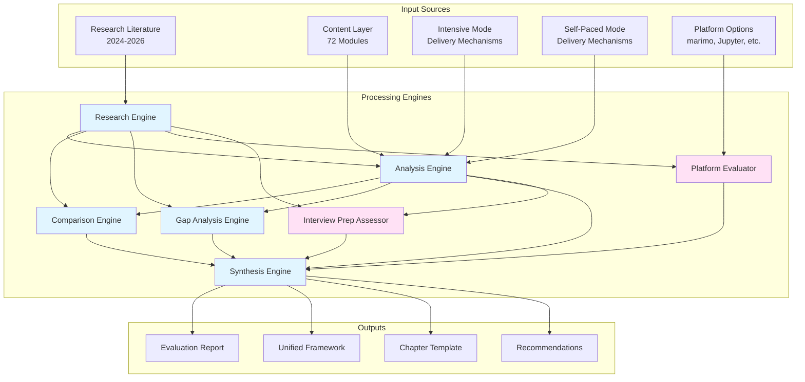

# Design Document: Teaching Methodology Evaluation and Improvement

## Document Information

**Version**: 1.0  
**Last Updated**: 2026-05-02  
**Status**: Draft  
**Owner**: Curriculum Design Team  
**Related Documents**:
- Requirements: `requirements.md`
- Tasks: `tasks.md`

## Overview

This design document specifies the architecture and implementation approach for a systematic teaching methodology evaluation system. The system researches current pedagogical best practices (2024-2026), analyzes existing curriculum architecture, identifies gaps and redundancies, and synthesizes evidence-based recommendations for improvement.

### System Purpose

The Teaching Methodology Evaluator serves as an analytical and research tool to:
- Ground curriculum improvements in evidence-based pedagogical research
- Evaluate the unified content layer with differentiated delivery modes architecture
- Ensure proper separation of concerns between content and delivery layers
- Identify opportunities for enhancement based on current research
- Generate actionable recommendations with implementation guidance

### Architectural Context

The curriculum follows a **unified content base with differentiated delivery modes** approach:

- **Content Layer**: 72 modular chapters with shared pedagogical patterns (action-first, progressive complexity, failure-forward learning, spaced repetition)
- **Delivery Layer**: Two distinct modes wrapping the unified content
  - **Intensive Mode**: 40-day bootcamp with daily sprints, cohort accountability, time-boxed constraints
  - **Self-Paced Mode**: 8-10 week milestone-based with adaptive scaffolding, self-assessment, flexible pacing

This architecture applies the DRY principle to curriculum design—content is written once with consistent pedagogical patterns, then delivered twice through context-appropriate mechanisms.

### Key Design Principles

1. **Evidence-Based Analysis**: All evaluations and recommendations must be grounded in peer-reviewed research from 2024-2026
2. **Separation of Concerns**: Maintain clear boundaries between content-layer patterns (universal) and delivery-layer mechanisms (mode-specific)
3. **Systematic Coverage**: Analyze all 72 content modules and both delivery modes comprehensively
4. **Actionable Output**: Generate specific, prioritized recommendations with implementation guidance
5. **Traceability**: Link all findings and recommendations back to research evidence and requirements
6. **Extensibility**: Design for future addition of new delivery modes or analysis types
7. **Reproducibility**: Ensure analysis can be re-run with updated research or curriculum changes

### Design Constraints

1. **Research Date Range**: Limited to publications from 2024-2026 to ensure currency
2. **Peer-Review Priority**: Academic sources prioritized over practitioner blogs
3. **Processing Time**: Complete analysis should finish within 1 hour for full curriculum
4. **Output Formats**: Must support Markdown (primary), HTML, JSON, and optionally PDF
5. **External Dependencies**: Minimize reliance on external APIs (use caching extensively)

## Architecture

### System Components

The Teaching Methodology Evaluator consists of seven primary engines and a reporting component:



### Component Responsibilities

#### Research Engine
- Retrieves current pedagogical research (2024-2026)
- Prioritizes peer-reviewed academic sources
- Extracts key findings, methodologies, and conclusions
- Organizes findings by pedagogical domain
- Identifies contradictory findings across sources
- Maintains citation information and evidence base

#### Analysis Engine
- Extracts teaching patterns from content layer
- Extracts delivery mechanisms from both modes
- Compares patterns/mechanisms against research evidence
- Flags patterns as evidence-supported, evidence-weak, or evidence-contrary
- Evaluates implementation quality of patterns
- Assesses consistency across modules
- Evaluates AI-era considerations (code comprehension, AI tool integration)
- Evaluates professional workflow integration
- Assesses technical interview preparation

#### Comparison Engine
- Identifies proper content-layer vs delivery-layer separation
- Detects inappropriate mixing of concerns
- Identifies content duplication between modes
- Evaluates content reusability across modes
- Verifies adaptation points for delivery customization
- Calculates content reuse percentage

#### Gap Analysis Engine
- Identifies missing research-supported patterns in content layer
- Identifies missing delivery mechanisms in both modes
- Assesses impact and implementation difficulty of gaps
- Prioritizes gaps by impact-to-effort ratio
- Provides concrete implementation examples
- Distinguishes universal content gaps from mode-specific delivery gaps

#### Synthesis Engine
- Creates unified teaching methodology framework
- Resolves conflicts with research-based rationale
- Generates actionable recommendations
- Creates unified chapter template with adaptation points
- Provides implementation guidance and examples
- Organizes recommendations by priority and phase

#### Platform Evaluator
- Evaluates interactive learning platforms against 2024-2026 research
- Assesses Git integration and version control friendliness
- Evaluates AI coding assistant compatibility
- Assesses professional workflow support (testing, deployment, modular imports)
- Compares alternative platforms (marimo, Quarto, Educative.io, etc.)
- Evaluates reproducibility rates and deployment capabilities
- Provides migration path guidance if platform change recommended

#### Interview Preparation Assessor
- Evaluates technical interview preparation integration throughout curriculum
- Assesses think-aloud practice opportunities
- Evaluates mock interview presence and frequency
- Assesses collaborative coding practice (pair programming, peer observation)
- Compares against 2025 Virginia Tech research on interview preparation
- Identifies gaps in communication skills practice
- Evaluates integration across both delivery modes

### Data Flow

1. **Research Phase**: Research Engine retrieves and structures current pedagogical literature
2. **Analysis Phase**: Analysis Engine evaluates existing patterns/mechanisms against evidence base
3. **Comparison Phase**: Comparison Engine assesses content-delivery separation and identifies duplication
4. **Gap Identification Phase**: Gap Analysis Engine identifies missing elements and opportunities
5. **Platform Evaluation Phase**: Platform Evaluator assesses tooling choices against 2024-2026 research and industry standards
6. **Interview Preparation Assessment Phase**: Interview Preparation Assessor evaluates technical interview readiness integration
7. **Synthesis Phase**: Synthesis Engine creates unified framework, template, and recommendations incorporating all findings
8. **Reporting Phase**: All findings compiled into comprehensive Evaluation Report

## Components and Interfaces

### Research Engine Interface

```python
class ResearchEngine:
    """Retrieves and structures pedagogical research from 2024-2026."""
    
    def search_research(
        self,
        query: str,
        domains: List[str],  # e.g., ["educational pedagogy", "adult learning", "technical skills"]
        date_range: Tuple[str, str] = ("2024-01-01", "2026-12-31")
    ) -> List[ResearchSource]:
        """Search for research publications matching query and domains."""
        pass
    
    def extract_findings(
        self,
        source: ResearchSource
    ) -> ResearchFindings:
        """Extract key findings, methodology, sample size, conclusions from source."""
        pass
    
    def organize_by_domain(
        self,
        findings: List[ResearchFindings]
    ) -> Dict[str, List[ResearchFindings]]:
        """Organize findings by pedagogical domain."""
        pass
    
    def identify_contradictions(
        self,
        findings: List[ResearchFindings]
    ) -> List[Contradiction]:
        """Identify contradictory findings across sources."""
        pass
```

### Analysis Engine Interface

```python
class AnalysisEngine:
    """Evaluates teaching patterns and delivery mechanisms against research evidence."""
    
    def extract_content_patterns(
        self,
        content_modules: List[ContentModule]
    ) -> List[TeachingPattern]:
        """Extract documented teaching patterns from content layer."""
        pass
    
    def extract_delivery_mechanisms(
        self,
        delivery_mode: DeliveryMode
    ) -> List[DeliveryMechanism]:
        """Extract delivery mechanisms from Intensive or Self-Paced mode."""
        pass
    
    def evaluate_against_evidence(
        self,
        pattern: Union[TeachingPattern, DeliveryMechanism],
        evidence_base: Dict[str, List[ResearchFindings]]
    ) -> EvidenceRating:
        """Compare pattern/mechanism against research evidence."""
        pass
    
    def assess_implementation_quality(
        self,
        pattern: TeachingPattern,
        modules: List[ContentModule]
    ) -> QualityAssessment:
        """Evaluate how well a pattern is implemented across modules."""
        pass
    
    def check_consistency(
        self,
        pattern: TeachingPattern,
        modules: List[ContentModule]
    ) -> ConsistencyReport:
        """Verify pattern is consistently applied across all modules."""
        pass
    
    def evaluate_ai_era_alignment(
        self,
        content_modules: List[ContentModule],
        evidence_base: Dict[str, List[ResearchFindings]]
    ) -> AIEraAssessment:
        """Evaluate code comprehension emphasis, AI tool integration, etc."""
        pass
```

### Comparison Engine Interface

```python
class ComparisonEngine:
    """Evaluates content-delivery separation and identifies duplication."""
    
    def classify_concerns(
        self,
        patterns: List[TeachingPattern],
        mechanisms: List[DeliveryMechanism]
    ) -> ConcernClassification:
        """Classify elements as content-layer (universal) or delivery-layer (mode-specific)."""
        pass
    
    def identify_mixed_concerns(
        self,
        content_modules: List[ContentModule],
        delivery_modes: List[DeliveryMode]
    ) -> List[MixedConcern]:
        """Identify cases where content and delivery are inappropriately mixed."""
        pass
    
    def detect_duplication(
        self,
        intensive_mode: DeliveryMode,
        self_paced_mode: DeliveryMode
    ) -> List[Duplication]:
        """Identify content duplicated between delivery modes."""
        pass
    
    def calculate_reuse_percentage(
        self,
        content_modules: List[ContentModule],
        delivery_modes: List[DeliveryMode]
    ) -> float:
        """Calculate percentage of content reused across modes."""
        pass
```

### Gap Analysis Engine Interface

```python
class GapAnalysisEngine:
    """Identifies missing patterns and mechanisms based on research."""
    
    def identify_content_gaps(
        self,
        current_patterns: List[TeachingPattern],
        evidence_base: Dict[str, List[ResearchFindings]]
    ) -> List[Gap]:
        """Identify research-supported patterns missing from content layer."""
        pass
    
    def identify_delivery_gaps(
        self,
        current_mechanisms: List[DeliveryMechanism],
        delivery_mode: str,  # "intensive" or "self-paced"
        evidence_base: Dict[str, List[ResearchFindings]]
    ) -> List[Gap]:
        """Identify research-supported mechanisms missing from delivery mode."""
        pass
    
    def assess_gap_impact(
        self,
        gap: Gap
    ) -> ImpactAssessment:
        """Assess potential impact of incorporating missing element."""
        pass
    
    def assess_implementation_difficulty(
        self,
        gap: Gap
    ) -> DifficultyAssessment:
        """Assess implementation difficulty of incorporating missing element."""
        pass
    
    def prioritize_gaps(
        self,
        gaps: List[Gap]
    ) -> List[Gap]:
        """Prioritize gaps by impact-to-effort ratio."""
        pass
```

### Synthesis Engine Interface

```python
class SynthesisEngine:
    """Creates unified framework, template, and recommendations."""
    
    def create_unified_framework(
        self,
        evidence_supported_patterns: List[TeachingPattern],
        evidence_supported_mechanisms: List[DeliveryMechanism],
        gaps: List[Gap]
    ) -> UnifiedFramework:
        """Create unified teaching methodology framework."""
        pass
    
    def generate_recommendations(
        self,
        analysis_results: AnalysisResults,
        comparison_results: ComparisonResults,
        gaps: List[Gap]
    ) -> List[Recommendation]:
        """Generate actionable recommendations with evidence, effort, and impact."""
        pass
    
    def create_chapter_template(
        self,
        unified_framework: UnifiedFramework
    ) -> ChapterTemplate:
        """Create unified chapter template with delivery mode adaptation points."""
        pass
    
    def prioritize_recommendations(
        self,
        recommendations: List[Recommendation]
    ) -> List[Recommendation]:
        """Prioritize recommendations by impact-to-effort ratio."""
        pass
```

### Platform Evaluator Interface

```python
class PlatformEvaluator:
    """Evaluates interactive learning platforms and development tools."""
    
    def evaluate_current_platform(
        self,
        platform_name: str,
        evidence_base: Dict[str, List[ResearchFindings]]
    ) -> PlatformEvaluation:
        """Evaluate current platform against 2024-2026 research on reproducibility and professional workflows."""
        pass
    
    def assess_git_integration(
        self,
        platform: Platform
    ) -> GitIntegrationAssessment:
        """Assess version control friendliness (plain text vs JSON, clean diffs, merge conflicts)."""
        pass
    
    def assess_ai_compatibility(
        self,
        platform: Platform
    ) -> AICompatibilityAssessment:
        """Evaluate compatibility with AI coding assistants (Claude Code, GitHub Copilot, etc.)."""
        pass
    
    def assess_professional_workflow_support(
        self,
        platform: Platform
    ) -> WorkflowSupportAssessment:
        """Evaluate support for testing, deployment, modular imports, and professional practices."""
        pass
    
    def compare_alternative_platforms(
        self,
        alternatives: List[Platform],
        evaluation_criteria: List[str]
    ) -> PlatformComparison:
        """Compare alternative platforms (marimo, Quarto, Educative.io, etc.) against criteria."""
        pass
    
    def assess_reproducibility(
        self,
        platform: Platform
    ) -> ReproducibilityAssessment:
        """Assess reproducibility rates (can notebooks run reliably when shared?)."""
        pass
    
    def assess_deployment_capability(
        self,
        platform: Platform
    ) -> DeploymentAssessment:
        """Evaluate platform support for deployment as portfolio pieces (notebooks as web apps)."""
        pass
    
    def generate_migration_guidance(
        self,
        current_platform: Platform,
        recommended_platform: Platform
    ) -> MigrationGuidance:
        """Provide migration path guidance if platform change is recommended."""
        pass
```

### Interview Preparation Assessor Interface

```python
class InterviewPreparationAssessor:
    """Evaluates technical interview preparation integration throughout curriculum."""
    
    def assess_explanation_exercises(
        self,
        content_modules: List[ContentModule]
    ) -> ExplanationExerciseAssessment:
        """Evaluate frequency and quality of 'explain your solution' exercises."""
        pass
    
    def assess_think_aloud_practice(
        self,
        content_modules: List[ContentModule],
        delivery_modes: List[DeliveryMode]
    ) -> ThinkAloudAssessment:
        """Evaluate presence of think-aloud practice opportunities (coding while explaining)."""
        pass
    
    def assess_mock_interview_integration(
        self,
        delivery_modes: List[DeliveryMode]
    ) -> MockInterviewAssessment:
        """Evaluate presence and frequency of mock interview practice in delivery mechanisms."""
        pass
    
    def assess_collaborative_coding(
        self,
        content_modules: List[ContentModule],
        delivery_modes: List[DeliveryMode]
    ) -> CollaborativeCodingAssessment:
        """Evaluate collaborative coding practice (pair programming, peer observation)."""
        pass
    
    def assess_observer_practice(
        self,
        delivery_modes: List[DeliveryMode]
    ) -> ObserverPracticeAssessment:
        """Evaluate whether learners practice coding with observers (authentic interview simulation)."""
        pass
    
    def compare_against_research(
        self,
        assessments: List[InterviewPrepAssessment],
        evidence_base: Dict[str, List[ResearchFindings]]
    ) -> ResearchComparisonReport:
        """Compare interview preparation integration against 2025 Virginia Tech research findings."""
        pass
    
    def identify_communication_gaps(
        self,
        content_modules: List[ContentModule],
        delivery_modes: List[DeliveryMode]
    ) -> List[Gap]:
        """Identify gaps in communication skills practice (most candidates under-practice this)."""
        pass
    
    def assess_integration_distribution(
        self,
        content_modules: List[ContentModule]
    ) -> IntegrationDistributionReport:
        """Evaluate whether interview prep is integrated throughout curriculum or isolated to specific modules."""
        pass
    
    def assess_peer_review_mechanisms(
        self,
        content_modules: List[ContentModule],
        delivery_modes: List[DeliveryMode]
    ) -> PeerReviewAssessment:
        """Evaluate presence of peer code review and feedback mechanisms."""
        pass
```

## Data Models

### Research Domain Models

```python
@dataclass
class ResearchSource:
    """Represents a research publication."""
    title: str
    authors: List[str]
    publication_date: str
    source_type: str  # "peer-reviewed", "conference", "book", "blog"
    url: str
    citation: str
    abstract: str

@dataclass
class ResearchFindings:
    """Key findings extracted from a research source."""
    source: ResearchSource
    pedagogical_domain: str  # e.g., "retrieval practice", "spaced repetition"
    key_findings: List[str]
    methodology: str
    sample_size: Optional[int]
    conclusions: List[str]
    limitations: List[str]

@dataclass
class Contradiction:
    """Represents contradictory findings across sources."""
    domain: str
    finding_a: ResearchFindings
    finding_b: ResearchFindings
    contradiction_description: str
    requires_manual_review: bool = True
```

### Content and Delivery Models

```python
@dataclass
class ContentModule:
    """Represents a unified content module."""
    module_id: str
    title: str
    learning_objectives: List[str]
    pedagogical_patterns: List[str]
    exercises: List[Exercise]
    assessments: List[Assessment]
    estimated_time_intensive: int  # minutes
    estimated_time_self_paced: int  # minutes
    prerequisites: List[str]
    adaptation_points: List[AdaptationPoint]

@dataclass
class TeachingPattern:
    """Represents a pedagogical pattern in content layer."""
    pattern_id: str
    name: str
    description: str
    pedagogical_principle: str
    implementation_examples: List[str]
    modules_using: List[str]  # module IDs
    evidence_rating: Optional[str] = None  # "supported", "weak", "contrary"

@dataclass
class DeliveryMode:
    """Represents a delivery mode (Intensive or Self-Paced)."""
    mode_id: str
    name: str  # "Intensive" or "Self-Paced"
    duration: str  # "40 days" or "8-10 weeks"
    mechanisms: List[DeliveryMechanism]
    content_modules: List[ContentModule]
    pacing_strategy: str

@dataclass
class DeliveryMechanism:
    """Represents a delivery-specific mechanism."""
    mechanism_id: str
    name: str
    description: str
    pedagogical_principle: str
    mode: str  # "intensive" or "self-paced"
    implementation_guidance: str
    evidence_rating: Optional[str] = None

@dataclass
class AdaptationPoint:
    """Represents a point where delivery modes customize content presentation."""
    point_id: str
    location: str  # section of content module
    description: str
    intensive_adaptation: str
    self_paced_adaptation: str
```

### Analysis Models

```python
@dataclass
class EvidenceRating:
    """Rating of a pattern/mechanism against research evidence."""
    element: Union[TeachingPattern, DeliveryMechanism]
    rating: str  # "evidence-supported", "evidence-weak", "evidence-contrary"
    supporting_research: List[ResearchFindings]
    rationale: str
    confidence: str  # "high", "medium", "low"

@dataclass
class QualityAssessment:
    """Assessment of implementation quality."""
    pattern: TeachingPattern
    quality_score: float  # 0.0 to 1.0
    strengths: List[str]
    weaknesses: List[str]
    improvement_suggestions: List[str]

@dataclass
class ConsistencyReport:
    """Report on pattern consistency across modules."""
    pattern: TeachingPattern
    modules_implementing: List[str]
    modules_missing: List[str]
    consistency_score: float  # 0.0 to 1.0
    deviations: List[Deviation]

@dataclass
class Deviation:
    """Represents a deviation from standard pattern implementation."""
    module_id: str
    deviation_description: str
    justified: bool
    justification: Optional[str]

@dataclass
class MixedConcern:
    """Represents inappropriate mixing of content and delivery concerns."""
    location: str  # module or delivery mode
    description: str
    content_element: str
    delivery_element: str
    recommendation: str

@dataclass
class Duplication:
    """Represents duplicated content between delivery modes."""
    content_description: str
    intensive_location: str
    self_paced_location: str
    duplication_type: str  # "exact", "partial", "unnecessary"
    consolidation_recommendation: str
```

### Gap and Recommendation Models

```python
@dataclass
class Gap:
    """Represents a missing pattern or mechanism."""
    gap_id: str
    gap_type: str  # "content-pattern", "intensive-mechanism", "self-paced-mechanism"
    name: str
    description: str
    supporting_research: List[ResearchFindings]
    impact_assessment: Optional[ImpactAssessment] = None
    difficulty_assessment: Optional[DifficultyAssessment] = None
    implementation_examples: List[str] = field(default_factory=list)
    priority_score: Optional[float] = None

@dataclass
class ImpactAssessment:
    """Assessment of potential impact."""
    impact_level: str  # "low", "medium", "high"
    expected_outcomes: List[str]
    affected_modules: List[str]
    rationale: str

@dataclass
class DifficultyAssessment:
    """Assessment of implementation difficulty."""
    difficulty_level: str  # "low", "medium", "high"
    required_resources: List[str]
    estimated_effort: str
    dependencies: List[str]
    risks: List[str]

@dataclass
class Recommendation:
    """Actionable recommendation for improvement."""
    recommendation_id: str
    title: str
    description: str
    target: str  # "content-layer", "intensive-mode", "self-paced-mode", "both-modes"
    supporting_evidence: List[ResearchFindings]
    implementation_effort: str  # "low", "medium", "high"
    expected_impact: str  # "low", "medium", "high"
    priority_score: float
    implementation_guidance: str
    affected_modules: List[str]
    quick_win: bool  # low effort, high impact
```

### Output Models

```python
@dataclass
class UnifiedFramework:
    """Unified teaching methodology framework."""
    framework_id: str
    version: str
    pedagogical_domains: Dict[str, List[TeachingPattern]]
    implementation_guidance: Dict[str, str]
    decision_trees: List[DecisionTree]
    effectiveness_criteria: Dict[str, List[str]]

@dataclass
class ChapterTemplate:
    """Unified chapter template with adaptation points."""
    template_id: str
    version: str
    sections: List[TemplateSection]
    required_patterns: List[str]
    adaptation_points: List[AdaptationPoint]
    author_checklist: List[str]
    common_mistakes: List[str]
    platform_requirements: PlatformRequirements

@dataclass
class TemplateSection:
    """Section of chapter template."""
    section_id: str
    name: str
    description: str
    pedagogical_rationale: str
    universal: bool  # True if same across all modes
    implementation_guidance: str
    examples: List[str]

@dataclass
class PlatformRequirements:
    """Platform and tooling requirements."""
    format: str  # e.g., "marimo .py files"
    git_native: bool
    reproducible_execution: bool
    ai_compatible: bool
    deployment_capable: bool
    testing_support: bool

@dataclass
class EvaluationReport:
    """Comprehensive evaluation report."""
    report_id: str
    generation_date: str
    executive_summary: str
    research_findings: Dict[str, List[ResearchFindings]]
    content_analysis: ContentAnalysisSection
    intensive_analysis: DeliveryAnalysisSection
    self_paced_analysis: DeliveryAnalysisSection
    separation_analysis: SeparationAnalysisSection
    gap_analysis: GapAnalysisSection
    redundancy_analysis: RedundancyAnalysisSection
    unified_framework: UnifiedFramework
    recommendations: List[Recommendation]
    chapter_template: ChapterTemplate
    bibliography: List[ResearchSource]
    implementation_roadmap: ImplementationRoadmap
    platform_evaluation: PlatformEvaluationSection
    interview_prep_assessment: InterviewPrepSection
```

### Platform Evaluation Models

```python
@dataclass
class Platform:
    """Represents an interactive learning platform."""
    name: str
    version: str
    format: str  # e.g., ".ipynb", ".py", ".qmd"
    is_git_native: bool
    is_open_source: bool
    cost_model: str  # "free", "freemium", "paid", "self-hosted"
    url: str

@dataclass
class PlatformEvaluation:
    """Evaluation of a platform against research and criteria."""
    platform: Platform
    reproducibility_score: float  # 0.0 to 1.0
    git_integration_score: float
    ai_compatibility_score: float
    workflow_support_score: float
    deployment_capability_score: float
    overall_score: float
    strengths: List[str]
    weaknesses: List[str]
    research_alignment: str  # "strong", "moderate", "weak"
    supporting_evidence: List[ResearchFindings]

@dataclass
class GitIntegrationAssessment:
    """Assessment of version control friendliness."""
    platform: Platform
    file_format: str  # "plain text", "JSON", "binary"
    diff_readability: str  # "excellent", "good", "poor"
    merge_conflict_handling: str  # "easy", "moderate", "difficult"
    supports_modular_imports: bool
    supports_clean_commits: bool
    assessment_details: str

@dataclass
class AICompatibilityAssessment:
    """Assessment of AI coding assistant compatibility."""
    platform: Platform
    works_with_claude_code: bool
    works_with_github_copilot: bool
    works_with_cursor: bool
    ai_can_read_format: bool
    ai_can_write_format: bool
    reproducible_execution: bool
    assessment_details: str

@dataclass
class WorkflowSupportAssessment:
    """Assessment of professional workflow support."""
    platform: Platform
    supports_unit_testing: bool
    supports_integration_testing: bool
    supports_modular_code: bool
    supports_deployment: bool
    supports_ci_cd: bool
    teaches_professional_practices: bool
    assessment_details: str

@dataclass
class ReproducibilityAssessment:
    """Assessment of reproducibility rates."""
    platform: Platform
    reproducibility_rate: float  # percentage of notebooks that run reliably when shared
    common_failure_modes: List[str]
    dependency_management: str  # "excellent", "good", "poor"
    environment_isolation: bool
    assessment_details: str

@dataclass
class DeploymentAssessment:
    """Assessment of deployment capabilities."""
    platform: Platform
    supports_web_deployment: bool
    supports_api_deployment: bool
    deployment_complexity: str  # "simple", "moderate", "complex"
    portfolio_ready: bool
    assessment_details: str

@dataclass
class PlatformComparison:
    """Comparison of multiple platforms."""
    platforms: List[Platform]
    evaluations: Dict[str, PlatformEvaluation]
    criteria_weights: Dict[str, float]
    ranked_platforms: List[str]  # platform names in order of overall score
    recommendation: str  # platform name
    recommendation_rationale: str

@dataclass
class MigrationGuidance:
    """Guidance for migrating from one platform to another."""
    from_platform: Platform
    to_platform: Platform
    migration_complexity: str  # "low", "medium", "high"
    estimated_effort: str
    migration_steps: List[str]
    conversion_tools: List[str]
    risks: List[str]
    benefits: List[str]

@dataclass
class PlatformEvaluationSection:
    """Platform evaluation section of the report."""
    current_platform_evaluation: PlatformEvaluation
    alternative_evaluations: List[PlatformEvaluation]
    platform_comparison: PlatformComparison
    git_integration_assessment: GitIntegrationAssessment
    ai_compatibility_assessment: AICompatibilityAssessment
    workflow_support_assessment: WorkflowSupportAssessment
    reproducibility_assessment: ReproducibilityAssessment
    deployment_assessment: DeploymentAssessment
    migration_guidance: Optional[MigrationGuidance]
    recommendations: List[str]
```

### Interview Preparation Models

```python
@dataclass
class ExplanationExerciseAssessment:
    """Assessment of 'explain your solution' exercises."""
    total_modules: int
    modules_with_explanation_exercises: int
    coverage_percentage: float
    exercise_quality: str  # "excellent", "good", "fair", "poor"
    frequency_per_module: float
    examples: List[str]
    gaps: List[str]

@dataclass
class ThinkAloudAssessment:
    """Assessment of think-aloud practice opportunities."""
    content_coverage: float  # percentage of modules with think-aloud practice
    intensive_mode_coverage: bool
    self_paced_mode_coverage: bool
    practice_frequency: str  # "frequent", "moderate", "rare", "absent"
    quality_assessment: str
    examples: List[str]
    gaps: List[str]

@dataclass
class MockInterviewAssessment:
    """Assessment of mock interview practice."""
    intensive_mode_mock_count: int
    self_paced_mode_mock_count: int
    mock_interview_quality: str  # "authentic", "partial", "absent"
    includes_peer_observation: bool
    includes_feedback_mechanisms: bool
    alignment_with_research: str  # "strong", "moderate", "weak"
    gaps: List[str]

@dataclass
class CollaborativeCodingAssessment:
    """Assessment of collaborative coding practice."""
    pair_programming_frequency: str  # "frequent", "moderate", "rare", "absent"
    peer_observation_opportunities: int
    group_debugging_exercises: int
    collaborative_projects: int
    quality_assessment: str
    gaps: List[str]

@dataclass
class ObserverPracticeAssessment:
    """Assessment of coding with observers practice."""
    intensive_mode_observer_practice: bool
    self_paced_mode_observer_practice: bool
    authenticity_level: str  # "high", "medium", "low"
    frequency: str
    gaps: List[str]

@dataclass
class ResearchComparisonReport:
    """Comparison against 2025 Virginia Tech research."""
    research_findings: List[ResearchFindings]
    curriculum_alignment: str  # "strong", "moderate", "weak"
    mock_interview_count_comparison: str
    communication_practice_comparison: str
    identified_gaps: List[str]
    recommendations: List[str]

@dataclass
class IntegrationDistributionReport:
    """Report on interview prep integration distribution."""
    integrated_throughout: bool
    isolated_modules: List[str]
    distribution_score: float  # 0.0 to 1.0
    recommendations: List[str]

@dataclass
class PeerReviewAssessment:
    """Assessment of peer code review mechanisms."""
    content_modules_with_peer_review: int
    intensive_mode_peer_review: bool
    self_paced_mode_peer_review: bool
    review_frequency: str
    feedback_quality: str
    gaps: List[str]

@dataclass
class InterviewPrepSection:
    """Interview preparation section of the report."""
    explanation_exercise_assessment: ExplanationExerciseAssessment
    think_aloud_assessment: ThinkAloudAssessment
    mock_interview_assessment: MockInterviewAssessment
    collaborative_coding_assessment: CollaborativeCodingAssessment
    observer_practice_assessment: ObserverPracticeAssessment
    research_comparison: ResearchComparisonReport
    integration_distribution: IntegrationDistributionReport
    peer_review_assessment: PeerReviewAssessment
    overall_readiness_score: float  # 0.0 to 1.0
    critical_gaps: List[str]
    recommendations: List[str]
```

## Error Handling

### Research Engine Error Handling

**Search Failures**
- Retry with exponential backoff for transient network errors
- Log failed searches with query details for manual review
- Continue with available sources if some searches fail
- Flag incomplete research coverage in final report

**Source Parsing Errors**
- Log unparseable sources with error details
- Continue processing remaining sources
- Include parsing error summary in report
- Provide manual review list for failed sources

**Contradiction Detection**
- Flag all contradictions for manual review
- Do not automatically resolve contradictions
- Present both sides with full context
- Allow human expert to make final determination

### Analysis Engine Error Handling

**Pattern Extraction Failures**
- Log modules with extraction errors
- Continue processing remaining modules
- Flag incomplete analysis in report
- Provide list of modules requiring manual review

**Evidence Comparison Errors**
- Default to "evidence-weak" rating when comparison fails
- Log comparison errors with context
- Continue with remaining patterns
- Include uncertainty in final ratings

**Consistency Check Failures**
- Report partial consistency results
- Flag modules that couldn't be checked
- Continue with available data
- Recommend manual verification

### Synthesis Engine Error Handling

**Framework Generation Errors**
- Generate partial framework with available data
- Flag missing sections clearly
- Provide rationale for omissions
- Recommend manual completion

**Template Creation Errors**
- Generate template with available patterns
- Mark incomplete sections
- Provide guidance for manual completion
- Include warnings about missing elements

**Recommendation Prioritization Errors**
- Fall back to manual prioritization guidance
- Provide unprioritized recommendations
- Include prioritization criteria for manual sorting
- Flag recommendations requiring expert judgment

### Platform Evaluator Error Handling

**Platform Access Errors**
- Log platforms that couldn't be evaluated
- Continue with available platforms
- Flag incomplete platform comparison in report
- Provide manual evaluation guidance for failed platforms

**Reproducibility Testing Errors**
- Report partial reproducibility results
- Log test failures with context
- Continue with remaining tests
- Include uncertainty in reproducibility scores

**Migration Guidance Errors**
- Generate partial migration guidance with available information
- Flag missing migration steps
- Provide general migration principles
- Recommend consulting platform documentation

### Interview Preparation Assessor Error Handling

**Content Analysis Errors**
- Report partial assessment results
- Log modules that couldn't be analyzed
- Continue with available modules
- Flag incomplete coverage in report

**Research Comparison Errors**
- Use available research findings
- Flag missing research comparisons
- Provide partial comparison results
- Recommend manual research review

**Assessment Scoring Errors**
- Provide qualitative assessment when quantitative scoring fails
- Flag uncertain scores
- Include confidence levels
- Recommend manual verification

### General Error Handling Principles

1. **Fail Gracefully**: Continue processing with partial results rather than failing completely
2. **Comprehensive Logging**: Log all errors with full context for debugging
3. **Transparency**: Clearly communicate limitations and incomplete analysis in reports
4. **Manual Review Flags**: Identify all items requiring human expert review
5. **Validation**: Validate all inputs and outputs with clear error messages
6. **Idempotency**: Ensure analysis can be re-run safely without side effects

## Testing Strategy

This system performs research, analysis, and synthesis rather than implementing algorithmic logic with universal properties. Therefore, property-based testing is not applicable. The testing strategy focuses on:

### Unit Testing

**Research Engine Tests**
- Test search query construction with various domains and date ranges
- Test source parsing with sample research papers (PDF, HTML, academic databases)
- Test findings extraction with known research papers
- Test contradiction detection with deliberately contradictory findings
- Test citation formatting for various source types
- Mock external API calls to research databases

**Analysis Engine Tests**
- Test pattern extraction from sample content modules
- Test mechanism extraction from sample delivery mode documentation
- Test evidence comparison with known research findings
- Test quality assessment scoring with sample implementations
- Test consistency checking across sample module sets
- Test AI-era alignment evaluation with sample content

**Comparison Engine Tests**
- Test concern classification with sample patterns and mechanisms
- Test mixed concern detection with deliberately mixed examples
- Test duplication detection with sample content
- Test reuse percentage calculation with known module sets

**Gap Analysis Engine Tests**
- Test gap identification with incomplete pattern sets
- Test impact assessment with sample gaps
- Test difficulty assessment with sample gaps
- Test prioritization algorithm with various gap combinations

**Synthesis Engine Tests**
- Test framework generation with sample analysis results
- Test recommendation generation with sample findings
- Test template creation with sample pattern sets
- Test prioritization with sample recommendations

### Integration Testing

**End-to-End Workflow Tests**
- Test complete workflow from research through report generation
- Use sample curriculum subset (e.g., 5 modules instead of 72)
- Verify all components interact correctly
- Validate output report structure and completeness

**Data Flow Tests**
- Test data passing between engines
- Verify data transformations preserve information
- Test error propagation through pipeline
- Validate intermediate outputs at each stage

**External Integration Tests**
- Test web search integration with real APIs (rate-limited)
- Test research database access (if applicable)
- Test file system operations for reading curriculum files
- Test report generation and file writing

### Validation Testing

**Output Validation**
- Validate report structure matches specification
- Verify all required sections are present
- Check citation formatting and completeness
- Validate recommendation format and required fields
- Verify template structure and completeness

**Research Quality Validation**
- Verify sources are from 2024-2026 date range
- Check that peer-reviewed sources are prioritized
- Validate citation information completeness
- Verify findings extraction captures key information

**Analysis Quality Validation**
- Verify all 72 modules are analyzed (or flag missing)
- Check that evidence ratings are assigned consistently
- Validate consistency scores are calculated correctly
- Verify gap identification is comprehensive

### Manual Review and Expert Validation

**Research Findings Review**
- Expert review of contradictory findings
- Validation of research interpretation
- Verification of pedagogical domain classification

**Analysis Results Review**
- Expert review of evidence ratings
- Validation of pattern/mechanism classifications
- Verification of quality assessments

**Recommendations Review**
- Expert review of prioritization
- Validation of implementation guidance
- Verification of effort and impact estimates

### Test Data Management

**Sample Curriculum**
- Maintain representative sample of content modules
- Include examples of each pedagogical pattern
- Include both delivery mode documentation samples
- Update samples when curriculum evolves

**Sample Research**
- Maintain collection of sample research papers
- Include various source types and formats
- Include contradictory findings for testing
- Update with new research periodically

**Expected Outputs**
- Maintain expected analysis results for sample data
- Update expectations when analysis logic changes
- Use for regression testing
- Validate output format stability

### Testing Priorities

1. **Critical Path**: Research retrieval → Pattern extraction → Evidence comparison → Report generation
2. **Data Integrity**: Ensure no data loss through pipeline
3. **Error Handling**: Verify graceful degradation with partial data
4. **Output Quality**: Validate report completeness and usefulness
5. **Performance**: Ensure analysis completes in reasonable time (< 1 hour for full curriculum)

### Testing Tools and Frameworks

- **Unit Testing**: pytest for Python implementation
- **Mocking**: unittest.mock for external API calls
- **Integration Testing**: pytest with fixtures for end-to-end tests
- **Validation**: JSON Schema or Pydantic for data model validation
- **Coverage**: pytest-cov to ensure comprehensive test coverage
- **Performance**: pytest-benchmark for performance regression testing

### Continuous Testing

- Run unit tests on every code change
- Run integration tests on pull requests
- Run full end-to-end tests weekly with real curriculum data
- Update test data when curriculum changes
- Review and update expected outputs quarterly

## Implementation Notes

### Research Phase Implementation

**Web Search Strategy**
- Use multiple search engines and academic databases (Google Scholar, ERIC, ResearchGate)
- Implement rate limiting and respectful crawling
- Cache search results to avoid redundant queries
- Prioritize open-access sources when possible

**Source Quality Filtering**
- Implement scoring system for source credibility
- Prioritize peer-reviewed journals and conferences
- Include high-quality practitioner sources (e.g., ACM, IEEE)
- Flag blog posts and opinion pieces clearly

### Analysis Phase Implementation

**Pattern Recognition**
- Use keyword matching and semantic analysis
- Implement pattern templates for common pedagogical approaches
- Allow manual pattern annotation for complex cases
- Maintain pattern taxonomy for consistent classification

**Evidence Comparison**
- Implement similarity matching between patterns and research
- Use confidence scoring for evidence ratings
- Allow manual override with justification
- Track evidence strength across multiple sources

### Performance Considerations

**Scalability**
- Design for 72 content modules (current) with room for growth
- Optimize for batch processing of modules
- Implement parallel processing where possible
- Cache intermediate results to avoid recomputation

**Processing Time**
- Target < 1 hour for complete analysis of full curriculum
- Implement progress reporting for long-running operations
- Allow incremental analysis (analyze changed modules only)
- Provide estimated time remaining during execution

### Extensibility

**Adding New Analysis Types**
- Design engines with plugin architecture
- Allow custom analysis modules
- Support custom pedagogical domains
- Enable custom recommendation types

**Supporting Additional Delivery Modes**
- Design for N delivery modes (currently 2)
- Abstract delivery mode analysis logic
- Support mode-specific analysis plugins
- Enable custom delivery mechanism types

### Output Formats

**Report Formats**
- Primary: Markdown for human readability and version control
- Secondary: HTML for web viewing
- Optional: PDF for distribution
- Structured: JSON for programmatic access

**Template Formats**
- Markdown with clear section markers
- Inline comments for guidance
- Examples in code blocks
- Adaptation points clearly marked

## Appendix: Pedagogical Domains Reference

### Core Pedagogical Domains

1. **Retrieval Practice**: Testing effect, active recall, self-quizzing
2. **Spaced Repetition**: Distributed practice, spacing effect, interleaving
3. **Productive Failure**: Struggle before instruction, desirable difficulties
4. **Progressive Complexity**: Scaffolding, zone of proximal development, gradual release
5. **Multi-Modal Learning**: Visual, auditory, kinesthetic, reading/writing modalities
6. **Action-First Learning**: Learning by doing, experiential learning, hands-on practice
7. **Metacognition**: Self-assessment, reflection, learning strategies
8. **Transfer**: Near transfer, far transfer, application to novel contexts
9. **Motivation**: Intrinsic motivation, goal-setting, self-efficacy
10. **Collaborative Learning**: Peer learning, pair programming, group work

### AI-Era Specific Domains (2024-2026)

11. **Code Comprehension**: Reading before writing, explanation exercises, understanding existing code
12. **AI Tool Integration**: Prompt engineering, AI code evaluation, AI-assisted debugging
13. **Professional Workflows**: Git, testing, deployment, code review, portfolio building
14. **Technical Interview Preparation**: Think-aloud practice, mock interviews, communication skills

### Delivery-Specific Domains

15. **Cohort Accountability**: Peer support, group milestones, social learning (Intensive)
16. **Adaptive Scaffolding**: Dynamic support, personalized pacing, mastery-based progression (Self-Paced)
17. **Time Management**: Pacing strategies, deadline management, cognitive load management
18. **Self-Regulation**: Goal-setting, progress tracking, self-assessment, motivation maintenance


---

## Design Summary

### Component Overview

| Component | Purpose | Input | Output | Requirements |
|-----------|---------|-------|--------|--------------|
| Research Engine | Retrieve pedagogical research | Search queries | Research findings | Req 1 |
| Analysis Engine | Evaluate patterns/mechanisms | Content modules, delivery modes | Evidence ratings, assessments | Req 2, 3, 11, 12, 13, 14, 18, 20 |
| Comparison Engine | Assess content-delivery separation | Patterns, mechanisms | Separation analysis, duplication report | Req 4, 18 |
| Gap Analysis Engine | Identify missing elements | Current patterns, evidence base | Prioritized gaps, redundancies | Req 5, 6 |
| Platform Evaluator | Evaluate learning platforms | Platform specs, research | Platform comparison, migration guidance | Req 21 |
| Interview Prep Assessor | Assess interview readiness | Content modules, delivery modes | Interview prep assessment | Req 22 |
| Synthesis Engine | Generate frameworks and recommendations | All analysis results | Framework, template, recommendations | Req 7, 8, 9, 15, 16, 17, 19 |
| Report Generator | Produce evaluation report | All outputs | Multi-format reports | Req 10 |

### Data Flow Summary

1. **Research Phase**: Research Engine → Evidence Base
2. **Analysis Phase**: Content/Delivery → Analysis Engine → Assessments
3. **Comparison Phase**: Assessments → Comparison Engine → Separation Analysis
4. **Gap Identification**: Assessments + Evidence Base → Gap Analysis Engine → Gaps + Redundancies
5. **Platform Evaluation**: Platform Specs + Evidence Base → Platform Evaluator → Platform Assessment
6. **Interview Assessment**: Content/Delivery → Interview Prep Assessor → Interview Assessment
7. **Synthesis Phase**: All Assessments → Synthesis Engine → Framework + Template + Recommendations
8. **Reporting Phase**: All Outputs → Report Generator → Evaluation Report

### Key Algorithms

**Evidence Rating Algorithm**:
```
FOR each pattern/mechanism:
  1. Extract keywords and pedagogical principles
  2. Search evidence base for matching research
  3. Calculate similarity scores
  4. Assign rating based on:
     - evidence-supported: similarity > 0.7 AND positive findings
     - evidence-weak: similarity < 0.5 OR insufficient research
     - evidence-contrary: similarity > 0.7 AND negative findings
  5. Provide rationale with supporting citations
```

**Gap Prioritization Algorithm**:
```
FOR each identified gap:
  1. Assess impact (0.0 to 1.0):
     - Affected learners
     - Learning outcome improvement potential
     - Research evidence strength
  2. Assess difficulty (0.0 to 1.0):
     - Implementation complexity
     - Required resources
     - Dependencies
  3. Calculate priority score: impact / difficulty
  4. Sort gaps by priority score (descending)
  5. Flag quick wins: impact > 0.7 AND difficulty < 0.3
```

**Redundancy Detection Algorithm**:
```
FOR each pair of patterns (P1, P2):
  1. Compare pedagogical purposes
  2. Calculate overlap score (0.0 to 1.0)
  3. IF overlap > 0.8:
     - Identify as redundant
     - Compare effectiveness using research
     - Recommend keeping more effective pattern
  4. IF patterns contradict:
     - Flag as conflict
     - Compare research support
     - Recommend resolution
```

### Technology Stack

**Programming Language**: Python 3.11+

**Core Libraries**:
- `dataclasses`: Data model definitions
- `typing`: Type hints and annotations
- `pydantic`: Data validation
- `pytest`: Testing framework
- `pytest-cov`: Code coverage

**Research and Analysis**:
- `requests`: HTTP requests for web search APIs
- `beautifulsoup4`: HTML parsing
- `pypdf`: PDF parsing
- `scikit-learn`: Similarity matching and clustering

**Output Generation**:
- `markdown`: Markdown generation
- `jinja2`: Template rendering
- `reportlab`: PDF generation (optional)
- `json`: JSON serialization

**Development Tools**:
- `black`: Code formatting
- `mypy`: Static type checking
- `pylint`: Code linting
- `pre-commit`: Git hooks

### Configuration Management

**Configuration File Structure** (`config.yaml`):
```yaml
research:
  api_keys:
    tavily: ${TAVILY_API_KEY}
    google_scholar: ${GOOGLE_SCHOLAR_API_KEY}
  date_range:
    start: "2024-01-01"
    end: "2026-12-31"
  cache_dir: "./cache/research"
  rate_limit: 10  # requests per minute

analysis:
  content_modules_path: "./curriculum/content"
  delivery_modes_path: "./curriculum/delivery"
  evidence_threshold: 0.7
  consistency_threshold: 0.8

output:
  report_dir: "./output/reports"
  formats: ["markdown", "html", "json"]
  template_dir: "./templates"

logging:
  level: "INFO"
  file: "./logs/evaluator.log"
  format: "%(asctime)s - %(name)s - %(levelname)s - %(message)s"
```

### Deployment Architecture

**Development Environment**:
- Local Python virtual environment
- Configuration via environment variables
- Local file system for curriculum access

**Production Environment** (if applicable):
- Containerized deployment (Docker)
- Secrets management for API keys
- Persistent storage for cache and outputs
- CI/CD pipeline for automated testing

### Security Considerations

1. **API Key Management**: Store API keys in environment variables, never in code
2. **Input Validation**: Validate all external inputs (research sources, curriculum files)
3. **Output Sanitization**: Sanitize all outputs to prevent injection attacks
4. **Rate Limiting**: Respect API rate limits to avoid service disruption
5. **Data Privacy**: Do not log or store sensitive curriculum content unnecessarily

### Performance Benchmarks

**Target Performance**:
- Research retrieval: < 5 minutes for 50 queries
- Pattern extraction: < 2 minutes for 72 modules
- Evidence comparison: < 10 minutes for all patterns
- Gap analysis: < 5 minutes
- Report generation: < 2 minutes
- **Total end-to-end**: < 30 minutes (target), < 60 minutes (maximum)

**Optimization Strategies**:
- Parallel processing of independent modules
- Caching of research results
- Incremental analysis (only changed modules)
- Lazy loading of large data structures

### Monitoring and Observability

**Logging Strategy**:
- INFO: Progress updates, major milestones
- WARNING: Recoverable errors, missing data
- ERROR: Unrecoverable errors, analysis failures
- DEBUG: Detailed execution traces (development only)

**Metrics to Track**:
- Research queries executed
- Patterns/mechanisms analyzed
- Gaps identified
- Recommendations generated
- Processing time per phase
- Cache hit rate

### Maintenance and Evolution

**Version Control**:
- Semantic versioning (MAJOR.MINOR.PATCH)
- Git for source code management
- Tagged releases for stable versions

**Backward Compatibility**:
- Maintain compatibility with previous curriculum formats
- Provide migration scripts for breaking changes
- Document all API changes in CHANGELOG.md

**Future Enhancements**:
1. **Machine Learning Integration**: Use ML for pattern recognition and similarity matching
2. **Interactive Dashboard**: Web-based UI for exploring results
3. **Real-Time Analysis**: Continuous evaluation as curriculum evolves
4. **Multi-Language Support**: Analyze curricula in multiple languages
5. **Collaborative Features**: Multi-user annotation and review

---

## Design Decisions

### Decision Log

| ID | Decision | Rationale | Alternatives Considered | Date |
|----|----------|-----------|------------------------|------|
| DD-001 | Use Python for implementation | Rich ecosystem for data analysis, NLP, and scientific computing | JavaScript (Node.js), Java | 2026-05-02 |
| DD-002 | Prioritize Markdown for reports | Version control friendly, human readable, widely supported | LaTeX, Word, HTML-only | 2026-05-02 |
| DD-003 | Separate Research Engine from Analysis Engine | Clear separation of concerns, easier testing, independent evolution | Monolithic analyzer | 2026-05-02 |
| DD-004 | Use dataclasses for data models | Simple, type-safe, built-in to Python 3.7+ | Pydantic (more complex), plain dicts | 2026-05-02 |
| DD-005 | Cache research results locally | Reduce API calls, faster re-runs, offline capability | Always fetch fresh, database storage | 2026-05-02 |
| DD-006 | Support multiple output formats | Different stakeholders have different needs | Markdown-only | 2026-05-02 |
| DD-007 | Plugin architecture for extensibility | Future-proof, allows custom analysis types | Hard-coded analysis types | 2026-05-02 |
| DD-008 | Separate Platform Evaluator component | Specialized domain requiring different expertise | Integrate into Analysis Engine | 2026-05-02 |
| DD-009 | Separate Interview Prep Assessor | Distinct evaluation criteria, different research base | Integrate into Analysis Engine | 2026-05-02 |

### Trade-offs

**Accuracy vs. Speed**:
- **Choice**: Prioritize accuracy over speed
- **Rationale**: Analysis is not time-critical; correctness is paramount
- **Impact**: May take up to 1 hour for full analysis

**Automation vs. Manual Review**:
- **Choice**: Automate where possible, flag for manual review when uncertain
- **Rationale**: Balance efficiency with quality assurance
- **Impact**: Some findings require expert judgment

**Generality vs. Specificity**:
- **Choice**: Design for current curriculum but allow extensibility
- **Rationale**: Solve immediate need while enabling future growth
- **Impact**: Some abstractions may be over-engineered for current use

**Simplicity vs. Features**:
- **Choice**: Start with core features, add advanced features incrementally
- **Rationale**: Deliver value quickly, iterate based on feedback
- **Impact**: Some nice-to-have features deferred to future versions

---

## Appendix: Requirements Traceability

### Requirements Coverage Matrix

| Requirement | Design Sections | Components | Data Models |
|-------------|----------------|------------|-------------|
| Req 1 | Research Engine Interface, Implementation Notes | Research Engine | ResearchSource, ResearchFindings, Contradiction |
| Req 2 | Analysis Engine Interface, AI-Era Alignment | Analysis Engine | TeachingPattern, EvidenceRating, QualityAssessment |
| Req 3 | Analysis Engine Interface, Delivery Mode Analysis | Analysis Engine | DeliveryMechanism, EvidenceRating |
| Req 4 | Comparison Engine Interface | Comparison Engine | MixedConcern, Duplication |
| Req 5 | Gap Analysis Engine Interface | Gap Analysis Engine | Gap, ImpactAssessment, DifficultyAssessment |
| Req 6 | Gap Analysis Engine Interface | Gap Analysis Engine | Redundancy models |
| Req 7 | Synthesis Engine Interface | Synthesis Engine | UnifiedFramework |
| Req 8 | Synthesis Engine Interface | Synthesis Engine | Recommendation |
| Req 9 | Synthesis Engine Interface | Synthesis Engine | ChapterTemplate |
| Req 10 | Report Generation, Output Models | Report Generator | EvaluationReport |
| Req 11 | Analysis Engine Interface | Analysis Engine | Delivery mode appropriateness models |
| Req 12 | Analysis Engine Interface | Analysis Engine | Practical application models |
| Req 13 | Analysis Engine Interface | Analysis Engine | Multi-modal learning models |
| Req 14 | Analysis Engine Interface | Analysis Engine | Documentation parsing models |
| Req 15 | Synthesis Engine Interface | Synthesis Engine | Content module structure models |
| Req 16 | Synthesis Engine Interface | Synthesis Engine | Intensive mode design models |
| Req 17 | Synthesis Engine Interface | Synthesis Engine | Self-paced mode design models |
| Req 18 | Comparison Engine Interface | Comparison Engine | DRY principle models |
| Req 19 | Synthesis Engine Interface | Synthesis Engine | Progress tracking models |
| Req 20 | Analysis Engine Interface | Analysis Engine | ConsistencyReport |
| Req 21 | Platform Evaluator Interface | Platform Evaluator | Platform, PlatformEvaluation |
| Req 22 | Interview Prep Assessor Interface | Interview Prep Assessor | Interview prep assessment models |

---

## Change Log

| Version | Date | Changes | Author |
|---------|------|---------|--------|
| 1.0 | 2026-05-02 | Initial design document | Curriculum Design Team |
| 1.1 | 2026-05-02 | Added document metadata, design constraints, and extensibility principles | Curriculum Design Team |
| 1.1 | 2026-05-02 | Added design summary, technology stack, and deployment architecture | Curriculum Design Team |
| 1.1 | 2026-05-02 | Added design decisions log, trade-offs, and requirements traceability | Curriculum Design Team |
