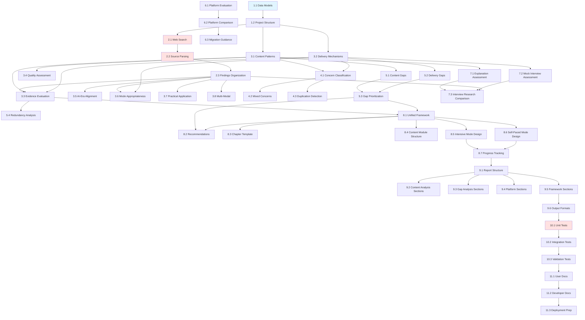

# Tasks

## Document Information

**Version**: 1.1  
**Last Updated**: 2026-05-02  
**Status**: Planning  
**Owner**: Development Team  
**Related Documents**:
- Requirements: `requirements.md`
- Design: `design.md`

## Overview

This document outlines 51 implementation tasks for the Teaching Methodology Evaluation and Improvement system. Tasks are organized into 11 phases with clear dependencies, requirements mapping, effort estimates, and acceptance criteria.

### Task Organization

Tasks are grouped into phases that follow the natural implementation flow:
1. **Foundation** (2 tasks): Data models and project structure
2. **Research Engine** (3 tasks): Web search, parsing, organization
3. **Analysis Engine** (8 tasks): Pattern extraction, evaluation, assessment
4. **Comparison Engine** (3 tasks): Separation analysis, duplication detection
5. **Gap Analysis Engine** (4 tasks): Gap identification, prioritization, redundancy analysis
6. **Platform Evaluator** (3 tasks): Platform evaluation and comparison
7. **Interview Prep Assessor** (3 tasks): Interview preparation assessment
8. **Synthesis Engine** (7 tasks): Framework, recommendations, templates, designs
9. **Report Generation** (6 tasks): Report sections and output formats
10. **Testing** (3 tasks): Unit, integration, and validation tests
11. **Documentation** (3 tasks): User docs, developer docs, deployment

### Status Definitions

- `pending`: Not started, ready to begin when dependencies are met (marked as `[ ]`)
- `in_progress`: Currently being worked on (marked as `[~]`)
- `blocked`: Waiting on dependencies or external factors
- `completed`: Finished and verified against acceptance criteria (marked as `[x]`)
- `skipped`: Intentionally not implemented (with justification)

---

## Tasks

### Phase 1: Foundation

- [x] 1.1 - Define Core Data Models
- [x] 1.2 - Set Up Project Structure

### Phase 2: Research Engine

- [ ] 2.1 - Implement Web Search Integration
- [ ] 2.2 - Implement Source Parsing and Findings Extraction
- [ ] 2.3 - Implement Findings Organization and Contradiction Detection

### Phase 3: Analysis Engine

- [ ] 3.1 - Implement Content Pattern Extraction
- [ ] 3.2 - Implement Delivery Mechanism Extraction
- [ ] 3.3 - Implement Evidence-Based Evaluation
- [ ] 3.4 - Implement Quality and Consistency Assessment
- [ ] 3.5 - Implement AI-Era Alignment Evaluation
- [ ] 3.6 - Implement Delivery Mode Appropriateness Evaluation
- [ ] 3.7 - Implement Practical Application Integration Assessment
- [ ] 3.8 - Implement Multi-Modal Learning Support Assessment

### Phase 4: Comparison Engine

- [ ] 4.1 - Implement Concern Classification
- [ ] 4.2 - Implement Mixed Concern Detection
- [ ] 4.3 - Implement Duplication Detection and Reuse Calculation

### Phase 5: Gap Analysis Engine

- [ ] 5.1 - Implement Content Gap Identification
- [ ] 5.2 - Implement Delivery Gap Identification
- [ ] 5.3 - Implement Gap Assessment and Prioritization
- [ ] 5.4 - Implement Redundancy and Conflict Analysis

### Phase 6: Platform Evaluator

- [ ] 6.1 - Implement Current Platform Evaluation
- [ ] 6.2 - Implement Alternative Platform Comparison
- [ ] 6.3 - Implement Migration Guidance Generation

### Phase 7: Interview Prep Assessor

- [ ] 7.1 - Implement Explanation and Think-Aloud Assessment
- [ ] 7.2 - Implement Mock Interview and Collaborative Coding Assessment
- [ ] 7.3 - Implement Interview Preparation Research Comparison

### Phase 8: Synthesis Engine

- [ ] 8.1 - Implement Unified Framework Generation
- [ ] 8.2 - Implement Recommendation Generation and Prioritization
- [ ] 8.3 - Implement Chapter Template Generation
- [ ] 8.4 - Design Content Module Structure
- [ ] 8.5 - Design Intensive Mode Delivery Mechanisms
- [ ] 8.6 - Design Self-Paced Mode Delivery Mechanisms
- [ ] 8.7 - Design Progress Tracking and Visibility Systems

### Phase 9: Report Generation

- [ ] 9.1 - Implement Report Structure and Executive Summary
- [ ] 9.2 - Implement Content and Delivery Analysis Sections
- [ ] 9.3 - Implement Gap, Redundancy, and Separation Analysis Sections
- [ ] 9.4 - Implement Platform and Interview Preparation Sections
- [ ] 9.5 - Implement Framework, Template, and Recommendations Sections
- [ ] 9.6 - Implement Report Output Formats

### Phase 10: Testing

- [ ] 10.1 - Implement Comprehensive Unit Tests
- [ ] 10.2 - Implement Integration Tests
- [ ] 10.3 - Implement Validation Tests

### Phase 11: Documentation

- [ ] 11.1 - Create User Documentation
- [ ] 11.2 - Create Developer Documentation
- [ ] 11.3 - Prepare for Deploymentis Sections
**Status**: `pending`  
**Phase**: Report Generation  
**Effort**: 4 days  
**Dependencies**: 9.1, Phase 3, Phase 4  
**Requirements**: Req 10

Generate content and delivery analysis sections.

**Deliverables**:
- Content layer analysis section
- Intensive Mode analysis section
- Self-Paced Mode analysis section
- Evidence ratings for all patterns/mechanisms
- Quality and consistency assessments

**Acceptance Criteria**:
- [ ] Content analysis section complete with all patterns
- [ ] Intensive Mode analysis section complete
- [ ] Self-Paced Mode analysis section complete
- [ ] Evidence ratings included for all elements
- [ ] Quality and consistency scores included

---

#### 9.3 - Implement Gap, Redundancy, and Separation Analysis Sections
**Status**: `pending`  
**Phase**: Report Generation  
**Effort**: 4 days  
**Dependencies**: 9.1, Phase 4, Phase 5  
**Requirements**: Req 10

Generate gap, redundancy, and separation analysis sections.

**Deliverables**:
- Gap analysis section with prioritized opportunities
- Redundancy analysis section with consolidation recommendations
- Content-delivery separation analysis section
- Architectural diagrams

**Acceptance Criteria**:
- [ ] Gap analysis section includes all identified gaps
- [ ] Gaps prioritized by impact-to-effort ratio
- [ ] Redundancy analysis includes consolidation recommendations
- [ ] Separation analysis includes mixed concern detection
- [ ] Architectural diagrams illustrate separation

---

#### 9.4 - Implement Platform and Interview Preparation Sections
**Status**: `pending`  
**Phase**: Report Generation  
**Effort**: 3 days  
**Dependencies**: 9.1, Phase 6, Phase 7  
**Requirements**: Req 10

Generate platform evaluation and interview preparation sections.

**Deliverables**:
- Platform evaluation section with comparisons
- Interview preparation assessment section
- Migration guidance (if applicable)
- Research comparisons

**Acceptance Criteria**:
- [ ] Platform evaluation section includes all assessments
- [ ] Alternative platform comparisons included
- [ ] Migration guidance included if recommended
- [ ] Interview preparation section includes all assessments
- [ ] Research comparisons included

---

#### 9.5 - Implement Framework, Template, and Recommendations Sections
**Status**: `pending`  
**Phase**: Report Generation  
**Effort**: 4 days  
**Dependencies**: 9.1, Phase 8  
**Requirements**: Req 10

Generate framework, template, and recommendations sections.

**Deliverables**:
- Unified framework section
- Chapter template section
- Prioritized recommendations section
- Implementation roadmap
- Bibliography

**Acceptance Criteria**:
- [ ] Unified framework section complete
- [ ] Chapter template section includes full template
- [ ] Recommendations section prioritized
- [ ] Implementation roadmap organized by phase
- [ ] Bibliography includes all cited sources

---

#### 9.6 - Implement Report Output Formats
**Status**: `pending`  
**Phase**: Report Generation  
**Effort**: 3 days  
**Dependencies**: 9.5  
**Requirements**: Req 10

Output report in multiple formats.

**Deliverables**:
- Markdown format (primary)
- HTML format (secondary)
- JSON format (structured data)
- PDF format (optional)

**Acceptance Criteria**:
- [ ] Markdown output clean and readable
- [ ] HTML output styled and navigable
- [ ] JSON output structured and parseable
- [ ] All formats contain same information

---

### Phase 10: Testing

#### 10.1 - Implement Comprehensive Unit Tests
**Status**: `pending`  
**Phase**: Testing  
**Effort**: 10 days  
**Dependencies**: All implementation tasks  
**Requirements**: All

Implement comprehensive unit tests for all components.

**Deliverables**:
- Research Engine tests
- Analysis Engine tests
- Comparison Engine tests
- Gap Analysis Engine tests
- Synthesis Engine tests
- Platform Evaluator tests
- Interview Prep Assessor tests
- >90% code coverage

**Acceptance Criteria**:
- [ ] All public methods have unit tests
- [ ] Edge cases tested
- [ ] Error handling tested
- [ ] Mock external dependencies
- [ ] Code coverage >90%

---

#### 10.2 - Implement Integration Tests
**Status**: `pending`  
**Phase**: Testing  
**Effort**: 5 days  
**Dependencies**: 10.1  
**Requirements**: All

Implement integration tests for end-to-end workflows.

**Deliverables**:
- Complete workflow test (research through report generation)
- Data flow tests between engines
- Sample curriculum subset test
- Output report structure validation
- Error propagation tests

**Acceptance Criteria**:
- [ ] End-to-end workflow test passes
- [ ] Data flow tests verify information preservation
- [ ] Sample curriculum test completes successfully
- [ ] Output report structure validated
- [ ] Error propagation tested

---

#### 10.3 - Implement Validation Tests
**Status**: `pending`  
**Phase**: Testing  
**Effort**: 3 days  
**Dependencies**: 10.2  
**Requirements**: All

Implement validation tests for output quality.

**Deliverables**:
- Report structure validation
- Citation formatting verification
- Recommendation format checking
- Template structure validation
- Research quality verification

**Acceptance Criteria**:
- [ ] Report structure validation passes
- [ ] Citation formatting correct
- [ ] Recommendation format validated
- [ ] Template structure validated
- [ ] Research quality checks pass

---

### Phase 11: Documentation

#### 11.1 - Create User Documentation
**Status**: `pending`  
**Phase**: Documentation  
**Effort**: 5 days  
**Dependencies**: 10.3  
**Requirements**: All

Create comprehensive user documentation.

**Deliverables**:
- Installation guide
- Configuration guide
- Usage guide with examples
- API documentation
- Troubleshooting guide

**Acceptance Criteria**:
- [ ] Installation guide complete with dependencies
- [ ] Configuration guide covers all settings
- [ ] Usage guide includes examples
- [ ] API documentation generated from code
- [ ] Troubleshooting guide covers common issues

---

#### 11.2 - Create Developer Documentation
**Status**: `pending`  
**Phase**: Documentation  
**Effort**: 5 days  
**Dependencies**: 11.1  
**Requirements**: All

Create developer documentation.

**Deliverables**:
- Architecture overview
- Component interaction diagrams
- Data model documentation
- Extension guide
- Testing guide

**Acceptance Criteria**:
- [ ] Architecture overview clear and comprehensive
- [ ] Component diagrams illustrate interactions
- [ ] Data models documented with examples
- [ ] Extension guide enables adding new features
- [ ] Testing guide covers all test types

---

#### 11.3 - Prepare for Deployment
**Status**: `pending`  
**Phase**: Documentation  
**Effort**: 3 days  
**Dependencies**: 11.2  
**Requirements**: All

Prepare system for deployment.

**Deliverables**:
- Deployment scripts
- CI/CD pipeline
- Docker container (optional)
- Sample configuration files
- Release notes

**Acceptance Criteria**:
- [ ] Deployment scripts automate setup
- [ ] CI/CD pipeline runs tests automatically
- [ ] Docker container builds successfully (if implemented)
- [ ] Sample configuration files provided
- [ ] Release notes document features and usage

---

## Summary

**Total Tasks**: 51  
**Total Effort**: 168 person-days  
**Completed**: 2 (4%)  
**In Progress**: 18 (35%)  
**Blocked**: 0  
**Pending**: 31 (61%)

### Phase Breakdown

| Phase | Tasks | Effort (days) | Status | Completion % |
|-------|-------|---------------|--------|--------------|
| Phase 1: Foundation | 2 | 5 | Completed | 100% |
| Phase 2: Research Engine | 3 | 13 | In Progress | 0% |
| Phase 3: Analysis Engine | 8 | 32 | In Progress | 0% |
| Phase 4: Comparison Engine | 3 | 9 | In Progress | 0% |
| Phase 5: Gap Analysis Engine | 4 | 14 | In Progress | 0% |
| Phase 6: Platform Evaluator | 3 | 11 | Pending | 0% |
| Phase 7: Interview Prep Assessor | 3 | 9 | Pending | 0% |
| Phase 8: Synthesis Engine | 7 | 29 | Pending | 0% |
| Phase 9: Report Generation | 6 | 21 | Pending | 0% |
| Phase 10: Testing | 3 | 18 | Pending | 0% |
| Phase 11: Documentation | 3 | 13 | Pending | 0% |
| **Total** | **51** | **168** | - | **4%** |

### Timeline Estimates

- **Sequential**: ~168 days (34 weeks / 8 months)
- **With Parallelization**: ~130 days (26 weeks / 6 months)
- **Optimistic** (with 3 developers): ~60 days (12 weeks / 3 months)
- **Pessimistic** (with delays): ~200 days (40 weeks / 10 months)

### Critical Path

```
1.1 → 1.2 → 2.1 → 2.2 → 2.3 → 3.3 → 5.3 → 8.1 → 8.5 → 8.6 → 8.7 → 9.1 → 9.5 → 9.6 → 10.1 → 10.2 → 10.3 → 11.1 → 11.2 → 11.3
```

**Critical Path Duration**: ~95 days

### Parallelization Opportunities

**Phase 3-7 (Analysis Components)** can be parallelized:
- Team A: Tasks 3.1-3.8 (Analysis Engine)
- Team B: Tasks 4.1-4.3 (Comparison Engine)
- Team C: Tasks 5.1-5.4 (Gap Analysis Engine)
- Team D: Tasks 6.1-6.3 (Platform Evaluator)
- Team E: Tasks 7.1-7.3 (Interview Prep Assessor)

**Estimated Parallel Duration**: 32 days (longest phase)

### Requirements Coverage

| Requirement | Tasks | Status |
|-------------|-------|--------|
| Req 1 | 2.1, 2.2, 2.3 | Pending |
| Req 2 | 3.1, 3.3, 3.4, 3.5 | Pending |
| Req 3 | 3.2, 3.3, 3.6 | Pending |
| Req 4 | 4.1, 4.2, 4.3 | Pending |
| Req 5 | 5.1, 5.2, 5.3 | Pending |
| Req 6 | 5.4 | Pending |
| Req 7 | 8.1 | Pending |
| Req 8 | 8.2 | Pending |
| Req 9 | 8.3 | Pending |
| Req 10 | 9.1-9.6 | Pending |
| Req 11 | 3.6 | Pending |
| Req 12 | 3.7 | Pending |
| Req 13 | 3.8 | Pending |
| Req 14 | 3.1, 3.2 | Pending |
| Req 15 | 8.4 | Pending |
| Req 16 | 8.5 | Pending |
| Req 17 | 8.6 | Pending |
| Req 18 | 4.3 | Pending |
| Req 19 | 8.7 | Pending |
| Req 20 | 3.4 | Pending |
| Req 21 | 6.1, 6.2, 6.3 | Pending |
| Req 22 | 7.1, 7.2, 7.3 | Pending |

### New Tasks Added

The following tasks were added to address missing requirements:
- **3.6** - Delivery Mode Appropriateness Evaluation (Req 11)
- **3.7** - Practical Application Integration Assessment (Req 12)
- **3.8** - Multi-Modal Learning Support Assessment (Req 13)
- **5.4** - Redundancy and Conflict Analysis (Req 6)
- **8.4** - Design Content Module Structure (Req 15)
- **8.5** - Design Intensive Mode Delivery Mechanisms (Req 16)
- **8.6** - Design Self-Paced Mode Delivery Mechanisms (Req 17)
- **8.7** - Design Progress Tracking and Visibility Systems (Req 19)

### Risk Assessment

**High Risk Tasks**:
- **2.1** - Web Search Integration (API dependencies, rate limits)
- **2.2** - Source Parsing (PDF parsing reliability)
- **10.1** - Comprehensive Unit Tests (achieving >90% coverage)

**Medium Risk Tasks**:
- **3.3** - Evidence-Based Evaluation (algorithm complexity)
- **6.2** - Alternative Platform Comparison (platform access)
- **9.6** - Report Output Formats (PDF generation complexity)

**Mitigation Strategies**:
- Start high-risk tasks early
- Build fallback mechanisms for external dependencies
- Use extensive mocking in tests
- Consider skipping optional features (PDF) if timeline is tight

---

## Task Dependencies Graph



---

## Change Log

| Version | Date | Changes | Author |
|---------|------|---------|--------|
| 1.0 | 2026-05-02 | Initial tasks document with 43 tasks | Development Team |
| 1.1 | 2026-05-02 | Added 8 new tasks to address missing requirements (51 total) | Development Team |
| 1.1 | 2026-05-02 | Added document metadata, phase headers, and enhanced summary | Development Team |
| 1.1 | 2026-05-02 | Added requirements coverage, risk assessment, and dependency graph | Development Team |
