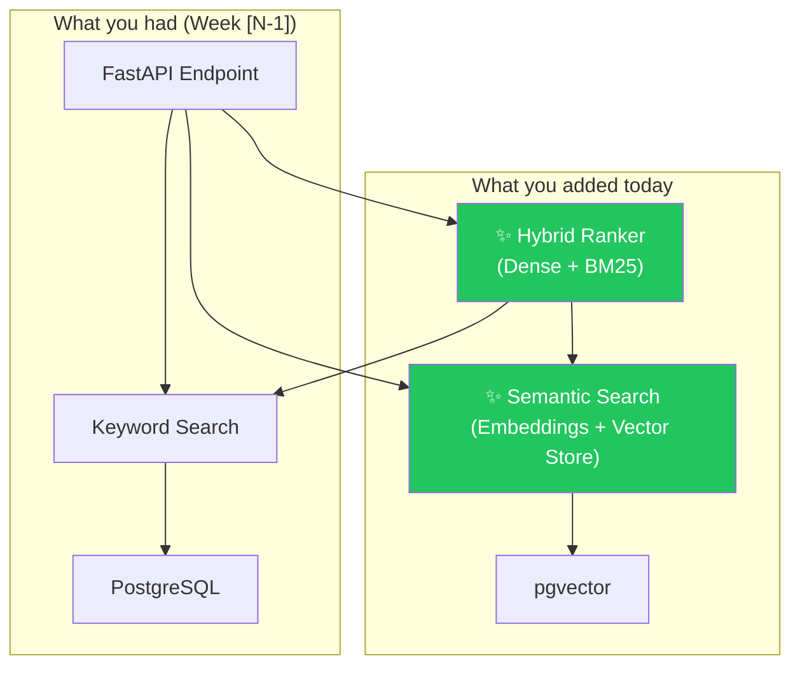

# Chapter Template: Hands-On AI Engineering Tutorials

**Based on:** [TEACHING-TECHNIQUES.md](TEACHING-TECHNIQUES.md)
**Applies to:** All 28 weeks, all section types (concept intro, project build, evaluation, deployment)

> **How to use this template:**
> Fill in every `[PLACEHOLDER]` section. Never skip the Hook, the Friction, or the
> Reflection — these three carry the most pedagogical weight. The rest is scaffolding.
> Keep the cafe-friend tone throughout: second person, contractions, short sentences.

---

# Week [N] · [Phase Name]: [Title With Active Verb]
### *[Evocative subtitle — one line that makes the reader curious]*

> **Time:** ~[X] hours · **Difficulty:** [Beginner / Intermediate / Advanced]
> **What you'll build:** [One concrete artifact — be specific, not vague]

---

## 🗺️ Before We Start: The Map

*Orient the reader. 5–8 lines max. Connect to the spiral.*

You've already got [prior skill from last week/chapter]. Today we're going to break it.

Specifically, you'll:
- [Concrete thing 1 — verb-noun, e.g., "Build a hybrid search function that combines dense and BM25 retrieval"]
- [Concrete thing 2]
- [Concrete thing 3 — optionally reference the flagship project]

This connects to **[prior concept]** from Week [N-x] and sets up **[future concept]**
in Week [N+y]. (Spiral learning — you'll see this pattern get deeper, not wider.)

```mermaid
mindmap
  root((Week [N]))
    Prior Knowledge
      [Concept from Week N-1]
      [Concept from Week N-2]
    New This Week
      [New Concept 1]
      [New Concept 2]
    Connects Forward
      [Week N+1 concept]
      [Flagship project milestone]
```

---

## 🎣 Act 1: The Hook

*A 150–300 word narrative scenario in the civil engineering domain. Show a real problem.
Write in second person, present tense. End with a question — never with an answer.*

---

*Example pattern (replace with chapter-specific content):*

It's 11 PM. A structural engineer is reviewing bridge inspection reports before
tomorrow's city council meeting. She types her question into the system you built
last week: "Which bridges show signs of rebar corrosion near expansion joints?"

The results come back. They're technically correct — every document mentioning
"rebar" or "corrosion" or "expansion joint" is there. But so is a 40-page general
maintenance manual. And a procurement catalog. And a contractor invoice from 2019.

She needed the *three relevant inspection reports*. She got forty documents.

Your search works. But it doesn't *understand*. And there's a difference.

**Here's the question you're going to answer today:** How do you make a retrieval
system that returns what someone *means*, not just what they *typed*?

---

## 🔥 Act 2: The Friction — Current Tools Fall Short

*Show exactly why their existing knowledge can't solve the hook problem.
Show broken code or a failed output. Keep it short: 50–100 words + code/output snippet.*

Here's what last week's system would do with that query:

```python
# Week [N-1] approach
results = search_by_keywords(query="rebar corrosion expansion joint")
# Returns: 40 documents ranked by keyword frequency
```

```
Output:
  1. Maintenance Manual Vol. 3 (score: 0.94)  ← Not what she needs
  2. Bridge #A12 Inspection 2024 (score: 0.91) ← This one, yes
  3. Rebar Procurement Catalog (score: 0.88)  ← Definitely not
  ...38 more documents
```

The problem: keyword matching doesn't understand context. It finds documents
that *contain the words*, not documents that *answer the question*.

**Before reading on — what do you think is missing here?** *(Take 10 seconds.)*

---

## 💡 Act 3: Concept Building

*Introduce concepts as solutions to the friction. Max 2 new concepts per section.
Each concept follows: Plain English → Analogy → Diagram → Minimal code → Question.*

---

### Concept 1: [Name]

*One-sentence plain English definition — Feynman technique: explain it to a friend, not a textbook.*

[Plain English explanation, 2–4 sentences. No jargon before it's earned.]

**The analogy:** [A real-world analogy that makes this click. Civil engineering domain preferred.]

> Example: "Embeddings are like GPS coordinates for meaning. Two documents about
> bridge load calculations will have similar coordinates, even if they use different
> words. A document about pasta recipes will be across the map."

```mermaid
[Diagram that shows the concept before any code]
```

*Caption: [One sentence telling the reader what to notice in the diagram.]*

**The minimal working version:**

```python
# [Describe what this does in a comment — decisions, not syntax]
# [Add think-aloud narration for non-obvious choices]

[minimal code — 5–15 lines max]
```

**Try it:** [Specific thing to run or observe] before moving on.

> **Stop and think:** [Question that triggers elaborative interrogation — "Why does...?"
> or "What would happen if...?" — answer follows in the next paragraph.]

[Answer to the question + connection to the next concept.]

---

### Concept 2: [Name]

*(Same structure as Concept 1)*

---

## 🧠 Act 4: Expert Modeling — Watch Me Build It

*Walk through a real implementation with full think-aloud narration.
Show the decisions, not just the code. Include at least one "I almost made this mistake" moment.*

OK — let me build this in front of you. I'll narrate what I'm thinking.

**Step 1: [Action]**

```python
# My first instinct was [naive approach]. But here's why that breaks:
# [1-2 sentence explanation]
# Instead, I'm going to [better approach] because [reason].

[code block]
```

**Step 2: [Action]**

```python
# This line is doing something subtle — [explain the non-obvious thing].
# A lot of people write [wrong version] here. The difference is [explain].

[code block]
```

**What I'd do differently in production:**

> [One honest note about what the "real" version would add — auth, error handling,
> monitoring. Don't implement it — just name it. Saves cognitive load, builds
> awareness.]

---

## ✍️ Act 5: Your Turn — Scaffolded Practice

*Faded examples → open problem. Three levels, each with decreasing help.*

---

### Exercise 1 (Guided — TODOs provided)

*Fill in the blanks. The structure is given; you supply the logic.*

```python
def [function_name](
    query: str,
    top_k: int = 5
) -> list[SearchResult]:
    """[Docstring describing what this should do]"""
    
    # Step 1: [What to do]
    embeddings = TODO  # Hint: use the encode() function from above
    
    # Step 2: [What to do]
    results = TODO  # Hint: remember the cosine_similarity function?
    
    # Step 3: [What to do]
    return TODO
```

Expected output when you call it with `"rebar corrosion bridge"`:
```
[Show expected output snippet]
```

---

### Exercise 2 (Semi-Guided — requirements only, no hints)

*Build [specific thing] that [does X]. Requirements:*
- *[Requirement 1]*
- *[Requirement 2]*
- *[Requirement 3]*

*No starter code this time. You've got everything you need from above.*

---

### Exercise 3 (Open — you design it)

*You noticed that [problem from Exercise 2]. How would you fix it?
There's no single right answer here. Write your approach in a comment block,
implement one version, and note what tradeoffs you made.*

---

## 🏗️ Act 6: Build — Apply to the Flagship Project

*Connect to the evolving flagship project. Give specific instructions.
Reference the current project stage (v1 / v2 / v3).*

Now wire this into your [**Flagship #1 v[N]** / **Flagship #2 v[N]**].

Open `[specific file path in the flagship project]` and:

1. **Replace** [old function/approach] with the new [new approach] you just built.
2. **Add** [specific test] to `tests/[test_file].py`.
3. **Update** the `README.md` with a one-paragraph explanation of what changed and why.

**The test that proves it works:**

```python
def test_[what_youre_testing]():
    """[What this test verifies]"""
    result = [your_function]("[test query]")
    
    assert len(result) == [expected count]
    assert result[0].[field] == "[expected value]"
    # [Add one more meaningful assertion]
```

Run it:
```bash
pytest tests/[test_file].py::test_[name] -v
```

You should see:
```
PASSED tests/[test_file].py::test_[name]
```

If you don't — good. That's a learning moment. Drop it in your Failure Log
(format below) before debugging.

---

## 🔭 Act 7: The Bigger Picture

*Show the full architecture diagram for the current project state.
Always build incrementally — this week's additions highlighted.*

Here's where your project stands after today:



*The green boxes are today's additions. Notice that you didn't replace the keyword
search — you layered on top of it. That's intentional: hybrid always beats pure.*

**What's next:** In Week [N+1], we'll add [concept] so that [benefit]. The architecture
diagram will grow by [2–3 more components]. You'll recognize the pattern.

---

## 📝 Act 8: Reflection + Commit

*Mandatory. This is where learning consolidates.*

---

### Your Failure Log Entry (weekly mandatory)

Copy this template into `guides/FAILURE-LOG.md`:

```markdown
## Week [N]: [Chapter Title]

**What broke:**
[Describe the error or unexpected behavior you hit — exact error message if possible]

**Why it broke:**
[Your explanation — what did you misunderstand or overlook?]

**How I fixed it:**
[What you actually did to solve it]

**What I'd do differently:**
[One thing you'd change if you were starting fresh]
```

---

### The One-Sentence Summary

Complete this before committing:

> "Today I learned that _____________ because I _____________, and next week I'll
> use this when I _____________."

*(This is the Feynman test. If you can't fill it in, re-read one section.)*

---

### Commit

```bash
git add .
git commit -m "week-[N]: [short description of what you built]

- [Bullet: what you added]
- [Bullet: what you changed]  
- [Bullet: what you tested]

Relates to: [Flagship #1 / #2] [v1/v2/v3]"

git push
```

---

### Looking Ahead

You've got **[Concept 1]** and **[Concept 2]** solid now. In Week [N+1], you're
going to use both of them to [preview next chapter's problem — one intriguing sentence
that makes them want to keep going].

See you there.

---

## ⚙️ Chapter Metadata (for authors)

```yaml
week: [N]
phase: [1-5 | phase name]
concepts_introduced:
  - [Concept 1]
  - [Concept 2]
concepts_reinforced:
  - [Concept from prior week]
  - [Concept from prior week]
concepts_previewed:
  - [Concept for next week]
flagship_project: [Flagship #1 or #2 | v1/v2/v3 stage]
mermaid_diagrams:
  - mindmap: "Week overview"
  - [diagram type]: "[what it shows]"
exercises:
  - guided: "[Exercise 1 description]"
  - semi_guided: "[Exercise 2 description]"
  - open: "[Exercise 3 description]"
estimated_hours: [N]
difficulty: [beginner | intermediate | advanced]
```

---

## ✅ Author Checklist

Before publishing a chapter, verify:

- [ ] Hook is a story, not a definition. Ends with a question.
- [ ] Friction shows the broken approach — not just describes it.
- [ ] Max 2 new concepts per section.
- [ ] Every concept has: plain English + analogy + diagram + code + question.
- [ ] Expert modeling narrates *decisions*, not syntax.
- [ ] Three exercise levels: guided → semi-guided → open.
- [ ] Flagship project integration is specific (file path, test, commit message).
- [ ] Architecture diagram shows THIS week's additions highlighted.
- [ ] Spiral callbacks: reference at least 1 prior week + 1 future week.
- [ ] Tone: second person, contractions, acknowledges difficulty, no condescension.
- [ ] Failure Log template is included.
- [ ] Commit message template is included.
- [ ] Chapter metadata block is filled in.
