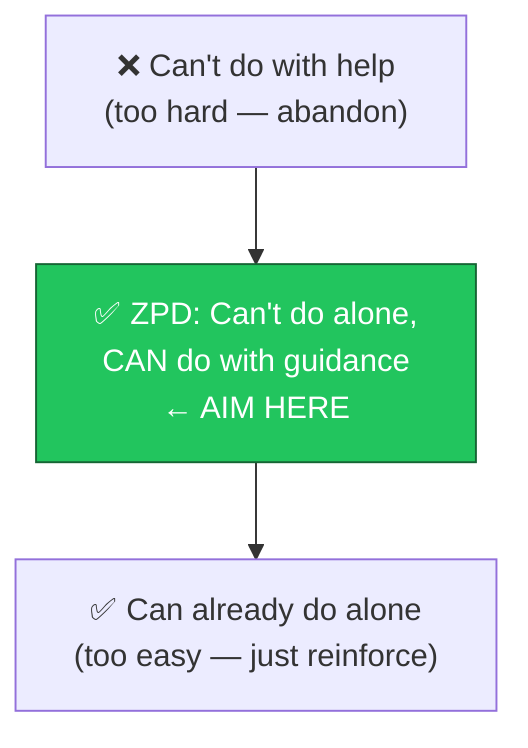
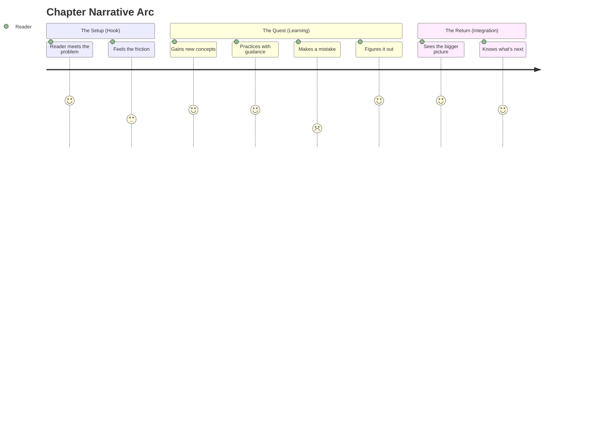
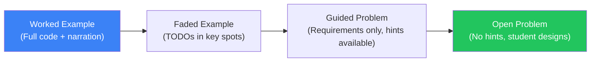
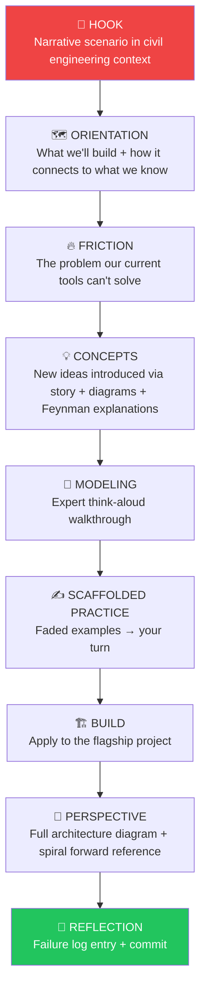

# Teaching & Tutoring Techniques Reference
## For the Hands-On AI Engineering Curriculum

**Purpose:** Research-backed pedagogical framework for authoring engaging, interactive,
story-like chapter tutorials across all 28 weeks.

**Audience:** Tutorial authors, AI assistants generating chapter content.

---

## The Core Philosophy

> "The best teacher is a knowledgeable friend who happens to know exactly what
> confuses you — and cares enough to walk you through it."

Three principles drive everything here:

1. **Problem first, concepts second.** Real struggle precedes real understanding.
2. **Story carries the technical payload.** Emotion + narrative = 22× better retention than facts alone (Bruner, 1990).
3. **Spiral deeper, not wider.** Revisit ideas at increasing depth rather than introducing more new ideas.

---

## Part 1: Foundational Pedagogical Frameworks

### 1.1 Cognitive Apprenticeship (Collins, Brown & Newman, 1989)

The gold standard for teaching expert thinking — not just expert behavior. Expert
performance in software engineering is *invisible* (it happens in the head). This
model makes it visible.

**Six Methods:**

| Method | What It Looks Like in a Chapter |
|--------|--------------------------------|
| **Modeling** | Author writes code live, narrating every thought ("I'm choosing a list here because...") |
| **Coaching** | Embedded hints, "Try this before reading on" prompts |
| **Scaffolding** | Starter code → faded examples → blank canvas, in sequence |
| **Articulation** | "In your own words, explain why..." reflection prompts |
| **Reflection** | Compare your solution to expert solution after building |
| **Exploration** | Open-ended extensions at chapter end |

**Diagram:**


---

### 1.2 Spiral Curriculum (Bruner, 1960)

"Any subject can be taught effectively in some intellectually honest form to any
person at any stage of development."

This curriculum already uses spiral learning (RAG in Weeks 5, 7–10, 13, and the
capstone). Every tutorial author should exploit this explicitly.

**How to signal the spiral:**
- Opening: "Remember the simple RAG pipeline from Week 5? Today we break it."
- Closing: "We'll revisit this in Week 13 when we add MCP tools."

```mermaid
spiral
    title Spiral Learning: RAG in This Curriculum
    "Week 5" : "Build RAG from scratch (no frameworks)"
    "Week 6" : "Add reranking, HyDE, caching"
    "Week 7" : "Evaluate it — RAGAS metrics"
    "Week 8" : "Rebuild in LangChain + LlamaIndex"
    "Week 10" : "Deploy it — monitoring, guardrails"
    "Week 13" : "Wire RAG into agentic MCP ecosystem"
    "Weeks 23-24" : "Final production polish + capstone"
```

*(Render as a concentric rings diagram if spiral syntax unsupported — outer rings = later weeks, deeper understanding.)*

---

### 1.3 Zone of Proximal Development + Scaffolding (Vygotsky, 1978)

The ZPD is the sweet spot: what a student *can't quite do alone yet* but *can do
with the right support*. Every chapter should target this zone.

**Practical rule:** If the student could have written this section themselves, the
chapter is too easy. If they couldn't follow it even with help, it's too hard.



**Scaffolding that fades:**
```
Week N introduction:    [Full code provided + explained]
Week N practice:        [Skeleton with TODOs]
Week N+2 extension:     [Problem statement only]
Week N+6 capstone:      [You design the solution]
```

---

### 1.4 Cognitive Load Theory (Sweller, 1988)

The working memory bottleneck is real. A student who is cognitively overloaded
learns nothing, even if they finish the exercise.

**Three load types:**

| Type | Cause | Fix |
|------|-------|-----|
| **Intrinsic** | Concept complexity | Sequence simpler concepts first; one new idea per section |
| **Extraneous** | Poor presentation (clutter, irrelevant details) | Clean layout; highlight what matters; cut boilerplate |
| **Germane** | Schema-building effort (the good kind) | Worked examples that connect to existing knowledge |

**Chapter design implications:**
- Never introduce more than **2 new concepts** per section.
- Provide a working environment (starter code) so students don't fight tooling.
- Use diagrams *before* code, not after. The mental model must exist first.

---

### 1.5 Problem-Based Learning (Barrows & Tamblyn, 1980)

Start with a real, messy problem. Let the student feel the friction. *Then* introduce
the concept that solves it.

**Chapter flow:**
```
BAD:  "Today we learn embeddings. Embeddings are vector representations of..."
GOOD: "Your search returns 'bridge maintenance manual' when asked about beam
       deflection. It's not wrong — but it's not helpful. What's missing?"
```

The second version makes the student want embeddings before you explain what they are.

---

## Part 2: Learning Science Techniques

### 2.1 Spaced Repetition + Interleaving

Don't explain a concept once and move on. Bring it back — slightly varied — at
increasing intervals.

**This curriculum's spiral is already spaced.** Tutorial authors reinforce by:
- Opening each chapter with a 2-sentence callback to relevant prior content.
- Ending each chapter with a "you'll see this again in Week X" forward reference.
- Using **interleaving** in exercises: mix new and old concepts rather than drilling
  one concept at a time.

### 2.2 Retrieval Practice (Testing Effect)

Retrieving information from memory strengthens it more than re-reading.

**In-chapter mechanics:**
- "Before reading the solution, write your prediction in one sentence."
- Checkpoint questions mid-chapter (not end-of-chapter).
- "Close your editor and rebuild from memory" mini-challenges.
- End-of-chapter "explain this concept to someone without a CS background."

### 2.3 Desirable Difficulties (Bjork, 1994)

Make it slightly harder than comfortable. Fluency is a false signal of learning.

**In practice:**
- Don't reveal the import statement needed — let the student look it up once.
- Give an intentionally broken code snippet and ask "what's wrong here?"
- Present multiple valid approaches and ask the student to pick and justify.
- Use "interleaved" exercises (mix Week 3 concepts into a Week 6 exercise).

### 2.4 Elaborative Interrogation (Why-Based Questioning)

"Why does this work?" questions outperform "what does this do?" questions for
long-term retention.

**Embed these naturally:**
> "We're using async here. Why does that matter for an LLM call that might take
> 3 seconds? What would happen to your API server if you didn't?"

---

## Part 3: Narrative & Engagement Techniques

### 3.1 The Story-First Framework

Human memory is structured around narrative. Facts decay; stories persist.

**Structure each chapter as a mini-story:**



**The three-act chapter:**
1. **Act 1 (Hook):** A scenario in the civil engineering context creates a real problem. End with a question.
2. **Act 2 (Learning):** Concepts unfold as tools that solve the problem. Struggle is acknowledged.
3. **Act 3 (Integration):** Student builds the solution, sees the architecture, commits.

### 3.2 The Hero's Journey Applied to Technical Learning

The student is the hero. The chapter is their quest.

| Hero's Journey Stage | Chapter Equivalent |
|---------------------|-------------------|
| **Ordinary World** | "You already know X from last week..." |
| **Call to Adventure** | The hook problem that current knowledge can't solve |
| **Refusal of the Call** | "You might think just doing Y is enough. Here's why it isn't." |
| **Mentor Appears** | The new concept or tool introduced |
| **Tests & Enemies** | Exercises, edge cases, broken code to debug |
| **Ordeal** | The hard exercise or design challenge |
| **Reward** | The working implementation, the insight |
| **The Road Back** | Connecting to the flagship project |
| **Return with Elixir** | The architectural view, the commit, "you now know X" |

### 3.3 The Cafe Friend Tone

Technical writing is usually impersonal and passive. Tutorial writing should feel
like a smart friend explaining something over coffee — direct, warm, slightly
irreverent, never condescending.

**Tone rules:**
- Write in second person: "you", not "the student" or "one should".
- Use contractions: "you'll", "it's", "don't".
- Acknowledge the hard parts: "This next bit is genuinely confusing the first time."
- Self-disclose: "When I first saw this error, I stared at it for 20 minutes."
- Use humor carefully: one light moment per section is plenty.
- Short sentences. Fragments are fine. (See what I did there.)

**Before/After:**
```
BEFORE: "The implementation of the retrieval mechanism necessitates consideration
         of the embedding dimensionality constraints."

AFTER:  "Here's the sneaky part: your embeddings need to match dimensions.
         OpenAI's ada-002 gives you 1536 floats. Cohere gives you 1024.
         Mix them and nothing works — silently. Fun."
```

### 3.4 Socratic Questioning (Embedded Mid-Chapter)

Don't tell the student what to think. Ask them to think, then confirm.

**Pattern:**
```
Pose a question → Give them a moment ("Stop and think for 10 seconds") →
Reveal the answer → Connect to the next concept
```

**Examples:**
> "What do you think happens to retrieval quality if we increase chunk size from
> 512 to 2048 tokens? Think before scrolling."

> "Look at this error. Before reading the explanation, what's your guess?"

---

## Part 4: Visual Learning & Diagram Strategy

### 4.1 Dual Coding Theory (Paivio, 1971)

Words + images together are processed through separate channels, increasing
encoding depth. Every conceptual section deserves a diagram.

**Rule:** If you can't draw it, you don't understand it well enough to teach it yet.

### 4.2 Mermaid Diagram Types by Purpose

| Purpose | Diagram Type | When to Use |
|---------|-------------|-------------|
| System architecture | `graph LR/TD` flowchart | Show how components connect |
| Data/request flow | `sequenceDiagram` | Show time-ordered interactions |
| Mental model map | `mindmap` | Introduce a new concept cluster |
| Learning journey | `journey` | Show chapter arc or student path |
| Project timeline | `gantt` | Phase overviews, week planning |
| State transitions | `stateDiagram-v2` | Agent states, pipeline states |
| Data relationships | `erDiagram` | Models, database schemas |
| Decision trees | `graph` with diamonds | Algorithm logic, flow control |

### 4.3 The Progressive Diagram Reveal

Don't show the full architecture diagram up front. Build it incrementally.

```
Start of chapter:     [Simple 2-box diagram — the core idea]
Mid-chapter:          [Add 2 more boxes — the new concepts]
End of chapter:       [Full architecture diagram — the complete picture]
```

This mirrors the ZPD scaffolding principle visually.

### 4.4 Diagram Placement Rules

1. **Before code, not after.** The mental model must exist before the syntax.
2. **One diagram per concept cluster.** Don't stack 4 diagrams in a row.
3. **Always caption the diagram.** One sentence explaining what the reader should
   see, not what the diagram contains.
4. **Redraw from prior weeks with additions.** Continuity builds schema.

---

## Part 5: Software-Specific Techniques

### 5.1 Code-First, Theory-Second (for Practitioner Learners)

For practitioners (this curriculum's audience), starting with working code and
extracting theory is more motivating than the reverse.

```
Show 10 lines that work → ask "why does this work?" → explain the concept →
generalize → apply to a harder problem
```

### 5.2 Worked Example → Faded Example → Open Problem Progression

The most evidence-backed sequence for skill acquisition in programming:



Each chapter uses all four levels. The worked example appears in the "Expert Modeling"
section; the open problem appears in the "Extend It" section.

### 5.3 Think-Aloud Expert Narration

When showing code in a chapter, narrate the *decisions*, not the *syntax*.

```python
# Narration example:
# "I'm using async here because LLM calls can take 2–5 seconds.
#  If I used sync, one slow request would block all others.
#  FastAPI + async = handle 10 concurrent requests with one thread."

async def generate_response(prompt: str) -> str:
    response = await client.messages.create(...)
    return response.content[0].text
```

### 5.4 Failure as Learning (Failure-First Design)

This curriculum mandates a Failure Log. Chapters should model this by deliberately
showing broken code first.

**Pattern:**
1. Show the naive/broken approach.
2. Run it. Show the error.
3. Ask "what went wrong?"
4. Explain. Fix. Run again.
5. Ask "what would break this again?"

This makes debugging a skill, not a punishment.

### 5.5 Real-World Domain Anchoring (Civil Engineering Context)

Every abstract concept needs a concrete civil engineering anchor. This is what
transforms "just another Python tutorial" into a coherent learning journey.

| Abstract Concept | Civil Engineering Anchor |
|------------------|--------------------------|
| Embeddings | "Encoding a bridge inspection report as a location in meaning-space" |
| Vector similarity | "Finding the most relevant failure report for this crack pattern" |
| RAG pipeline | "The engineer's research workflow — retrieve specs, synthesize answer" |
| Agents | "An AI inspector that can pull drawings, run calculations, file reports" |
| Token limits | "Fitting the entire project specification into one conversation" |

---

## Part 6: The Engagement Stack

Every chapter should layer these engagement techniques:



---

## Summary: The 10 Non-Negotiables

1. **Problem before concept** — never explain a concept before the student feels why they need it.
2. **Story arc** — every chapter has a hook, a struggle, and a resolution.
3. **Cafe friend tone** — second person, contractions, acknowledge difficulty, no condescension.
4. **Two new concepts max** per section — respect cognitive load.
5. **Diagram before code** — mental model first, syntax second.
6. **Expert think-aloud** — narrate decisions, not syntax.
7. **Faded scaffolding** — worked example → faded → open problem.
8. **Spiral callbacks** — reference what came before and preview what's next.
9. **Civil engineering anchors** — every abstraction has a domain story.
10. **Failure is curriculum** — show the broken version first; make debugging a skill.

---

## Sources & Further Reading

- Collins, A., Brown, J. S., & Newman, S. E. (1989). *Cognitive apprenticeship: Teaching the crafts of reading, writing, and mathematics.*
- Bruner, J. S. (1960). *The Process of Education.* Harvard University Press.
- Vygotsky, L. S. (1978). *Mind in Society.* Harvard University Press.
- Sweller, J. (1988). Cognitive load during problem solving. *Cognitive Science, 12*(2), 257–285.
- Bjork, R. A. (1994). Memory and metamemory considerations in the training of human beings. *Metacognition: Knowing about knowing.*
- Paivio, A. (1971). *Imagery and Verbal Processes.* Holt, Rinehart & Winston.
- Barrows, H. S., & Tamblyn, R. (1980). *Problem-Based Learning.* Springer.
- Feynman, R. (technique popularized). See: [fs.blog/feynman-technique](https://fs.blog/feynman-technique/)

**Research Sources Used:**
- [Active Learning Strategies in CS Education (MDPI)](https://www.mdpi.com/2414-4088/8/6/50)
- [Cognitive Apprenticeship (Collins, Brown & Holum, AFT)](https://www.aft.org/ae/winter1991/collins_brown_holum)
- [Zone of Proximal Development Guide (Growth Engineering)](https://www.growthengineering.co.uk/zone-of-proximal-development/)
- [Storytelling in Education (K. Patricia Cross Academy)](https://kpcrossacademy.ua.edu/the-power-of-storytelling-using-narrative-to-enhance-teaching-and-learning/)
- [Digital Storytelling Benefits & Techniques (Research.com)](https://research.com/education/digital-storytelling)
- [Spaced Repetition Science (Traverse)](https://traverse.link/spaced-repetition)
- [Feynman Technique for Programming (Medium)](https://haase1020.medium.com/feynman-technique-for-learning-programming-and-computer-science-a814e624f4ad)
- [Immersive Education & Narrative (PMC/NIH)](https://pmc.ncbi.nlm.nih.gov/articles/PMC11659684/)
- [6 Storytelling Techniques in eLearning (Shift)](https://www.shiftelearning.com/blog/storytelling-techniques-in-elearning)
