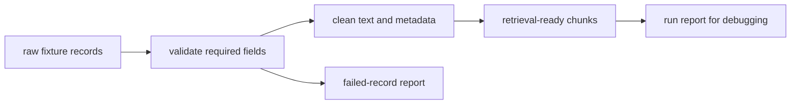

# Phase 1: AI-Ready Ingestion And Chunking Lab

## Learning Logic

Use the course map in `curriculum/LEARNER_JOURNEY_MAP.md` and the local module README to keep this lesson bounded.

| Question | Learner-facing answer |
| --- | --- |
| What can I do now? | build validated tools and structured context. |
| What new capability am I adding? | create raw, clean, failed, and chunked AI-ready records. |
| What failure does this help me catch? | missing metadata, silent record drops, and bad chunk provenance. |
| How does this improve FinAgent or a practical AI system? | gives FinAgent source-grounded material before retrieval answers. |
| What should I be able to explain afterward? | how ingestion quality controls RAG reliability. |

## Minimum Path, Enrichment, And Doorway

- **Minimum path:** read the scenario, inspect the tests or fixtures, complete the TODOs in `workbench.py`, run the verification command, and write the reflection/evidence note.
- **Optional enrichment:** add one edge case, comparison, or small test after the required behavior works.
- **Advanced doorway:** notice the later advanced topic this prepares for, then return to the bounded Course 1 task.

## Evidence Portfolio

Leave this lesson with technical evidence, failure evidence, explanation evidence, and transfer evidence. A passing test alone is not the whole learning outcome.

Folder: `week-01-basic-rag`  
Expected time to finish: 5-7 hours  
File to edit: `workbench.py`  
Test folder: `tests/`  
Core test file: `tests/test_ai_ready_pipeline.py`

## Learning Goal

Build the small data-prep layer that must exist before a RAG system can answer with confidence: raw records, cleaned records, failed records, source metadata, and retrieval-ready chunks.

## What You Will Build

- a deterministic fixture loader
- text normalization that keeps source meaning intact
- metadata normalization that preserves provenance
- validation for missing IDs, source IDs, timestamps, and content
- failed-record reporting instead of silent drops
- chunk output with source IDs, timestamps, and record metadata
- a compact run report that explains what happened

## Success Looks Like

- Valid records become clean records with normalized text and metadata.
- Bad records are reported with useful reasons instead of crashing the whole run.
- Chunks preserve enough source information for later citation checks.
- The run report shows counts for raw, clean, failed, and chunked records.
- No network, vector database, framework, or LLM is needed for the first green path.

## Real-World Context

FinAgent should not retrieve mystery text. Before it can cite market context, it needs records with stable IDs, source names, collection timestamps, and clean text.

At the cafe table, this is the whole first slice:



## Before You Run

Before editing, predict:

1. Which bad record should be reported instead of silently disappearing?
2. Which fields must a future citation need?
3. Why is chunking before metadata preservation dangerous?

## Evidence First

Run the tests once before coding:

```powershell
python -m pytest tests -v
```

The first run should fail because `workbench.py` contains TODO behavior. Read the first failure and decide whether it points to validation, cleaning, chunking, or reporting.

## Trace

Open `workbench.py` and answer:

1. Which dataclass represents a source before cleaning?
2. Which dataclass records a rejected source?
3. Which function should preserve `source_id` and `collected_at`?
4. Where should chunk metadata come from?
5. What would make the pipeline impossible to debug later?

## Modify

Start with the smallest useful changes:

1. Implement `normalize_text`.
2. Implement `normalize_metadata`.
3. Implement `prepare_records`.
4. Run the tests again.
5. Implement `chunk_records`.
6. Implement `build_pipeline_report` and `run_pipeline`.

Do not add embeddings or vector search yet. If the records are not trustworthy, retrieval quality will only hide the problem.

## Create

Complete the TODOs in `workbench.py`:

- `load_fixture_records`
- `normalize_text`
- `normalize_metadata`
- `prepare_records`
- `chunk_records`
- `build_pipeline_report`
- `run_pipeline`

## Smallest Change

When a test fails, make the smallest useful edit:

- If the failure mentions whitespace, fix text normalization first.
- If the failure mentions missing fields, fix validation before chunking.
- If the failure mentions metadata, preserve provenance before adding new fields.
- If the failure mentions counts, inspect the clean and failed lists before changing the report.

## Verify

Run from this folder:

```powershell
python -m pytest tests -v
```

Run from the repo root:

```powershell
python -m pytest curriculum/04-module-4-agentic-workflows/week-01-basic-rag/tests -v
```

## Evidence Artifact

```text
Bad record refused:
Clean record count:
Failed record count:
Chunk count:
Metadata preserved:
One thing this pipeline still does not prove:
```

## Connection To Module 3

Module 3 taught provider and tool boundaries. This phase gives those tools trustworthy input: records that can be validated, traced, chunked, and cited before any LLM or agent is allowed to act.


