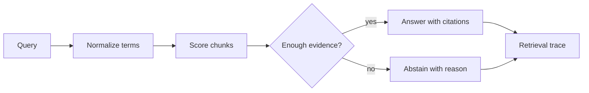

# Phase 2: Citation And Abstention RAG Lab

## Learning Goal

Build a small retrieval answerer that cites retrieved chunks and abstains when the evidence is too weak.

**Expected time to finish:** 5-7 hours

## Real-World Context

Module 4 Phase 1 created clean, chunked records. The Web Data Acquisition bridge created fixture-first source records. This phase consumes those outputs: retrieval should answer only from citation-ready evidence.

## Visual Map



## Evidence First

Run:

```powershell
python -m pytest curriculum/04-module-4-agentic-workflows/week-02-advanced-rag/tests -v
```

The first run should fail on TODO behavior while imports and collection succeed.

## Learner Outputs

| Artifact | Purpose |
| --- | --- |
| Retrieval result list | Show which chunks matched and why. |
| Cited answer object | Keep answer text, citations, confidence, and abstention flag together. |
| Abstention rule | Refuse unsupported answers when no chunk meets the score threshold. |
| Trace note | Explain the query, selected chunks, rejected chunks, and citation coverage. |

## FinAgent Connection

FinAgent can use this lab to answer market-context questions only when a retrieved source supports the response. Unsupported questions should produce an abstention, not a confident guess.

## Cafe Visual Break

- Reference: [OpenAI evaluation best practices](https://platform.openai.com/docs/guides/evaluation-best-practices) - use it to frame supported, unsupported, and ambiguous retrieval cases before tuning behavior.
- Reference: [OpenAI: Why language models hallucinate](https://openai.com/index/why-language-models-hallucinate/) - use the abstention discussion to explain why refusing weak evidence is a reliability feature.
