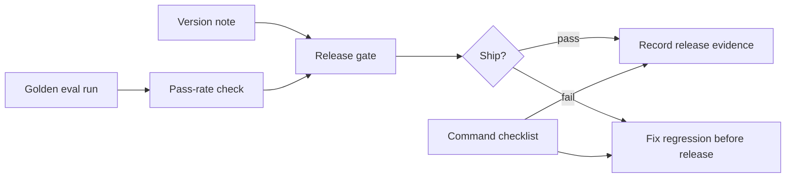

# Week 2: CI-Style Regression Gate

## Learning Logic

Use the course map in `curriculum/LEARNER_JOURNEY_MAP.md` and the local module README to keep this lesson bounded.

| Question | Learner-facing answer |
| --- | --- |
| What can I do now? | run a small golden eval set. |
| What new capability am I adding? | add CI-style pass-rate gates, version notes, and review checklists. |
| What failure does this help me catch? | silent prompt/model/index drift and failing eval runs. |
| How does this improve FinAgent or a practical AI system? | turns FinAgent quality checks into repeatable release evidence. |
| What should I be able to explain afterward? | how CI gates connect tests, evals, versions, and review. |

## Minimum Path, Enrichment, And Doorway

- **Minimum path:** read the scenario, inspect the tests or fixtures, complete the TODOs in `workbench.py`, run the verification command, and write the reflection/evidence note.
- **Optional enrichment:** add one edge case, comparison, or small test after the required behavior works.
- **Advanced doorway:** notice the later advanced topic this prepares for, then return to the bounded Course 1 task.

## Evidence Portfolio

Leave this lesson with technical evidence, failure evidence, explanation evidence, and transfer evidence. A passing test alone is not the whole learning outcome.

## Learning Goal

Turn the golden eval scaffold into a repeatable release gate a teammate could run from a clean checkout.

**Expected time to finish:** 4-6 hours

## Real-World Context

Week 1 gave you examples and eval results. Week 2 asks the production question: should this change ship? A CI-style gate does not need a cloud provider yet. It needs version notes, a pass-rate threshold, visible failure categories, and commands that can be rerun.

## Visual Map



## Evidence First

Run:

```powershell
python -m pytest curriculum/05-module-5-production/week-02-cicd/tests -v
```

The first run should collect cleanly and fail on TODO behavior in `workbench.py`.

## Learner Outputs

| Artifact | Purpose |
| --- | --- |
| Eval run loader | Read a deterministic eval result without hidden service state. |
| Version note | Record prompt, model, index, and dataset versions. |
| Gate decision | Pass only when thresholds and failure counts allow release. |
| Command checklist | Show exact commands for unit tests, evals, and the gate. |
| Gate report | Give reviewers run ID, pass rate, status, reasons, versions, failures, and commands. |

## FinAgent Connection

FinAgent cannot rely on "it answered well when I tried it." A release gate catches missing citations, wrong abstentions, and safety mismatches before a capstone demo or portfolio recording.

## Cafe Visual Break

- Reference: [OpenAI evals guide](https://platform.openai.com/docs/guides/evals) - use it to connect small golden evals to repeatable quality checks.
- Reference: [GitHub Actions for Python](https://docs.github.com/en/actions/how-tos/writing-workflows/building-and-testing/building-and-testing-python) - use it later when turning this local checklist into an actual CI workflow.

