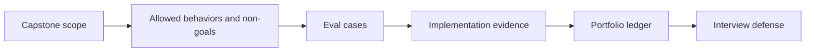

# Week 1: FinAgent Capstone Kickoff

## Learning Goal

Scope a portfolio-ready FinAgent capstone, wire a small eval harness, and start a portfolio evidence ledger.

**Expected time to finish:** 6-8 hours

## Real-World Context

The capstone should prove the learner can connect responsible data collection, provenance, RAG citations, abstention, golden evals, safety boundaries, and clear explanation. This week prevents overbuilding by forcing scope and evidence decisions first.

## Visual Map



## Evidence First

Run:

```powershell
python -m pytest curriculum/06-capstone-projects/week-01-build/tests -v
```

The starting failures are expected TODO failures in `workbench.py`.

## Learner Outputs

| Artifact | Purpose |
| --- | --- |
| Capstone scope | Define users, allowed behaviors, non-goals, data sources, and safety limits. |
| Eval harness | Run deterministic cases for citations, abstention, and refusal behavior. |
| Portfolio evidence ledger | Track implementation, tests, evals, traces, diagrams, demo notes, and limitations. |

## Minimum Scope

FinAgent should answer educational market-context questions from approved, cited sources. It should not recommend trades, guarantee returns, or pretend that stale or missing evidence is enough.

## Reflect

- Which feature proves the most portfolio value with the least scope?
- Which data source has enough provenance for citation?
- Which failure mode would embarrass the project in an interview?

## Cafe Visual Break

- Reference: [OpenAI evaluation best practices](https://platform.openai.com/docs/guides/evaluation-best-practices) - use it when deciding which capstone behaviors need repeatable eval evidence.
