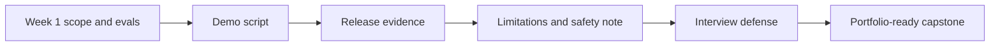

# Week 2: Capstone Polish And Defense

## Learning Goal

Turn the FinAgent capstone into a reviewer-ready portfolio artifact with a demo script, limitation note, release evidence, and interview defense.

**Expected time to finish:** 6-8 hours

## Real-World Context

A capstone is not finished when the happy-path demo works once. A reviewer, teammate, or interviewer needs to see what was tested, what failed, what is safe to claim, and where the system should refuse or abstain.

This week keeps the polish practical: no full SaaS deployment, no trading advice, and no hidden model magic. You package the evidence a real reviewer would inspect before trusting the project.

## Visual Map



## Evidence First

Run:

```powershell
python -m pytest curriculum/06-capstone-projects/week-02-polish/tests -v
```

The starting failures are expected TODO failures in `workbench.py`.

## Learner Outputs

| Artifact | Purpose |
| --- | --- |
| Demo script | Shows the reviewer exactly what to run, say, and inspect. |
| Release evidence | Records test, eval, trace, data, and safety checks before sharing the capstone. |
| Limitation note | Names stale data, missing sources, non-advice boundaries, and remaining risks. |
| Interview defense | Explains architecture, evals, safety, tradeoffs, and what you would improve next. |

## Minimum Polish Gate

Your capstone is ready to present when a reviewer can:

- rerun the demo without guessing the command
- see test and eval evidence from the current version
- inspect at least one trace or sample output
- understand source freshness and citation limits
- see the non-advice boundary clearly
- ask tradeoff questions and get precise answers

## Reflect

- Which demo moment proves the capstone is more than a prompt wrapper?
- Which limitation would you rather disclose before the reviewer finds it?
- Which tradeoff would you defend in an interview if challenged?

## Cafe Visual Break

- Reference: [OpenAI evaluation best practices](https://platform.openai.com/docs/guides/evaluation-best-practices) - use the continuous-evaluation mindset when deciding which checks belong in your release evidence.
