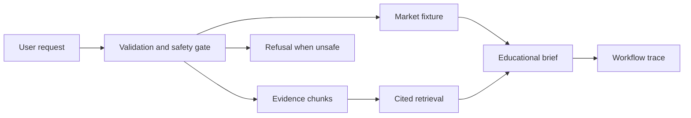

# Week 3: Runnable FinAgent Integration Build

## Learning Logic

This milestone turns the capstone from scope and presentation artifacts into a
small local workflow a reviewer can run. It stays deterministic so failures are
easy to inspect before live LLMs, tools, or services enter the system.

| Question | Learner-facing answer |
| --- | --- |
| What can I do now? | Define FinAgent scope, eval cases, release evidence, and limitations. |
| What new capability am I adding? | Compose fixture market data, cited evidence, safety gates, and a workflow trace into one runnable educational brief. |
| What failure does this help me catch? | Malformed tickers, unsupported advice requests, missing citations, stale evidence, and untraceable decisions. |
| How does this improve FinAgent or a practical AI system? | It proves the capstone has an executable backbone before model calls or hosted services are added. |
| What should I be able to explain afterward? | Why the workflow is deterministic, where evidence enters, when it refuses, and what would change for a live implementation. |

## Learning Goal

Build the smallest runnable FinAgent workflow: validate request, load fixture
market data, retrieve cited context, apply safety gates, compose an educational
brief, and return a trace.

**Expected time to finish:** 6-8 hours

## Real-World Context

Portfolio reviewers trust a small workflow they can run more than a large
architecture promise. This milestone connects the course spine into one local
capstone path while preserving the finance safety boundary.

## Visual Map



## Evidence First

Run:

```powershell
python -m pytest curriculum/06-capstone-projects/week-03-integration-build/tests -v
```

The starting failures are expected TODO failures in `workbench.py`.

## Learner Outputs

| Artifact | Purpose |
| --- | --- |
| Request validator | Accept supported educational questions and reject malformed or advice-seeking requests. |
| Fixture loaders | Keep market data and evidence deterministic for tests. |
| Retrieval function | Select cited evidence chunks without a vector database. |
| Brief composer | Produce an educational summary with movement, citations, uncertainty, and non-advice language. |
| Workflow runner | Return a runnable result and trace each gate a reviewer should inspect. |
| Integration note | Explain what is deterministic now and what could become live later. |

## Minimum Scope

Use local fixtures only. The workflow may discuss public market context for
education, but it must not recommend trades, predict returns as advice, or
pretend fixture data is live.

## Reflect

- Which earlier module skill became most important during integration?
- Which refusal path protects the capstone from overclaiming?
- Where would a live LLM or tool call fit later, and what test would need to stay deterministic?
- What trace step would you show first in an interview?

## Cafe Visual Break

- Reference: [OpenAI evaluation best practices](https://platform.openai.com/docs/guides/evaluation-best-practices) - use it to connect deterministic capstone cases to later production evals.
- Reference: [OpenAI agent evals guide](https://platform.openai.com/docs/guides/agent-evals) - use it as optional context for how workflow traces can become eval evidence later.
