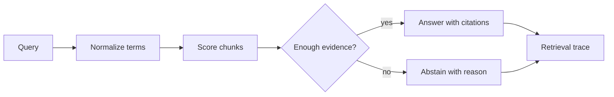

# Phase 2: Citation And Abstention RAG Lab

## Learning Logic

Use the course map in `curriculum/LEARNER_JOURNEY_MAP.md` and the local module README to keep this lesson bounded.

| Question | Learner-facing answer |
| --- | --- |
| What can I do now? | produce AI-ready chunks with provenance. |
| What new capability am I adding? | add keyword, vector, hybrid retrieval, citation, and abstention behavior. |
| What failure does this help me catch? | unsupported answers, weak matches, missing citations, and poor trace data. |
| How does this improve FinAgent or a practical AI system? | turns FinAgent into a cited assistant instead of an oracle. |
| What should I be able to explain afterward? | how retrieval evidence controls whether to answer or abstain. |

## Minimum Path, Enrichment, And Doorway

- **Minimum path:** read the scenario, inspect the tests or fixtures, complete the TODOs in `workbench.py`, run the verification command, and write the reflection/evidence note.
- **Optional enrichment:** add one edge case, comparison, or small test after the required behavior works.
- **Advanced doorway:** notice the later advanced topic this prepares for, then return to the bounded Course 1 task.

## Evidence Portfolio

Leave this lesson with technical evidence, failure evidence, explanation evidence, and transfer evidence. A passing test alone is not the whole learning outcome.

## Learning Goal

Build a small retrieval answerer that cites retrieved chunks and abstains when the evidence is too weak.

**Expected time to finish:** 5-7 hours

## Real-World Context

Module 4 Phase 1 created clean, chunked records. The Web Data Acquisition bridge created fixture-first source records. This phase consumes those outputs: retrieval should answer only from citation-ready evidence.

## Visual Map



## Evidence First

Run:

```powershell
python -m pytest curriculum/main-track/04-module-4-agentic-workflows/week-02-advanced-rag/tests -v
```

The first run should fail on TODO behavior while imports and collection succeed.

## Learner Outputs

| Artifact | Purpose |
| --- | --- |
| Retrieval result list | Show which chunks matched and why. |
| Cited answer object | Keep answer text, citations, confidence, and abstention flag together. |
| Abstention rule | Refuse unsupported answers when no chunk meets the score threshold. |
| Trace note | Explain the query, selected chunks, rejected chunks, and citation coverage. |
| Retrieval comparison note | Compare keyword baseline, tiny embedding similarity, and hybrid scoring on one supported and one unsupported query. |

## FinAgent Connection

FinAgent can use this lab to answer market-context questions only when a retrieved source supports the response. Unsupported questions should produce an abstention, not a confident guess.

## Retrieval Progression

Start with keyword overlap because it is inspectable. After the baseline passes,
add a small optional comparison:

1. Represent each chunk with a tiny fixed vocabulary vector.
2. Score query-to-chunk similarity with the same vector discipline learned in Module 2.
3. Combine keyword overlap and vector similarity into a hybrid score.
4. Record one case where keyword wins, one where vector similarity helps, and one where both should abstain.

This progression keeps the first lab solvable while making the later Module 4
checkpoint about keyword, vector, and hybrid retrieval concrete.

## Cafe Visual Break

- Reference: [OpenAI evaluation best practices](https://platform.openai.com/docs/guides/evaluation-best-practices) - use it to frame supported, unsupported, and ambiguous retrieval cases before tuning behavior.
- Reference: [OpenAI: Why language models hallucinate](https://openai.com/index/why-language-models-hallucinate/) - use the abstention discussion to explain why refusing weak evidence is a reliability feature.

