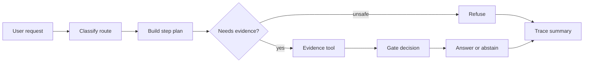

# Phase 3: Explicit Workflow Pattern Lab

## Learning Logic

Use the course map in `curriculum/LEARNER_JOURNEY_MAP.md` and the local module README to keep this lesson bounded.

| Question | Learner-facing answer |
| --- | --- |
| What can I do now? | answer with cited retrieval and abstention. |
| What new capability am I adding? | build explicit prompt-chain, route, and tool-use workflow gates. |
| What failure does this help me catch? | wrong route selection, missing evidence, and tool calls without stopping rules. |
| How does this improve FinAgent or a practical AI system? | lets FinAgent use workflows before autonomous agents. |
| What should I be able to explain afterward? | how explicit state and gates make workflow failures debuggable. |

## Minimum Path, Enrichment, And Doorway

- **Minimum path:** read the scenario, inspect the tests or fixtures, complete the TODOs in `workbench.py`, run the verification command, and write the reflection/evidence note.
- **Optional enrichment:** add one edge case, comparison, or small test after the required behavior works.
- **Advanced doorway:** notice the later advanced topic this prepares for, then return to the bounded Course 1 task.

## Evidence Portfolio

Leave this lesson with technical evidence, failure evidence, explanation evidence, and transfer evidence. A passing test alone is not the whole learning outcome.

## Learning Goal

Build prompt chaining, routing, gated tool use, and trace summaries before adding agent autonomy.

**Expected time to finish:** 4-6 hours

## Real-World Context

After citation and abstention RAG, the next temptation is to call everything an agent. Most production tasks need something simpler first: an explicit workflow where the code decides the route, the tool calls are bounded, and a gate decides whether the system may answer.

## Visual Map



## Evidence First

Run:

```powershell
python -m pytest curriculum/main-track/04-module-4-agentic-workflows/week-03-core-patterns/tests -v
```

The first run should collect cleanly and fail on TODO behavior in `workbench.py`.

## Learner Outputs

| Artifact | Purpose |
| --- | --- |
| Request classifier | Route requests before tool calls happen. |
| Prompt-chain plan | Make each step inspectable instead of hidden in one prompt. |
| Evidence tool wrapper | Keep tool use deterministic and bounded. |
| Gate decision | Answer only with evidence, abstain when unsupported, refuse unsafe advice. |
| Workflow trace | Debug route, steps, tools, gate decision, and final response. |

## FinAgent Connection

FinAgent should not jump from RAG to a free-running market agent. It first needs explicit workflows that decide whether a request needs retrieval, whether the evidence is enough, and whether the safest response is a refusal.

## Cafe Visual Break

- Reference: [Anthropic Building Effective Agents](https://www.anthropic.com/engineering/building-effective-agents) - use the workflow patterns as a mental model for prompt chaining, routing, and tool use before autonomous agents.
- Reference: [OpenAI Agents guide](https://platform.openai.com/docs/guides/agents) - use it later to compare explicit workflows with agent-managed tool calls.

