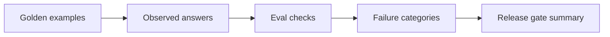

# Week 1: Golden Eval Scaffold

## Learning Logic

Use the course map in `curriculum/LEARNER_JOURNEY_MAP.md` and the local module README to keep this lesson bounded.

| Question | Learner-facing answer |
| --- | --- |
| What can I do now? | build RAG and workflow behavior with explicit evidence. |
| What new capability am I adding? | create golden examples, edge cases, eval objectives, and score summaries. |
| What failure does this help me catch? | unsupported answers, ambiguous failures, and missing refusal cases. |
| How does this improve FinAgent or a practical AI system? | gives FinAgent a repeatable quality gate before release work. |
| What should I be able to explain afterward? | how eval cases define what good behavior means. |

## Minimum Path, Enrichment, And Doorway

- **Minimum path:** read the scenario, inspect the tests or fixtures, complete the TODOs in `workbench.py`, run the verification command, and write the reflection/evidence note.
- **Optional enrichment:** add one edge case, comparison, or small test after the required behavior works.
- **Advanced doorway:** notice the later advanced topic this prepares for, then return to the bounded Course 1 task.

## Evidence Portfolio

Leave this lesson with technical evidence, failure evidence, explanation evidence, and transfer evidence. A passing test alone is not the whole learning outcome.

## Learning Goal

Create a small golden dataset and an eval runner that catches unsupported answers, missing citations, and unsafe finance claims.

**Expected time to finish:** 4-6 hours

## Real-World Context

Module 4 produced cited and abstaining RAG behavior. Module 5 starts by freezing a few examples that define what "good enough" means before prompt tweaks, workflow changes, or model swaps.

## Visual Map



## Evidence First

Run:

```powershell
python -m pytest curriculum/main-track/05-module-5-production/week-01-golden-datasets/tests -v
```

The first run should collect and fail on TODO behavior.

## Learner Outputs

| Artifact | Purpose |
| --- | --- |
| Golden examples | Define supported, abstained, and safety-boundary cases. |
| Eval result rows | Show pass/fail category, expected behavior, and observed behavior. |
| Summary report | Count total, passed, failed, and failure categories. |
| Failure note | Explain one false positive, false negative, or ambiguous case. |

## FinAgent Connection

FinAgent needs regression evidence for citation failures, unsupported investment advice, stale data, and malformed source records before it becomes a portfolio capstone.

## Cafe Visual Break

- Reference: [OpenAI evaluation best practices](https://platform.openai.com/docs/guides/evaluation-best-practices) - use it to compare deterministic checks, human review, and task-specific eval cases.

