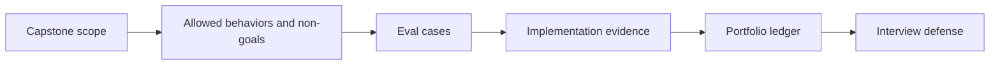

# Week 1: FinAgent Capstone Kickoff

## Learning Logic

Use the course map in `curriculum/LEARNER_JOURNEY_MAP.md` and the local module README to keep this lesson bounded.

| Question | Learner-facing answer |
| --- | --- |
| What can I do now? | harden AI features with evals and release evidence. |
| What new capability am I adding? | scope the FinAgent capstone, define eval cases, and start the evidence ledger. |
| What failure does this help me catch? | oversized capstone scope, missing safety cases, and weak portfolio evidence. |
| How does this improve FinAgent or a practical AI system? | turns prior modules into a realistic but bounded final project. |
| What should I be able to explain afterward? | what FinAgent will prove and what it will intentionally not do. |

## Minimum Path, Enrichment, And Doorway

- **Minimum path:** read the scenario, inspect the tests or fixtures, complete the TODOs in `workbench.py`, run the verification command, and write the reflection/evidence note.
- **Optional enrichment:** add one edge case, comparison, or small test after the required behavior works.
- **Advanced doorway:** notice the later advanced topic this prepares for, then return to the bounded Course 1 task.

## Evidence Portfolio

Leave this lesson with technical evidence, failure evidence, explanation evidence, and transfer evidence. A passing test alone is not the whole learning outcome.

## Learning Goal

Scope a portfolio-ready FinAgent capstone, wire a small eval harness, and start a portfolio evidence ledger.

**Expected time to finish:** 6-8 hours

## Real-World Context

The capstone should prove the learner can connect responsible data collection, provenance, RAG citations, abstention, golden evals, safety boundaries, and clear explanation. This week prevents overbuilding by forcing scope and evidence decisions first.

## Visual Map



## Evidence First

Run:

```powershell
python -m pytest curriculum/main-track/06-capstone-projects/week-01-build/tests -v
```

The starting failures are expected TODO failures in `workbench.py`.

## Learner Outputs

| Artifact | Purpose |
| --- | --- |
| Capstone scope | Define users, allowed behaviors, non-goals, data sources, and safety limits. |
| Eval harness | Run deterministic cases for citations, abstention, and refusal behavior. |
| Portfolio evidence ledger | Track implementation, tests, evals, traces, diagrams, demo notes, and limitations. |

## Minimum Scope

FinAgent should answer educational market-context questions from approved, cited sources. It should not recommend trades, guarantee returns, or pretend that stale or missing evidence is enough.

Use `../../../FINANCE_SAFETY.md` as the capstone safety checklist.

## Reflect

- Which feature proves the most portfolio value with the least scope?
- Which data source has enough provenance for citation?
- Which failure mode would embarrass the project in an interview?

## Cafe Visual Break

- Reference: [OpenAI evaluation best practices](https://platform.openai.com/docs/guides/evaluation-best-practices) - use it when deciding which capstone behaviors need repeatable eval evidence.

