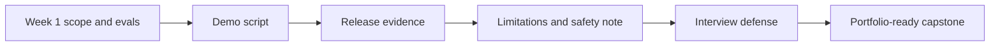

# Week 2: Capstone Polish And Defense

## Learning Logic

Use the course map in `curriculum/LEARNER_JOURNEY_MAP.md` and the local module README to keep this lesson bounded.

| Question | Learner-facing answer |
| --- | --- |
| What can I do now? | build or inspect the runnable FinAgent integration. |
| What new capability am I adding? | prepare demo flow, release evidence, limitation notes, and interview defense. |
| What failure does this help me catch? | unclear demos, missing blockers, and overclaimed capabilities. |
| How does this improve FinAgent or a practical AI system? | makes FinAgent portfolio-ready without hiding limitations. |
| What should I be able to explain afterward? | how to defend architecture, evals, safety, and next improvements. |

## Minimum Path, Enrichment, And Doorway

- **Minimum path:** read the scenario, inspect the tests or fixtures, complete the TODOs in `workbench.py`, run the verification command, and write the reflection/evidence note.
- **Optional enrichment:** add one edge case, comparison, or small test after the required behavior works.
- **Advanced doorway:** notice the later advanced topic this prepares for, then return to the bounded Course 1 task.

## Evidence Portfolio

Leave this lesson with technical evidence, failure evidence, explanation evidence, and transfer evidence. A passing test alone is not the whole learning outcome.

## Learning Goal

Turn the FinAgent capstone into a reviewer-ready portfolio artifact with a demo script, limitation note, release evidence, and interview defense.

**Expected time to finish:** 6-8 hours

## Real-World Context

A capstone is not finished when the happy-path demo works once. A reviewer, teammate, or interviewer needs to see what was tested, what failed, what is safe to claim, and where the system should refuse or abstain.

This week keeps the polish practical: no full SaaS deployment, no trading advice, and no hidden model magic. You package the evidence a real reviewer would inspect before trusting the project.

## Visual Map



## Evidence First

Run:

```powershell
python -m pytest curriculum/main-track/06-capstone-projects/week-02-polish/tests -v
```

The starting failures are expected TODO failures in `workbench.py`.

## Learner Outputs

| Artifact | Purpose |
| --- | --- |
| Demo script | Shows the reviewer exactly what to run, say, and inspect. |
| Release evidence | Records test, eval, trace, data, and safety checks before sharing the capstone. |
| Limitation note | Names stale data, missing sources, non-advice boundaries, and remaining risks. |
| Interview defense | Explains architecture, evals, safety, tradeoffs, and what you would improve next. |
| Portfolio README | Packages the project claim, run commands, evidence table, limitations, tradeoffs, and STAR defense. |
| Final assessment checklist | Confirms the capstone is ready before you present it as Course 1 portfolio evidence. |

## Portfolio Packaging Gate

After the workbench tests pass, package the capstone evidence with the module
templates:

1. Use `../PORTFOLIO_README_TEMPLATE.md` to draft the final project README.
2. Fill the evidence table with real artifacts: test commands, eval summaries,
   citation or trace records, release blockers, and limitation notes.
3. Run `../FINAL_ASSESSMENT_CHECKLIST.md` as a self-review before presenting.

The README should not make claims that the checklist cannot verify. If the
checklist exposes a blocker, keep the blocker visible in release evidence
instead of polishing around it.

## Minimum Polish Gate

Your capstone is ready to present when a reviewer can:

- rerun the demo without guessing the command
- see test and eval evidence from the current version
- inspect at least one trace or sample output
- understand source freshness and citation limits
- see the non-advice boundary clearly
- match every portfolio README claim to a code, test, eval, trace, fixture,
  demo, or limitation artifact
- pass the final assessment checklist without hidden blockers
- ask tradeoff questions and get precise answers

## Reflect

- Which demo moment proves the capstone is more than a prompt wrapper?
- Which limitation would you rather disclose before the reviewer finds it?
- Which tradeoff would you defend in an interview if challenged?

## Cafe Visual Break

- Reference: [OpenAI evaluation best practices](https://platform.openai.com/docs/guides/evaluation-best-practices) - use the continuous-evaluation mindset when deciding which checks belong in your release evidence.

