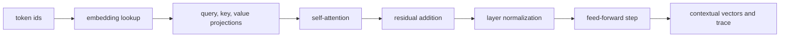

# Phase 4: Tiny Transformer Block Lab

## Learning Logic

Use the course map in `curriculum/LEARNER_JOURNEY_MAP.md` and the local module README to keep this lesson bounded.

| Question | Learner-facing answer |
| --- | --- |
| What can I do now? | trace attention outputs for market context. |
| What new capability am I adding? | assemble a tiny transformer-style block with residual and feed-forward steps. |
| What failure does this help me catch? | dimension errors, missing trace fields, and overtrust in toy math. |
| How does this improve FinAgent or a practical AI system? | prepares FinAgent API work with clearer model-internals intuition. |
| What should I be able to explain afterward? | how token representations become contextual representations. |

## Minimum Path, Enrichment, And Doorway

- **Minimum path:** read the scenario, inspect the tests or fixtures, complete the TODOs in `workbench.py`, run the verification command, and write the reflection/evidence note.
- **Optional enrichment:** add one edge case, comparison, or small test after the required behavior works.
- **Advanced doorway:** notice the later advanced topic this prepares for, then return to the bounded Course 1 task.

## Evidence Portfolio

Leave this lesson with technical evidence, failure evidence, explanation evidence, and transfer evidence. A passing test alone is not the whole learning outcome.

Folder: `week-01-tiny-transformer`  
Expected time to finish: 5-7 hours  
File to edit: `workbench.py`  
Test folder: `tests/`  
Core test file: `tests/test_tiny_transformer.py`

## Learning Goal

Assemble a tiny transformer-style forward pass with plain Python and explain how token vectors become contextual vectors.

## Success Looks Like

- The tests pass because embedding lookup, projections, attention, residual addition, normalization, feed-forward output, and trace metadata work.
- Your trace note shows the shape of each intermediate step.
- Your reflection explains what this toy block teaches, and what real transformer libraries still handle for you.

## Real-World Context

FinAgent is getting closer to real model APIs. Before Module 3 wraps providers, prompts, tools, and MCP boundaries, you need one compact mental model for what happens inside a transformer block.

This lab is not about training a model. It is about seeing the forward path:



No NumPy. No PyTorch. No provider API. The whole point is to keep the mechanism small enough to inspect.

## Story

Imagine FinAgent reads this tiny market sentence:

```text
AAPL revenue improved
```

The tokens are not useful to a model as words alone. They become vectors, then each token looks at the other tokens through attention, then the block keeps the original signal with a residual connection, stabilizes the values with normalization, and applies a small feed-forward transformation.

At the cafe table, this is the notebook sketch:

| Step | What changes | Why it matters |
| --- | --- | --- |
| Embedding | token ids become vectors | words enter numeric space |
| Projection | vectors become query, key, value views | the block can compare and carry information |
| Attention | each token blends context from the sequence | "revenue" can carry context from "AAPL" |
| Residual | original signal is added back | useful information is not washed away |
| Normalization | values are centered and stabilized | later layers receive calmer numbers |
| Feed-forward | each vector gets a deterministic update | the block can reshape the representation |

## Before You Run

Before editing, predict:

1. Which token should carry the strongest market-context signal after attention?
2. Why should the final output have one vector per input token?
3. What trace field would help you debug a shape mismatch?

## Evidence First

Run the tests once before coding:

```powershell
python -m pytest tests -v
```

The first run should fail because `workbench.py` contains TODO behavior. Read the first failure and identify whether it points to shape validation, vector math, attention, normalization, or trace metadata.

## Read

A transformer block is a data-flow pattern. In this lab, it follows:

```text
embeddings = lookup token ids
queries, keys, values = project embeddings
attention_outputs = self-attention over the sequence
residual_outputs = embeddings + attention_outputs
normalized_outputs = layer_norm for each residual vector
final_outputs = feed_forward for each normalized vector
trace = inspectable metadata for debugging
```

Keep the code boring and inspectable. Lists and loops are enough here.

## Trace

Open `workbench.py` and answer:

1. Which function should reject mismatched vector dimensions?
2. Which function should preserve token order?
3. Which projection matrix dimension must match the vector length?
4. Where should attention weights be stored for debugging?
5. Why does the block return both `outputs` and `trace`?

## Modify

Start with the smallest changes:

1. Implement `add_vectors`.
2. Implement `layer_norm`.
3. Implement `lookup_embeddings`.
4. Run the tests again.
5. Implement projection helpers.
6. Then build attention, residual, feed-forward, and the final trace.

Do not try to write the whole block at once. The tests are arranged so one small function unlocks the next idea.

## Create

Complete the TODOs in `workbench.py`:

- `add_vectors`
- `layer_norm`
- `lookup_embeddings`
- `project_vector`
- `project_sequence`
- `self_attention`
- `feed_forward`
- `transformer_block`

## Smallest Change

When a test fails, make the smallest useful edit:

- If the failure mentions length, fix validation first.
- If the failure mentions shape, inspect vector and matrix dimensions.
- If the failure mentions trace keys, return richer metadata before changing math.
- If the failure mentions attention weights, print or inspect one row at a time.

## Verify

Run from this folder:

```powershell
python -m pytest tests -v
```

The tests intentionally fail at first. Your goal is to turn each failure into one clear implementation step.

## Explain Like A Teammate

Write 2-4 sentences answering:

1. What does the residual connection protect?
2. Why does layer normalization make the next step easier to inspect?
3. Why is this toy transformer block useful even though it is not a real LLM?

## Optional Visual Support

- [3Blue1Brown attention in transformers](https://www.3blue1brown.com/lessons/attention/): optional visual support for attention and transformer intuition.
- [The Illustrated Transformer](https://jalammar.github.io/illustrated-transformer/): optional diagram-heavy reference for the full production architecture shape.

These are support links, not prerequisites. Build the tiny block first.

## Reflect

- Which intermediate trace field was most useful?
- What does this toy block prove about model data flow?
- What does it not prove about production LLM behavior?
- Why should Module 3 still wrap real APIs behind tests and provider boundaries?

## Extension

Add one test for an empty token sequence or a projection matrix with the wrong width. Make the error message useful enough that a future learner can debug it without guessing.

## Evidence Artifact

Write a short transformer trace:

```text
Input token ids:
Embedding shape:
Attention weight rows:
Residual shape:
Normalized shape:
Final output shape:
Most useful trace field:
What this teaches before Module 3:
```

## Connection To Phase 3

Phase 3 taught attention as a single mechanism. Phase 4 places attention inside a tiny block with residual, normalization, and feed-forward steps. Module 3 will use that intuition to make better decisions about real model APIs, prompts, structured outputs, and tool boundaries.

