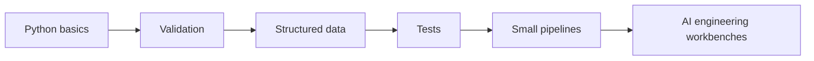
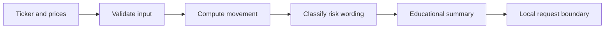
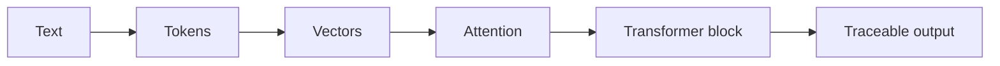
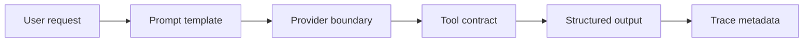
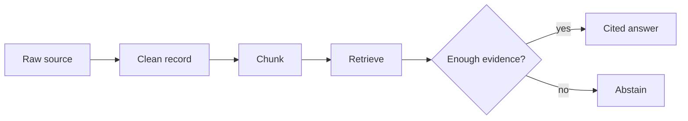
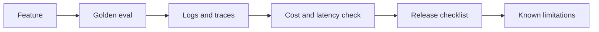
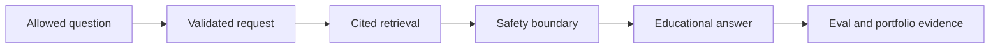

# Course Visual Map

Use these Mermaid diagrams as the standard visual language for Course 1. Copy a
diagram into a module README only when it clarifies the lesson.

## Module 0: Python Skill To AI Engineering Use

## Module 1: Deterministic FinAgent Pipeline

## Module 2: Text To Transformer-Style Output

## Module 3: Provider, Prompt, Tool, And Trace Boundary

## Module 4: Raw Data To Cited Answer

## Module 5: Production Release Gate

## Module 6: FinAgent Capstone Architecture

