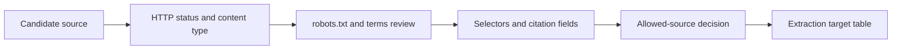

# Core Lab 1: HTTP And Page Inspection

## Learning Goal

Inspect a public-data target before writing extraction code, then decide whether it is allowed, stable, and useful enough for an AI workflow.

**Expected time to finish:** 2-3 hours

## Real-World Context

RAG and FinAgent are only as trustworthy as their source collection. This lab makes learners slow down before scraping: inspect status codes, links, robots guidance, page structure, and provenance fields first.

## Visual Map



## Evidence First

Run the tests before editing:

```powershell
python -m pytest curriculum/specializations/web-scraping/core-lab-01-http-inspection/tests -v
```

The first run should collect cleanly and fail on TODO behavior in `workbench.py`.

## Learner Outputs

| Artifact | Purpose |
| --- | --- |
| Page inspection note | Record URL, status, content type, page title, and important selectors. |
| Allowed-source checklist | Decide whether collection is allowed, attributed, rate-limited, and bounded. |
| Extraction target table | Name the fields that later labs should extract and preserve. |

## FinAgent Connection

FinAgent should not collect market context from unknown or disallowed sources. This lab produces the source-review habit that later feeds Module 4 citation/abstention RAG.

## Reflect

- What evidence says this source is allowed?
- Which fields are useful for citation later?
- What would make this source too risky or unstable to use?

## Cafe Visual Break

- Reference: [Google Search Central robots.txt introduction](https://developers.google.com/search/docs/crawling-indexing/robots/intro) - use it to understand what robots.txt can and cannot control before deciding collection boundaries.
