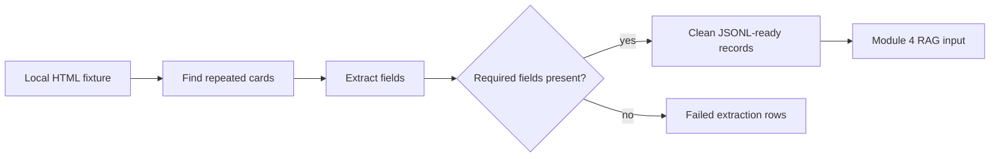

# Core Lab 2: Fixture-First Static Extraction

## Learning Logic

Use the course map in `curriculum/LEARNER_JOURNEY_MAP.md` and the local module README to keep this lesson bounded.

| Question | Learner-facing answer |
| --- | --- |
| What can I do now? | choose responsible static extraction targets. |
| What new capability am I adding? | parse local HTML fixtures into citation-ready records. |
| What failure does this help me catch? | broken selectors, missing fields, and lost source IDs. |
| How does this improve FinAgent or a practical AI system? | gives FinAgent deterministic web-data records before live collection. |
| What should I be able to explain afterward? | how fixture-first extraction protects parser reliability. |

## Minimum Path, Enrichment, And Doorway

- **Minimum path:** read the scenario, inspect the tests or fixtures, complete the TODOs in `workbench.py`, run the verification command, and write the reflection/evidence note.
- **Optional enrichment:** add one edge case, comparison, or small test after the required behavior works.
- **Advanced doorway:** notice the later advanced topic this prepares for, then return to the bounded Course 1 task.

## Evidence Portfolio

Leave this lesson with technical evidence, failure evidence, explanation evidence, and transfer evidence. A passing test alone is not the whole learning outcome.

## Learning Goal

Extract structured rows from stable local HTML fixtures before touching live network collection.

**Expected time to finish:** 3-4 hours

## Real-World Context

Responsible web acquisition starts with repeatable fixtures. A learner should prove selectors, missing-field handling, normalization, and provenance locally before adding requests, retries, or rate limits.

## Visual Map



## Evidence First

Run:

```powershell
python -m pytest curriculum/specializations/web-scraping/core-lab-02-fixture-static-extraction/tests -v
```

The starting failures are expected TODO failures in `workbench.py`.

## Learner Outputs

| Artifact | Purpose |
| --- | --- |
| Fixture parser | Extract stable rows from local HTML. |
| Normalized JSONL-ready records | Preserve title, URL, summary, source, timestamp, and extraction assumptions. |
| Failed extraction list | Keep broken cards reviewable instead of silently dropping them. |

## Module 4 Handoff

The clean records from this lab become the input shape for Module 4 Phase 2 citation/abstention RAG.

## Cafe Visual Break

- Reference: [Beautiful Soup documentation](https://www.crummy.com/software/BeautifulSoup/bs4/doc/) - use the searching and CSS selector sections to compare fixture selectors before writing parser code.

