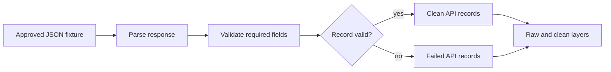

# Core Lab 3: API-First Collection

## Learning Goal

Prefer a stable JSON endpoint over scraping HTML when an approved source offers structured data.

**Expected time to finish:** 3-4 hours

## Real-World Context

If a source provides structured JSON, use it. API-first collection usually gives cleaner fields, fewer broken selectors, clearer errors, and better provenance than scraping rendered pages.

## Visual Map



## Evidence First

Run:

```powershell
python -m pytest curriculum/specializations/web-scraping/core-lab-03-api-first-collection/tests -v
```

The first run should collect cleanly and fail on TODO behavior in `workbench.py`.

## Learner Outputs

| Artifact | Purpose |
| --- | --- |
| JSON fixture loader | Practice API-style collection without live network instability. |
| Validation report | Keep malformed records visible. |
| Raw and clean layers | Preserve source payload and normalized records separately. |
| API-first decision note | Explain why JSON is preferred over scraping for this source. |

## Module 4 Handoff

The clean API records use the same provenance habit as Core Lab 2, so Module 4 can retrieve from both HTML-derived and API-derived context without losing citation fields.

## Cafe Visual Break

- Reference: [Requests quickstart](https://requests.readthedocs.io/en/master/user/quickstart/) - use the JSON response and status-error sections when you later replace fixtures with live requests.
- Reference: [Python json documentation](https://docs.python.org/3/library/json.html) - use it to understand how fixture JSON becomes Python dictionaries and lists.
