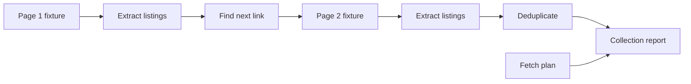

# Core Lab 4: Pagination, Retries, and Deduplication

## Learning Logic

Use the course map in `curriculum/LEARNER_JOURNEY_MAP.md` and the local module README to keep this lesson bounded.

| Question | Learner-facing answer |
| --- | --- |
| What can I do now? | validate API-collected market records. |
| What new capability am I adding? | handle pagination, retry policy, and duplicate records. |
| What failure does this help me catch? | lost pages, repeated records, retrying validation errors, and unstable IDs. |
| How does this improve FinAgent or a practical AI system? | prepares FinAgent for multi-page source collection without messy duplicates. |
| What should I be able to explain afterward? | how pagination and retry choices affect data quality. |

## Minimum Path, Enrichment, And Doorway

- **Minimum path:** read the scenario, inspect the tests or fixtures, complete the TODOs in `workbench.py`, run the verification command, and write the reflection/evidence note.
- **Optional enrichment:** add one edge case, comparison, or small test after the required behavior works.
- **Advanced doorway:** notice the later advanced topic this prepares for, then return to the bounded Course 1 task.

## Evidence Portfolio

Leave this lesson with technical evidence, failure evidence, explanation evidence, and transfer evidence. A passing test alone is not the whole learning outcome.

## Learning Goal

Collect more than one page without creating duplicate records or aggressive traffic.

**Expected time to finish:** 3-4 hours

## Real-World Context

A useful collector rarely stops after one page. The danger is that "just follow next" can become noisy, impolite, and hard to trust. This lab keeps the work fixture-first: learners inspect stable HTML pages, discover the next-page link, plan polite requests, and deduplicate repeated records before anything touches a live site.

## Visual Map



## Evidence First

Run:

```powershell
python -m pytest curriculum/specializations/web-scraping/core-lab-04-pagination-retries-deduplication/tests -v
```

The first run should collect cleanly and fail on TODO behavior in `workbench.py`.

## Learner Outputs

| Artifact | Purpose |
| --- | --- |
| Next-page detector | Follow pagination deliberately instead of guessing URLs. |
| Listing extractor | Preserve source URL, page URL, title, and content hash. |
| Deduplication helper | Remove repeats by normalized URL and page content. |
| Polite fetch plan | Record timeout, retry, and delay choices before live requests. |
| Collection summary | Show record counts, failure counts, source URLs, and failure reasons. |

## Module 4 Handoff

Pagination makes RAG inputs broader, but broader is only useful when provenance survives. The deduped records from this lab are ready to become clean source records before chunking.

## Cafe Visual Break

- Reference: [urllib.parse documentation](https://docs.python.org/3/library/urllib.parse.html) - use `urljoin` when turning relative next links into absolute URLs.
- Reference: [Requests timeouts](https://requests.readthedocs.io/en/master/user/quickstart/#timeouts) - use the timeout idea when this fixture-first lab becomes live collection.

