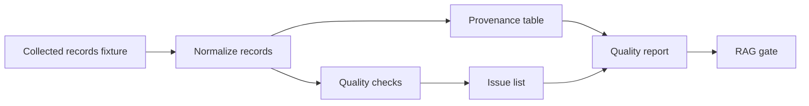

# Core Lab 5: Provenance and Data Quality

## Learning Logic

Use the course map in `curriculum/LEARNER_JOURNEY_MAP.md` and the local module README to keep this lesson bounded.

| Question | Learner-facing answer |
| --- | --- |
| What can I do now? | collect multi-page records with retries and dedupe. |
| What new capability am I adding? | score provenance, freshness, required fields, and quality decisions. |
| What failure does this help me catch? | stale sources, missing citations, and unreviewed low-quality records. |
| How does this improve FinAgent or a practical AI system? | teaches FinAgent to trust evidence by quality, not just availability. |
| What should I be able to explain afterward? | how provenance and quality gates decide record readiness. |

## Minimum Path, Enrichment, And Doorway

- **Minimum path:** read the scenario, inspect the tests or fixtures, complete the TODOs in `workbench.py`, run the verification command, and write the reflection/evidence note.
- **Optional enrichment:** add one edge case, comparison, or small test after the required behavior works.
- **Advanced doorway:** notice the later advanced topic this prepares for, then return to the bounded Course 1 task.

## Evidence Portfolio

Leave this lesson with technical evidence, failure evidence, explanation evidence, and transfer evidence. A passing test alone is not the whole learning outcome.

## Learning Goal

Make a collected dataset reviewable before it becomes retrieval or agent context.

**Expected time to finish:** 3-4 hours

## Real-World Context

A scraper can "work" and still produce data that should not feed an AI system. Records may be duplicated, stale, too thin, or missing the source assumptions a reviewer needs. This lab turns cleaned records into a provenance table and a data-quality report before Module 4 packages anything for RAG.

## Visual Map



## Evidence First

Run:

```powershell
python -m pytest curriculum/specializations/web-scraping/core-lab-05-provenance-data-quality/tests -v
```

The first run should collect cleanly and fail on TODO behavior in `workbench.py`.

## Learner Outputs

| Artifact | Purpose |
| --- | --- |
| Normalized source records | Keep source URL, heading, timestamp, assumptions, and content hash together. |
| Provenance table | Give humans a compact review surface before retrieval. |
| Quality issue list | Flag duplicate, stale, missing-provenance, and weak-summary records. |
| Quality report | Decide whether the dataset is ready for RAG packaging. |

## Module 4 Handoff

Only records that pass this gate should become chunk candidates. Module 4 can retrieve from cleaner context because the web-data mini-course has already made provenance and failure modes explicit.

## Cafe Visual Break

- Reference: [ISO 8601 date/time examples](https://www.w3.org/TR/NOTE-datetime) - use consistent timestamps when comparing freshness.
- Reference: [Python hashlib documentation](https://docs.python.org/3/library/hashlib.html) - use stable hashes to detect duplicate content.

