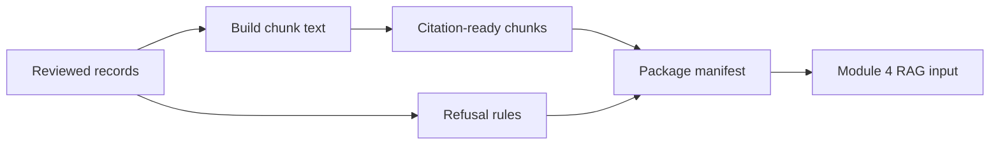

# Core Lab 6: RAG-Ready Packaging

## Learning Logic

Use the course map in `curriculum/LEARNER_JOURNEY_MAP.md` and the local module README to keep this lesson bounded.

| Question | Learner-facing answer |
| --- | --- |
| What can I do now? | review source records for provenance and quality. |
| What new capability am I adding? | package passed records into citation-preserving RAG chunks and refusal rules. |
| What failure does this help me catch? | chunks without citations, stale evidence, and unsafe financial claims. |
| How does this improve FinAgent or a practical AI system? | hands Module 4 retrieval clean evidence for FinAgent answers. |
| What should I be able to explain afterward? | how source records become retrieval-ready context. |

## Minimum Path, Enrichment, And Doorway

- **Minimum path:** read the scenario, inspect the tests or fixtures, complete the TODOs in `workbench.py`, run the verification command, and write the reflection/evidence note.
- **Optional enrichment:** add one edge case, comparison, or small test after the required behavior works.
- **Advanced doorway:** notice the later advanced topic this prepares for, then return to the bounded Course 1 task.

## Evidence Portfolio

Leave this lesson with technical evidence, failure evidence, explanation evidence, and transfer evidence. A passing test alone is not the whole learning outcome.

## Learning Goal

Convert reviewed web records into citation-ready chunks and refusal rules for downstream retrieval.

**Expected time to finish:** 3-4 hours

## Real-World Context

RAG does not start with embeddings. It starts with records that have passed provenance and quality checks, then packages them so a retriever can cite sources and refuse unsafe questions. This lab is the handoff between web data acquisition and Module 4 retrieval.

## Visual Map



## Evidence First

Run:

```powershell
python -m pytest curriculum/specializations/web-scraping/core-lab-06-rag-ready-packaging/tests -v
```

The first run should collect cleanly and fail on TODO behavior in `workbench.py`.

## Learner Outputs

| Artifact | Purpose |
| --- | --- |
| Reviewed record loader | Start only from records that passed quality review. |
| Chunk text builder | Preserve title, source section, and summary in retrievable text. |
| RAG package chunks | Carry source URL, collection time, citation, and quality status. |
| Refusal rules | State when the dataset should refuse, flag, or mark uncertainty. |
| Package manifest | Show counts, citations, refusal rules, and source URLs before Module 4. |

## Module 4 Handoff

The chunks from this lab match the citation habits used in Module 4. Learners should understand that retrieval quality depends on packaging discipline before vector databases or LLM calls enter the picture.

## Cafe Visual Break

- Reference: [OpenAI retrieval-augmented generation guide](https://platform.openai.com/docs/guides/retrieval) - use it to connect chunk packaging to later retrieval workflows.
- Reference: [OpenAI evals guidance](https://platform.openai.com/docs/guides/evals) - use it to think about how refusal rules become test cases later.

