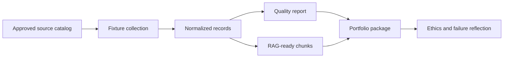

# Portfolio Mini-Project: Market Context Data Package

## Learning Logic

Use the six web data core labs as your toolkit. This project asks you to
compose them into one bounded portfolio artifact instead of learning a new
scraping technique.

| Question | Learner-facing answer |
| --- | --- |
| What can I do now? | Inspect sources, parse fixtures, prefer APIs, deduplicate records, review provenance, and package RAG chunks. |
| What new capability am I adding? | Turn those separate skills into one reviewable market-context data package. |
| What failure does this help me catch? | Unapproved sources, stale records, missing provenance, duplicate evidence, and uncited chunks. |
| How does this improve FinAgent or a practical AI system? | It gives a later assistant cited public context without pretending the data is live, complete, or advice-ready. |
| What should I be able to explain afterward? | Why each source was allowed, how records were cleaned, what the quality report caught, and what the package must refuse. |

## Learning Goal

Build a small, ethical, fixture-first web data portfolio package that can feed a
RAG or FinAgent workflow.

**Expected time to finish:** 6-8 hours

## Real-World Context

A useful AI portfolio does not need a giant crawler. Reviewers want to see that
you can choose sources responsibly, preserve provenance, catch data-quality
problems, and package records so downstream retrieval can cite sources and
refuse weak evidence.

## Visual Map



## Evidence First

Run:

```powershell
python -m pytest curriculum/specializations/web-scraping/portfolio-mini-project/tests -v
```

The starting failures are expected TODO failures in `workbench.py`.

## Learner Outputs

| Artifact | Purpose |
| --- | --- |
| Source approval table | Show which sources are allowed and why. |
| Raw fixture records | Preserve original source metadata before cleaning. |
| Clean records | Normalize title, summary, source URL, timestamp, and tags. |
| Quality report | Count accepted, blocked, duplicate, stale, and missing-provenance records. |
| RAG package manifest | Show chunks, citations, source URLs, refusal rules, and reviewer notes. |
| Ethics reflection | Explain safety boundaries, attribution, freshness limits, and production failure modes. |

## Minimum Scope

Use only local fixtures. Do not scrape live sites in this project unless an
instructor explicitly adds a live-source extension. The portfolio artifact is a
data package, not a production crawler.

## Reflect

- Which source was most useful and why was it allowed?
- Which record did the quality report block or flag?
- What should a downstream assistant refuse because this package cannot prove it?
- How would this break if a real website changed layout or terms?

## Cafe Visual Break

- Reference: [OpenAI retrieval-augmented generation guide](https://help.openai.com/en/articles/8868588-retrieval-augmented-generation-rag-and-semantic-search-for-gpts) - use it to connect citation-ready chunks to downstream retrieval.
- Reference: [Google Search Central robots.txt introduction](https://developers.google.com/search/docs/crawling-indexing/robots/intro) - use it to remember that robots guidance is part of source review, not a complete legal approval.
